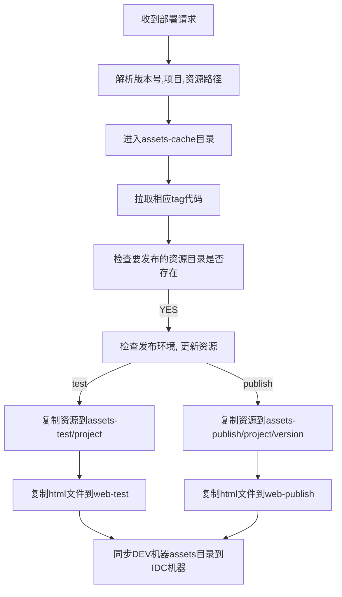

# 部署流程

```mermaid
graph TB
A[收到部署请求]-->B[解析版本号,项目,资源路径]

B[解析版本号,项目,资源路径]-->C[进入assets-cache目录]

C[进入assets-cache目录]-->D[拉取相应tag代码]

D[拉取相应tag代码]-->F[检查要发布的资源目录是否存在]

F[检查要发布的资源目录是否存在]-->|YES|checkType[检查发布环境]

checkType[检查发布环境, 更新资源]-->|publish|publishAssets[复制资源到assets-publish/project/version]

checkType[检查发布环境, 更新资源]-->|test|testAssets[复制资源到assets-test/project]

publishAssets[复制资源到assets-publish/project/version]-->htmlPublish[复制html文件到web-publish]

testAssets[复制资源到assets-test/project]-->htmlTest[复制html文件到web-test]

htmlTest[复制html文件到web-test]-->J[同步DEV机器assets目录到IDC机器]

htmlPublish[复制html文件到web-publish]
-->J[同步DEV机器assets目录到IDC机器]

```