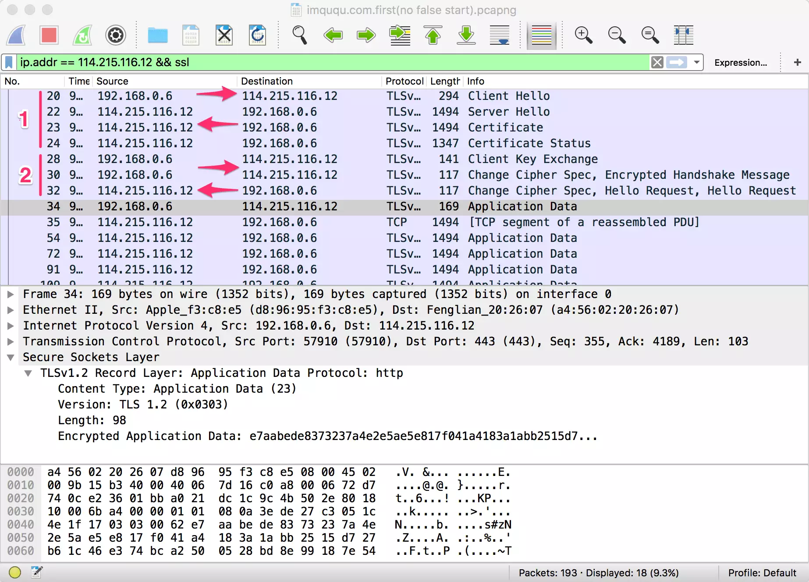
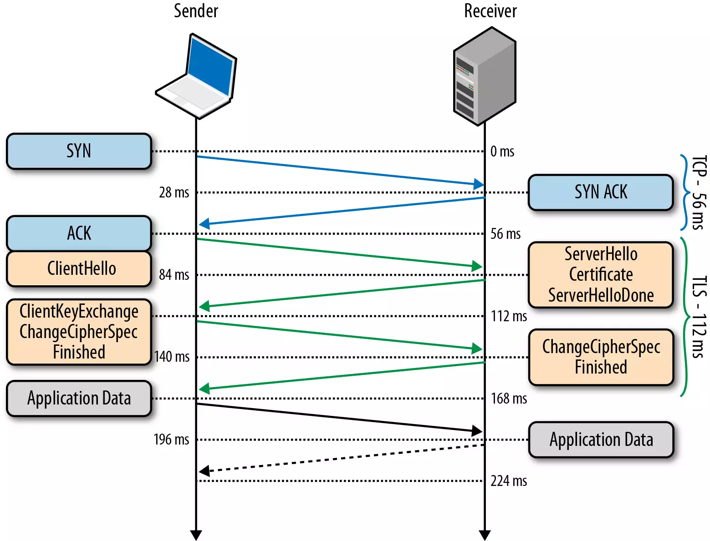

[TOC]

# TLS 笔记

[wiki文档](https://zh.wikipedia.org/wiki/%E5%82%B3%E8%BC%B8%E5%B1%A4%E5%AE%89%E5%85%A8%E6%80%A7%E5%8D%94%E5%AE%9A)

TLS是传输层安全性协议(Transport Layer Security)

SSL是socket层安全协议(Secure Sockets Layer)

TLS协议的优势是与高层的应用层协议（如HTTP、FTP、Telnet等）无耦合。应用层协议能透明地运行在TLS协议之上，由TLS协议进行创建加密通道需要的协商和认证。应用层协议传送的数据在通过TLS协议时都会被加密，从而保证通信的私密性。

## TLS 握手
抓包

握手过程

1. 完成 TCP 的三次握手
2. server 认证
    1. client 发出请求 client hello
    2. server返回 Server hello 以及 pub key
    3. 证书校验, 判断证书是否有效, 与浏览器内置的信任的根证书比对, 若是这些根证书机构或者其二级机构颁发的, 则有效.
3.  协商会话密钥
    1. 用 server_pub_key 加密 client_pub_key与 Client_session_key 发送给server
    2. server 用自己的 server_pri_key 解密, 得到 client_pub_key, 用该 key 加密 server_session_key 发送给 client
    3. client收到 server_session_key
4. 之后切换为对称加密, 使用session key 进行加密并发送加密后的数据.

## 优化

1. false start 抢跑, 在客户端发送自己的session key 的时候可以携带加密后的数据一起发送. 
2. session key信息保存, 在下次握手时可以节省协商 session key 的过程

## 参考资料

- [TLS 握手优化详解](https://imququ.com/post/optimize-tls-handshake.html)
- [微软TLS handshake](https://docs.microsoft.com/en-us/windows/desktop/secauthn/tls-handshake-protocol)