#  atoms design

原文 [http://atomicdesign.bradfrost.com](http://atomicdesign.bradfrost.com)

## 原理

参考真实世界的物质组成， 真实时间由原子 -> 分子 -> 生物体

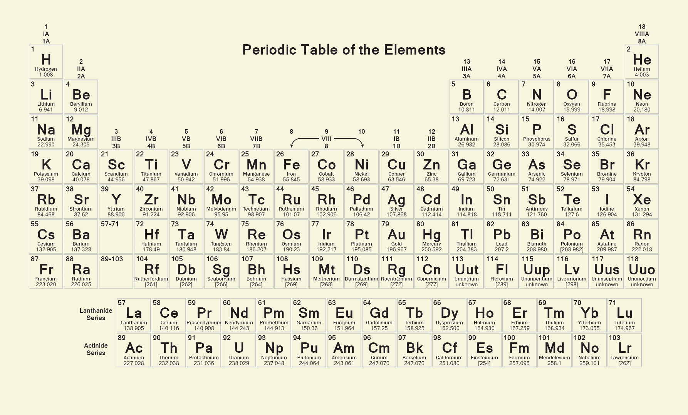

在 web 开发中的原子

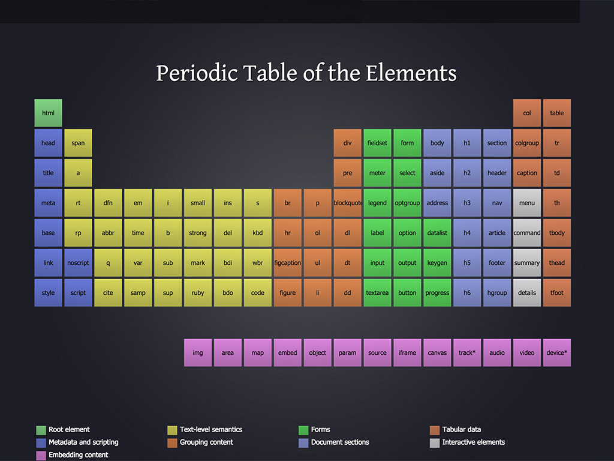

由此利用物质世界的组成对应到 web 开发中

可以划分为以下5个层次

- Atoms
- Molecules
- Organisms
- Templates
- Pages

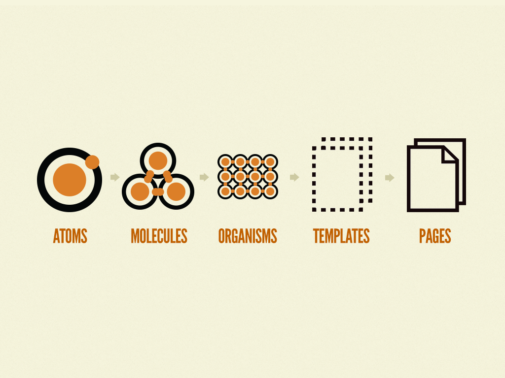

5个层次不是线性的关系， 他们一起完成了页面的交互

## 原子 atoms

atoms 作为物质世界的最小单位， 在 web 开发中对应最小的元素。比如 span, input, text 等基本元素

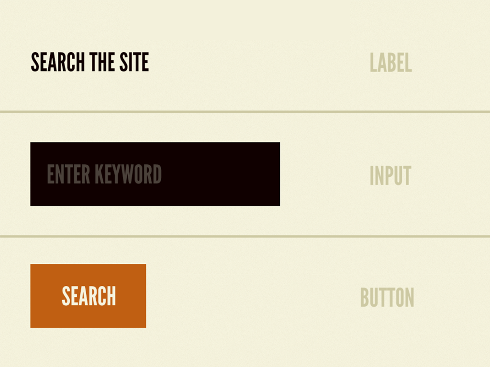

## 分子 Molecules

分子是由原子通过化学键之间的相互作用组合而形成的有一定空间结构的整体。

在 web 开发中 Molecules 对应基本的 UI 组件， 比如 label, input, text 组合而形成的搜索框组件。

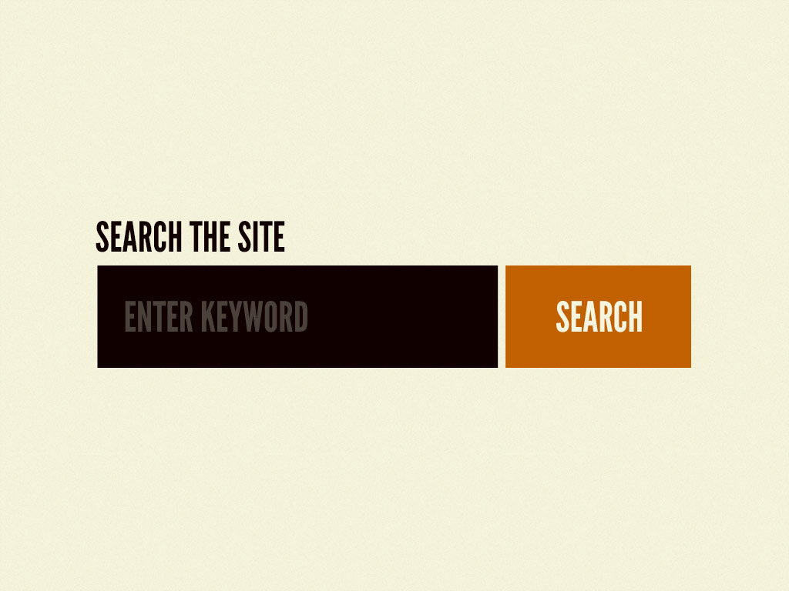

## 组织 Organisms

组织是一种由分子，原子或其他组织组成的一种复杂的 UI 组件。

如页面的 header

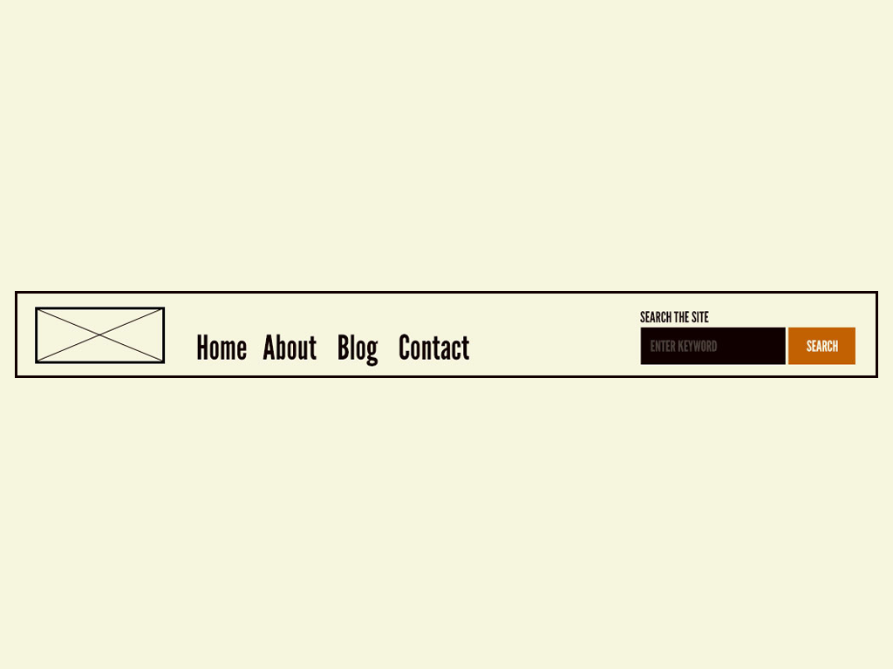

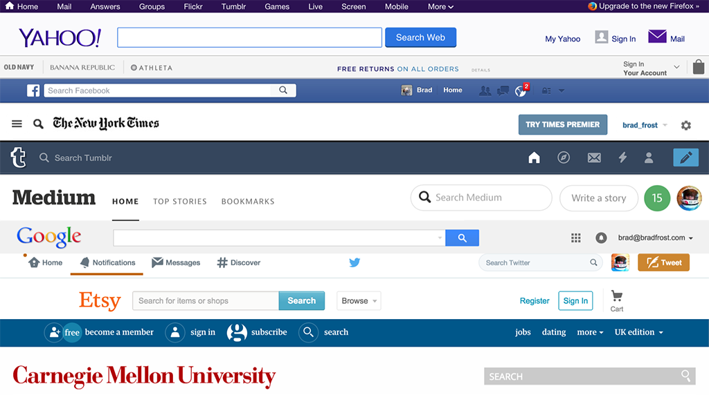

## 页面模板 Templates

原子， 分子，组织的组成形式可以帮助理解页面的组成结构。
接下来回归到 web 页面的术语
模板是页面级别的对象， 用来生成页面的骨架，以及组件的坑位。

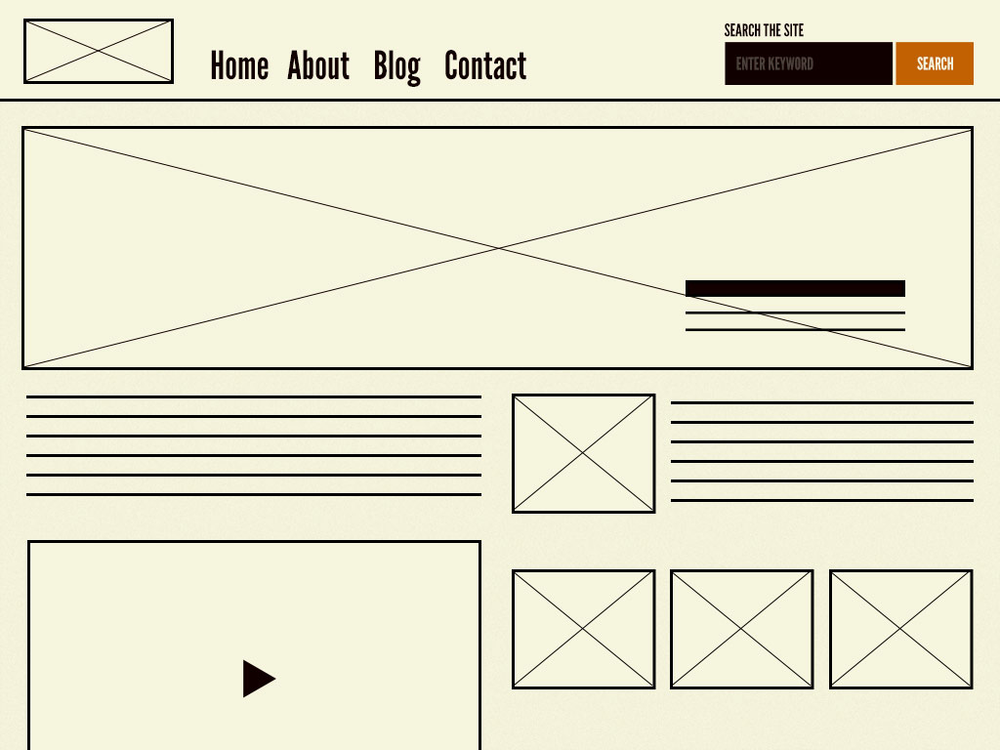

## 页面 Pages

页面是模板的一个实例，填充数据之后，渲染出最后的可视的 UI 视图， 

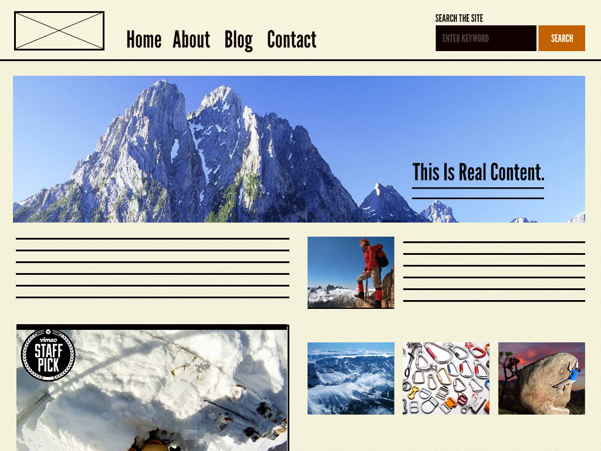

## 5大元素总结

- Atoms 是基本的 UI 元素， 不能再被拆分
- Molecules 是由 Atoms 组成的简单的 UI 组件
- Organisms 是相对复杂的独立组件。 组成界面的基本结构。 由 Atoms, Molecules 或其他 Organisms 组成。
- Templates 是一种布局结构， 构成页面骨架， 内部存放其他的组件。
- Pages 模板加载数据之后， 渲染生成最终的页面。

## Atomic Design 的优势

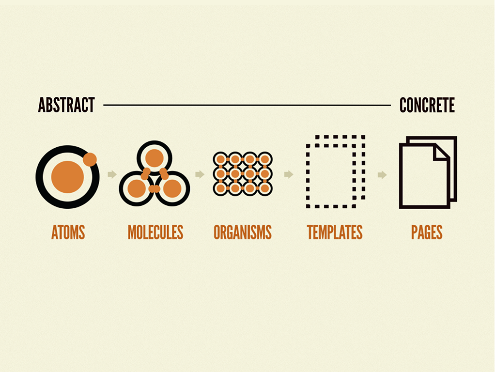

使用 Atomic design，可以使我们快速的在抽象与具体之间进行转换。 可以同时看到界面使怎么拆分成基本元素，以及如何由基本元素组成页面， 并构成最终的用户体验。

Atomic design 提供了一种描述页面结构的语言。

## 创建可持续的设计系统 Creating maintainable design systems

一个设计体系需要能够不断的扩展

一个可持续的设计系统需要做到以下几点

- 官方
- 可是英
- 可维护
- 跨学科
- 易用 approachable
- 可见 visible
- 更强大
- 独立的
- 上下文相关
- make it last

### Official

为了设计体系的长期发展，需要得到自己组织官方的认可和支持。
如何赢得自己组织的支持，可以参考以下步骤：

- Make a thing
- Show that it`s useful
- Make it official

#### Make a thing

首先初步建立一个基础， 可以给大家演示讲解。
从一个项目起步引入自己的 design system 是最好的启动方式。 
在项目中整理自己的 UI patterns，并准备好可以应用到其他项目中。
利用一个周末的时间久可以建立起 pattern library 基础

#### Show that it`s useful

向 leader 展示该模式的优势以及必要性。 可以从其提高效率， 节省时间，费用等优势出发。
最好能得到同事的背书与支持。

#### Make it official

得到组织以及 leader 的认可之后，接下来需要开始开发计划，使该方案更完善。

- 准备相关的人力资源
- 接下来的开发计划
- 项目管理策略
- 准备产品 roadmap

#### Establishing a design system team

建立团队，推动该设计体系在团队内的使用

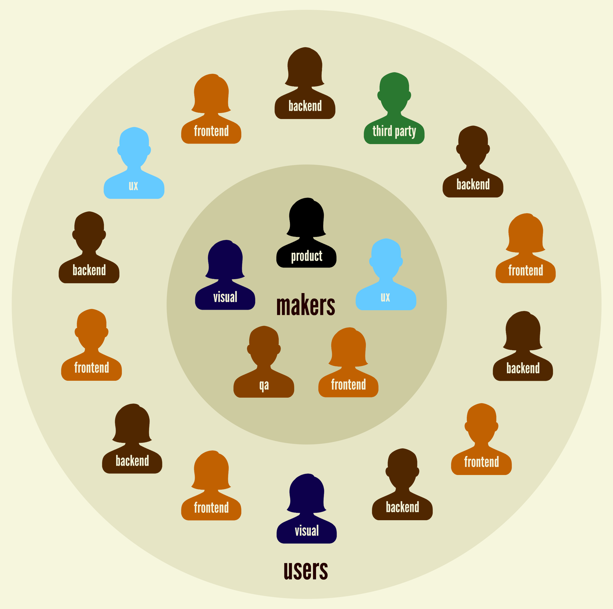

### Make it adaptable

一个设计体系不应该是一成不变的，会需要不断的完善，修改, 进化。 所以需要提供punches, feedback

如何管理改变，可以从以下几点考虑：

- What happens when an existing pattern doesn’t quite work for a specific application? Does the pattern get modified? - Do you recommend using a different pattern? Does a new pattern need creating?
- How are new pattern requests handled?
- How are old patterns retired?
- What happens when bugs are found?
- Who approves changes to the design system?
- Who is responsible for keeping documentation up to date?
- Who actually makes changes to the system’s UI patterns?
- How are design system changes deployed to live applications?
- How will people find out about changes?

### Make it maintainable 可维护性

设计体系应该是经常维护的， 包括文档更新， bug 修复等
很多系统开发到后面会越来越臃肿， 要修改什么东西非常麻烦。最后会因为维护成本太高而弃用， 

### Make it cross-disciplinary

一个 style guide 可以为公司建立一套通用的风格语言， 可以应用于每个产品。 
使工作更高效，沟通更便利，协作更通畅。
因此 style guide 应该是提供给所有人的共识，不仅是 design systems 的用户。

### Make it approachable

注意 pattern library， style guide, 文档等的外观， 使其看起来舒服，友好，易于浏览
为文档制作一个吸引人的主页，可以 can lead to more usage, help build awareness, help create organizational investment, and help get non-developers’ eyeballs on the style guide.

### Make it visible

design system 应该是可见的。需要提供一个页面来展示所做的工作

包括以下几点：
- 系统的改动： change logs, roadmap, 成功案例，注意事项
- 使用教程
- 技术支持：issues 等

### Make it bigger

逐步完善并扩展 pattern library

### Make it context-agnostic

组件命名应该是与上下文无关。
比如 “主页轮播图” 会限制该组件的使用，相反命名为“轮播图”会有更多的使用场景。

### Make it contextual

UI patterns 在 pattern library 中展示时应提供相应的场景。 而不是只展示一个组件。

### Make it last

使 design patterns 能够延续下去。 design patterns不仅为公司提供了更好的展示效果，同时也是自己长期的成功。

