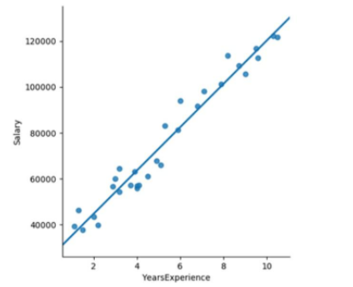
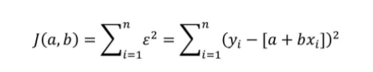
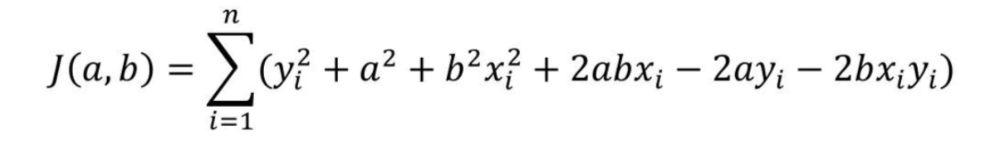

[TOC]

# 线性回归

参考 从零开始学Python数据分析与挖掘 - 

线性回归属于经典的统计学模型, 应用场景是根据已知的变量(自变量)来预测某个连续的数值变量(因变量)

站在数据挖掘的角度看, 它属于一种有监督的学习算法. 

## 一元线性回归模型

模型中只有一个自变量和因变量

数学公式为 $y = a + b * x + ε$

### 拟合线的求解

求拟合线即求 即求 a, b 的值.
误差项ε是为了平衡等号两边的值，如果拟合线能够精确地捕捉到每一个点（所有的散点全部落在拟合线上），那么对应的误差项ε应该为0。按照这个思路来看，要想得到理想的拟合线，就必须使误差项ε达到最小。

$$ε = y - (a + b * x)$$

可得到以下公式

第一步：展开平方项

第二步: 使用偏导数分别求出a,b

$$
\begin{cases}
\frac {\partial_J} {\partial_a} = \sum_{i=1}^n (0 + 2a + 0 + 2bx_i - 2y_i - 0) = 0 \\
\frac {\partial_J} {\partial_b} = \sum_{i=1}^n (0 + 0 + 2bx_i^2 + 2ax_i - 0 - 2x_iy_i) = 0
\end{cases}
$$

计算步骤如下

$$
\begin{cases}
\frac {\partial_J} {\partial_a} = 0 + 2an + 0 + 2b\sum_{i=1}^nx_i - 2\sum_{i=1}^ny_i - 0 = 0 \\
\frac {\partial_J} {\partial_b} = 0 + 0 + 2b\sum_{i=1}^nx_i^2 + 2a\sum_{i=1}^nx_i - 0 - 2\sum_{i=1}^nx_iy_i= 0
\end{cases}
$$

$$
\begin{cases}
a + b\sum_{i=1}^nx_i - \sum_{i=1}^ny_i = 0 \\
b\sum_{i=1}^nx_i^2 + a\sum_{i=1}^nx_i  - \sum_{i=1}^nx_iy_i= 0
\end{cases}
$$

得到 a 的值

$$
a=\frac {\sum_{i=1}^ny_i - b\sum_{i=1}^nx_i} n
$$

代入公式二

$$
b\sum_{i=1}^nx_i^2 + (\frac {\sum_{i=1}^ny_i - b\sum_{i=1}^nx_i} n)\sum_{i=1}^nx_i  - \sum_{i=1}^nx_iy_i= 0
$$

得到 b 的值

$$
b = \frac {\sum_{i=1}^nx_iy_i -  \frac 1 n {\sum_{i=1}^ny_i\sum_{i=1}^nx_i}} {\sum_{i=1}^nx_i^2 - \frac 1  n(\sum_{i=1}^nx_i)^2}
$$

xi, yi 都是已知数据. 代入实际数据可求得 a, b 的值

