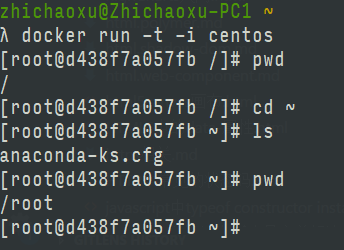
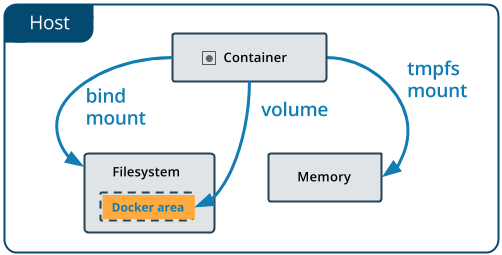

# Docker

[TOC]

## 简介

Docker 是一个软件容器平台, 通过对进程进行封装格力, 属于操作系统层面的虚拟化技术.  由于隔离的进程独立于宿主和其它的隔离的进程, 因此也称为容器.

容器是将软件打包成标准化单元, 以用于开发, 交付和部署

- 容器镜像是轻量的, 可执行的独立软件包, 包含软件运行所需的所有内容: 代码, 运行时环境, 系统工具, 系统库和设置. 
- 容器化软件适用于基于Linux和windows的应用, 在任何一种环境中都能始终如一的运行
- 容器赋予了软件独立性

## Docker 思想

- 集装箱
- 标准化: 运输方式, 存储方式, API接口
- 隔离

## Docker 容器的特点

Docker能够自动执行重复性任务, 例如搭建和配置开发环境. 
用户可以方便的创建和使用容器, 把自己的应用放入容器, 容器还可以进行版本管理, 复制, 分享, 修改

- 轻量: 
在一台机器上运行的多个Docker容器可以共享这台机器的操作系统内核; 它们能够迅速启动, 只需占用很少的计算和内存资源. 镜像是通过文件系统层镜像构造的, 并共享一些公共文件, 这样就能尽量降低磁盘用量, 并能更快地下载镜像

- 标准:
Docker 容器基于开放式标准, 能够在所有主流Linux, Windows以及VM等设备上运行.

- 安全:
Docker 赋予应用的隔离性不仅限于彼此隔离, 还独立于底层的基础设施.  因此应用出现问题, 也只是单个容器的问题, 而不会簸箕到整台机器.

## 为什么要用Docker

- Docker的镜像提供了除内核外完整的运行时环境, 确保了应用运行环境的一致性.
- 可以做到秒级, 毫秒级的启动时间. 
- 避免公用的服务器,资源会受到其他用户的影响
- 可以非常方便的将一个平台上的应用迁移到另一个平台上.
- 可以通过定制应用镜像来实现持续集成, 持续交付,部署

## 基本概念

- Image 镜像 
- Container 容器
- Repository 仓库

## Docker 安装

[官网下载](https://docs.docker.com/install/)

## 启动一个centos

```bash
$ docker run centos # 会安装 centos 镜像
$ docker run -t -i centos # 启动一个交互式的centos容器
```



```bash
$ exit # 退出
```

退出交互式terminal, 并且不终止进程. ctrl+P, ctrl+Q

## 常用命令

```bash
$ docker image ls # 列出已安装的image镜像

$ docker ps 显示容器

$ docker logs 显示容器中的标准输出

$ docker stop 停止一个运行中的容器
```

## Dockerfile

定义容器内的环境. 网络接口, 文件系统等.

### 可用指令

https://docs.docker.com/engine/reference/builder/#entrypoint

```dockerfile
FROM busybox
ENV foo /bar
WORKDIR ${foo}   # WORKDIR /bar
ADD . $foo       # ADD . /bar
COPY \$foo /quux # COPY $foo /quux
```

#### ENTRYPOINT

ENTRYPOINT 让container作为一个可执行文件来运行

语法:

有两种形式

```docker
# exec form
ENTRYPOINT ["executable", "param1", "param2"]
# shell form
ENTRYPOINT command param1 param2
```

命令行 `docker run <image>` 后面的参数, 会追加到  exec form 后, 同时会覆盖 CMD 指令. 

docker run 的 --entrypoint 参数, 可以覆盖 dockerfile 中的 ENTRYPOINT 指令

shell form 的形式不会传递 CMD or run 命令的参数. 同时 ENTRYPOINT 的命令会以这种形式执行 /bin/sh -c <ENTRYPOINT 命令> 并且不会传入 signals. 因此不可以通过 docker stop <container> 来结束程序

有多个ENTRYPOINT时, 只有最后一个有效

**ENTRYPOINT 与 CMD 的使用**

这2个命令都可以指定container运行时要执行的命令.

共同点:
- Dockerfile需要指定最少一个 `CMD` 或 `ENTRYPOINT` 命令
- 如果container 作为一个可执行的文件, 则使用 `ENTRYPOINT`
- `CMD` 应该作为一种给 `ENTRYPOINT` 命令传递参数的方式, 或者在container中执行 ad-hoc 命令
- 如果docker run 执行时携带命令参数的时候, 会覆盖 `CMD` 命令

|  |No ENTRYPOINT|	ENTRYPOINT exec_entry p1_entry |	ENTRYPOINT [“exec_entry”, “p1_entry”] |
|--|--|--|--|
|No CMD	| error, not allowed | /bin/sh -c exec_entry p1_entry |	exec_entry p1_entry |
|CMD [“exec_cmd”, “p1_cmd”]	| exec_cmd p1_cmd	| /bin/sh -c exec_entry p1_entry |	exec_entry p1_entry exec_cmd p1_cmd|
|CMD [“p1_cmd”, “p2_cmd”]	| p1_cmd p2_cmd	| /bin/sh -c exec_entry p1_entry |	exec_entry p1_entry p1_cmd p2_cmd|
|CMD exec_cmd p1_cmd	| /bin/sh -c exec_cmd p1_cmd |	/bin/sh -c exec_entry p1_entry |	exec_entry p1_entry /bin/sh -c exec_cmd p1_cmd |

#### VOLUME

根据指定的名称创建一个挂载点. 该名称是 host 机器中的路径
docker run 初始化后会在container中创建volumne

```docker
# 使用数组, 需要使用双引号, 路径为host中的文件
VOLUME ["/data"]
# 或使用多个路径字符串
VOLUME /var/log /var/db
```

### 生成image

docker build [OPTIONS] PATH | URL | -

```
docker build -t <user name>/<custom app name>:latest .
```
参数 

```
-t 指定 tag
```

## CLI 命令

### Docker run

语法
```
docker run [OPTIONS] IMAGE [COMMAND] [ARG...]
```

示例

```
# 以交互式从image启动一个新的container, 把container 8080端口绑定到host的80端口
docker run -p 80:8080 -e NODE_ENV=development --name <container name>  -v $PWD/logs:/local/logs -t -i <imgae>:<tag> /bin/sh
```

参数

```
-d, --detach               Detached mode: run command in the background
    --detach-keys string   Override the key sequence for detaching a container
-e, --env list             Set environment variables
    --expose		           Expose a port or a range of ports
-h, --hostname string      Container host name
-i, --interactive          Keep STDIN open even if not attached
    --privileged           Give extended privileges to the command
-m, --memory bytes         Memory limit
    --mount type=<volume|bind|tmpfs|npipe>,src=<volume|host目录>,dst=<container路径>,readonly=<true|false>          Attach a filesystem mount to the container
    --name string          Assign a name to the container
-p, --publish list         Publish a container's port(s) to the host
-t, --tty                  Allocate a pseudo-TTY
-u, --user string          Username or UID (format: <name|uid>[:<group|gid>])
-v, --volume list          Bind mount a volume
-w, --workdir string       Working directory inside the container
```

如果要在后台启动container, 使用 -d 参数. 
退出一个交互式的container, 并且不终止terminal. 使用快捷键 ctrl + P, ctrl + Q

参数 mount

```
--mount type=<volume|bind|tmpfs|npipe>,src=<volume name | path in host>,dst=<path in container>,readonly=<true|false> 
```

## image

### image 管理

1.pull

```sh
docker pull [OPTIONS] NAME[:TAG|@DIGEST]
# 例子
$ docker pull node:12.18.2-alpine3.10
12.18.2-alpine3.10: Pulling from library/node
Digest: sha256:24797dd05e07cb987638c30d92914dce994a854186e2dd2f8e54117ff46bcc70
Status: Image is up to date for node:12.18.2-alpine3.10
docker.io/library/node:12.18.2-alpine3.10

$ docker images
REPOSITORY                                          TAG                  IMAGE ID            CREATED             SIZE
node                                                12.18.2-alpine3.10   f4ee33144ba0        2 months ago        89MB
```
2. commit

```sh
docker commit [OPTIONS] CONTAINER [REPOSITORY[:TAG]]

# 例子
$ docker ps

CONTAINER ID        IMAGE               COMMAND             CREATED             STATUS              PORTS              NAMES
c3f279d17e0a        ubuntu:12.04        /bin/bash           7 days ago          Up 25 hours                            desperate_dubinsky
197387f1b436        ubuntu:12.04        /bin/bash           7 days ago          Up 25 hours                            focused_hamilton

$ docker commit c3f279d17e0a  svendowideit/testimage:version3

f5283438590d

$ docker images

REPOSITORY                        TAG                 ID                  CREATED             SIZE
svendowideit/testimage            version3            f5283438590d        16 seconds ago      335.7 MB
```
2. 发布

```sh
docker push [OPTIONS] NAME[:TAG]
docker push svendowideit/testimage:version3
```

3. 删除image

```
docker rmi [OPTIONS] IMAGE [IMAGE...]
```


## container

https://docs.docker.com/engine/reference/commandline/container/

### container 相关命令

- container 管理

```
docker container ls
docker container rm
 # 列出所有的container
docker ps -a
# 移除container
docker rm [OPTIONS] CONTAINER [CONTAINER...]
# 强制删除 redis container
docker rm --force redis
```

- container 运行

```sh
# 启动 container
docker container start
docker container restart
docker container pause
# 停止正在运行的container
docker stop <CONTAINER>
# 关闭正在运行的 container
docker container kill [OPTIONS] CONTAINER [CONTAINER...]
# 在一个新 container 中运行命令
docker container run [OPTIONS] IMAGE [COMMAND] [ARG...]
# 在一个运行的container中执行命令 Run a command in a running container
docker container exec 
```

- 由image创建container

```sh
docker container create [OPTIONS] IMAGE [COMMAND] [ARG...]
```

- 文件管理

```sh
# 在 container 和本地文件间复制文件
docker container cp
```

- 文件存档

```sh
# Export a container’s filesystem as a tar archive
docker container export [OPTIONS] CONTAINER
```

- 由container创建新的image

```sh
docker commit [OPTIONS] CONTAINER [REPOSITORY[:TAG]]

# 案例
$ docker ps

CONTAINER ID        IMAGE               COMMAND             CREATED             STATUS              PORTS              NAMES
c3f279d17e0a        ubuntu:12.04        /bin/bash           7 days ago          Up 25 hours                            desperate_dubinsky
197387f1b436        ubuntu:12.04        /bin/bash           7 days ago          Up 25 hours                            focused_hamilton

$ docker commit c3f279d17e0a  svendowideit/testimage:version3

f5283438590d

$ docker images

REPOSITORY                        TAG                 ID                  CREATED             SIZE
svendowideit/testimage            version3            f5283438590d        16 seconds ago      335.7 MB
```

## docker-compose

https://docs.docker.com/compose/

用来整合一个docker应用. 把项目代码, container, 服务整合到一起, 配置文件为 docker-compose.yml, 相关配置参数 https://docs.docker.com/compose/compose-file/

```yaml
# docker-compose.yml
version: '2.0'
services:
  web:
    build: .
    ports:
    - "5000:5000"
    volumes:
    - .:/code
    - logvolume01:/var/log
    links:
    - redis
  redis:
    image: redis
volumes:
  logvolume01: {}
```

一个  docker-compose.yml 配置包含 version, services 两部分

配置文件文档  https://docs.docker.com/compose/compose-file/#compose-file-structure-and-examples


### 常用命令

- 启动应用

```
docker-compose up -d
```

参数
```
-d 后台启动
```
- 查看当前运行的应用

```
docker-compose ps
```

- 停止应用 

```
docker-compose stop
```

## 其他

### docker 数据管理 Volumes & Mounts & tmps mount

- Volumes 和 mounts 可以用于在host与container之间共同访问文件, 以共享持久数据. 
- tmpfs mount 在 host 机器的内存中保存数据, 当host重启后, 会丢失数据. 


[https://docs.docker.com/storage/volumes/](https://docs.docker.com/storage/volumes/)



#### 三种类型介绍

**Volumes**
 
在 container 创建时创建, 由docker管理, 会与host机器的核心功能隔离. 
一个volume 可以同时绑定到多个container.  如果没有正在运行的container使用该volume. 该volume仍可以被docker使用, 并且不会自动移出. 可以通过 `docker volume prune.` 来移除未使用的volume

用到的命令

```sh
# Create a volume
$ docker volume create my-vol
$ docker volume ls
local               my-vol
$ docker volume inspect my-vol
[
    {
        "Driver": "local",
        "Labels": {},
        "Mountpoint": "/var/lib/docker/volumes/my-vol/_data",
        "Name": "my-vol",
        "Options": {},
        "Scope": "local"
    }
]
$ docker volume rm my-vol
```

**Bind mounts**

docker早期就提供了该功能, 比volumes相比, 功能受限, 使用绑定挂载点时, host机器的一个文件夹会挂载到container中. 挂载的文件需要绝对路径, 因此会收到开发环境的影响. 目前推荐使用volume功能. 

**tmpfs mounts**

tmpfs 是一种非持久性的存储. 保存在内存中, 而非硬盘.  

 **npipe**
 named pipes 可以在host 和 container 之间传递.

#### Volumes 比 Mounts 的优势

- Volumes are easier to back up or migrate than bind mounts.
- You can manage volumes using Docker CLI commands or the Docker API.
- Volumes work on both Linux and Windows containers.
- Volumes can be more safely shared among multiple containers.
- Volume drivers let you store volumes on remote hosts or cloud providers, to encrypt the contents of volumes, or to add other functionality.
- New volumes can have their content pre-populated by a container.


