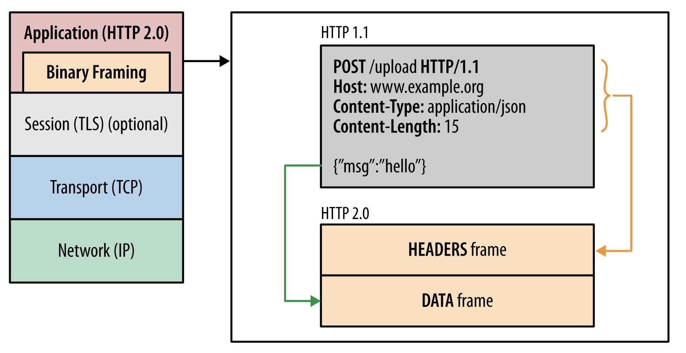
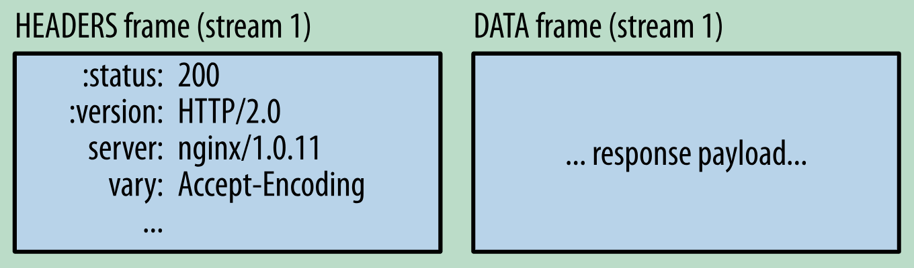

[TOC]

# HTTP 笔记

## Http1.1

Http1.1 与Http1.0的区别有

1. 缓存机制: Http1.1 引入e-tag字段
2. 带宽优化: 通过设置range字段请求资源的部分内容, 可以支持断点续传与多线程下载.
3. Host: header里增加了host字段, 支持一个服务器上服务多个域名
4. 长连接: 支持了长连接, 一个Tcp连接上可以发送多个http请求和响应.

### 并行连接

Http0.x中一个页面只能打开一个 Tcp 连接, Http1.1中支持并行连接, 不同浏览器实现不同, Chrome 支持6个

### 长连接 keep alive

 HTTP/1.0 和 HTTP/1.1（默认）都支持了持久连接。如果一个请求完成后，不会立刻断开连接，而是在一定的时间内保持连接，以便快速处理即将到来的 HTTP 请求，复用同一个 TCP 通道，直到客户端心跳检测失败或服务器连接超时。这个特性可以通过 HTTP 首部 Connection: keep-alive 来激活，客户端也可以发送 Connection: close 来主动关闭连接。

### 管道化连接

长连接可以支持重用连接来完成多次请求, 但必须满足 FIFO 的原则, 会出现队首阻塞现象

## Https

https 是在http上增加了一层TLS加密层以支持加密传输

会话过程:
1. server 认证
    1. client 发出请求
    2. server返回pub key
    3. 证书校验, 判断证书是否有效, 与浏览器内置的信任的根证书比对, 若是这些根证书机构或者其二级机构颁发的, 则有效.
2.  协商会话密钥
    1. 用 server_pub_key 加密 client_pub_key与 Client_session_key 发送给server
    2. server 用自己的 server_pri_key 解密, 得到 client_pub_key, 用该 key 加密 server_session_key 以及 application data 发送给 client
    3. client收到server_session_key, 用该 key 解密 application data
3. 之后切换为对称加密, 使用session key 进行信息传递.

## Http2

### 二进制协议

在 Http2中增加了二进制分帧层. 是在 Http API 与 socket 之间的一种新的编码进制, 可以将 Http 分割为更小的消息和帧, 并采用二进制格式进行编码.

### 数据帧

参考 [Wire Format](http://undertow.io/blog/2015/04/27/An-in-depth-overview-of-HTTP2.html)

http2 是基于 frame 的协议, 所有数据都基于帧传输.

frame 的结构

帧包括 header 和 data 两部分

frame header 包括以下几部分:

- The frame length
- The frame type
- Flags
- Stream identifier

frame types 包括:
- DATA: Carries the data in a request or response.
- HEADERS: Used to open a stream (i.e. start a request or response), it contains the headers associated with the request or response
- PRIORITY: Used to set the priority of a stream
- RST_STREAM: Forcibly terminates a stream, this is only used if one endpoint decides to cancel a stream, it is not used for normal stream termination
- SETTINGS: Establishes connection settings for the HTTP/2 connection
- PUSH_PROMISE: Sent by the server to push a response to the client
- PING: Sends a ping to the remote endpoint, which must respond with a ping of its own
- GOAWAY: Sent when an endpoint is going to close the connection
- WINDOW_UPDATE: Updates the flow control window
- CONTINUATION: Used to send additional headers if the headers are too large to fit in a single HEADERS frame

### 请求和响应混合复用 Request and response multiplexing

可以在一个连接上同时发送请求和响应, 解决了Http1.1中请求队首阻塞的问题.
- 并行交错的发送多个请求和响应, 相互之间互不影响
- 使用一个 TCP 连接发送多个请求和响应

### 数据流优先级

当 http 消息分解为许多独立的帧后, 这些帧的发送和传递顺序成为关键的性能决定因素, 因此 Http2中支持对数据流指定权重和依赖关系. 

- 优先级: 可以向每个数据流分配一个介于 1 至 256 之间的整数。
- 依赖: 每个数据流与其他数据流之间可以存在显式依赖关系。

加载顺序:

按权重比例分配资源
按依赖关系优先加载被依赖项

### 多路复用 One connection per origin

Http2中每个origin建一个 TCP 连接, 基于一个Tcp通道实现多路复用的流.

- 对网络更友好, 使用更少的 TCP 连接, 与其他流的竞争减少, 并且连接的持续时间变长, 提升网络容量的利用率.   
- 每个单独的http2连接都可以包含多个并发的流，这些流中交错的包含着来自两端的帧。流既可以被客户端/服务器端单方面的建立和使用，也可以被双方共享，或者被任意一边关闭。在流里面，每一帧发送的顺序非常关键。接收方会按照收到帧的顺序来进行处理。
- 将 http 消息分解为独立的帧, 交错发送, 在另一端再进行组装. 有很多优势

### 流控制

流控制是一种阻止发送方向接收方发送大量数据的机制，以免超出后者的需求或处理能力：发送方可能非常繁忙、处于较高的负载之下，也可能仅仅希望为特定数据流分配固定量的资源。

http2提供了一些building block 来实现服务器和客户端实现其自己的数据流和连接流的控制.

### 头部压缩

可以节省流量. 通过Hpack压缩方案进行压缩. HTTP每一次通信都会携带一组头部，大部分请求都是相同的信息, 为了减少这块的资源消耗并提升性能， HTTP/2对这些首部采取了压缩策略.
1. 首部表: 在 客户端喝服务端保存首部表来跟踪和存储之前发送到键值对, 对于相同的数据, 不再每次都发送. 
2. 首部表在 H2存续期内始终存在, 由客户端喝服务器共同渐进更新
    
### 请求中断

HTTP1.1的有一个缺点是：当一个含有确切值的Content-Length的HTTP消息被送出之后，你就很难中断它了。当然，通常你可以断开整个TCP链接（但也不总是可以这样），但这样导致的代价就是需要通过三次握手来重新建立一个新的TCP连接。一个更好的方案是只终止当前传输的消息并重新发送一个新的。在http2里面，我们可以通过发送RST_STREAM帧来实现这种需求，从而避免浪费带宽和中断已有的连接。

### server push

server主动向客户端推送资源, 暂时缓存起来, 当客户端请求资源的时候就可以尽快的提取.

## 参考资料:

- [H2中文文档](https://ye11ow.gitbooks.io/http2-explained/content/part2.html)
- [google Http2 简介](https://developers.google.com/web/fundamentals/performance/http2/)
- [IBM Http2 原理](https://www.ibm.com/developerworks/cn/web/wa-http2-under-the-hood/index.html)
- [An in depth overview of HTTP/2](http://undertow.io/blog/2015/04/27/An-in-depth-overview-of-HTTP2.html)
- [HTTP 协议中的并发限制及队首阻塞问题](https://juejin.im/post/5b8909036fb9a01a0b31a7a4)