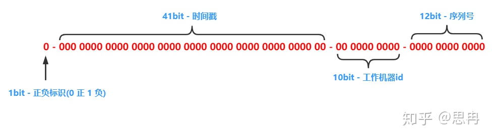

# 生成ID

## UUID 标准

rfc4122草案 https://www.cryptosys.net/pki/uuid-rfc4122.html

如下为一个uuid

```
AA97B177-9383-4934-8543-0F91A7A02836
              ^    ^
              1    2
```

特点:  位置1上只能是4, 位置2上可以是 "8", "9", "A" or "B".

生成规则
1. 生成16个随机字节, 共 128 位
2. 以下位置的字符按草案处理
    1. 第7个字节的高位字符设置为 0100'B, 因此该位置数字位4
    2. 第9个字节的2个高位字符设置为 10'B, 因此该位置的数字会是 "8", "9", "A", 或 "B"
3. 将上面的字节编码为32个十六进制数字
4. 在依次间隔 8, 4, 4, 4 和 12字节之间添加连接符 "-"
5. 输出一个32个支付的字符串结果 "XXXXXXXX-XXXX-XXXX-XXXX-XXXXXXXXXXXX"

js中实现uuid算法

```js
function uuid4() {
  let array = new Uint8Array(16)
  crypto.getRandomValues(array)

  // manipulate 9th byte
  array[8] &= 0b00111111 // clear first two bits
  array[8] |= 0b10000000 // set first two bits to 10

  // manipulate 7th byte
  array[6] &= 0b00001111 // clear first four bits
  array[6] |= 0b01000000 // set first four bits to 0100

  const pattern = "XXXXXXXX-XXXX-XXXX-XXXX-XXXXXXXXXXXX"
  let idx = 0

  return pattern.replace(
    /XX/g,
    () => array[idx++].toString(16).padStart(2, "0"), // padStart ensures leading zero, if needed
  )
}
```

## 雪花算法 snowflake

snowflake算法是Twitter开源的分布式ID生成算法，结果是一个long长整型的ID。结构如下：



1、第一位末使用，固定为0，表示正数。
2、接下来的41位为毫秒级时间，41位的长度可以使用69年。
3、然后是10位节点ID，最多支持部署1024个节点（一般是数据中心编号和机器编号组成）。
4、最后12位是毫秒内单位的算法调用计数（意味着每个节点每毫秒产生4096个ID序号）。
上面4部分组合起来就是64比特位= 8字节=Long类型（转换为整数最多19位）。


SnowFlake算法的优点：

- 高性能高可用：生成时不依赖于数据库，完全在内存中生成。
- 容量大：每秒中能生成数百万的自增ID。
- ID自增：存入数据库中，索引效率高。

SnowFlake算法的缺点：

依赖与系统时间的一致性，如果系统时间被回调，或者改变，可能会造成id冲突或者重复。
