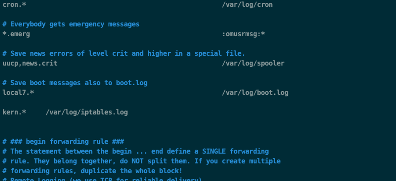

# IPTables

配置网络防火墙

## 查看规则

```bash
$ iptables -L
# 输出
Chain INPUT (policy DROP)
target     prot opt source               destination
ACCEPT     all  --  anywhere             anywhere             ctstate RELATED,ESTABLISHED
ACCEPT     all  --  anywhere             anywhere
DROP       all  --  anywhere             anywhere             ctstate INVALID
```

指定类型查看

```bash
# 可选参数如下
$ iptables -S 
-P INPUT ACCEPT
-P FORWARD DROP
-P OUTPUT ACCEPT
-N DOCKER
-N DOCKER-ISOLATION-STAGE-1
-N DOCKER-ISOLATION-STAGE-2
-N DOCKER-USER
-A FORWARD -j DOCKER-USER
-A FORWARD -j DOCKER-ISOLATION-STAGE-1
-A FORWARD -o docker0 -m conntrack --ctstate RELATED,ESTABLISHED -j ACCEPT
-A FORWARD -o docker0 -j DOCKER
-A FORWARD -i docker0 ! -o docker0 -j ACCEPT
-A FORWARD -i docker0 -o docker0 -j ACCEPT
-A DOCKER -d 192.168.10.7/32 ! -i docker0 -o docker0 -p tcp -m tcp --dport 8899 -j ACCEPT
-A DOCKER -d 192.168.10.5/32 ! -i docker0 -o docker0 -p tcp -m tcp --dport 443 -j ACCEPT
-A DOCKER -d 192.168.10.5/32 ! -i docker0 -o docker0 -p tcp -m tcp --dport 80 -j ACCEPT
-A DOCKER -d 192.168.10.6/32 ! -i docker0 -o docker0 -p tcp -m tcp --dport 443 -j ACCEPT
-A DOCKER -d 192.168.10.6/32 ! -i docker0 -o docker0 -p tcp -m tcp --dport 80 -j ACCEPT
-A DOCKER-ISOLATION-STAGE-1 -i docker0 ! -o docker0 -j DOCKER-ISOLATION-STAGE-2
-A DOCKER-ISOLATION-STAGE-1 -j RETURN
-A DOCKER-ISOLATION-STAGE-2 -o docker0 -j DROP
-A DOCKER-ISOLATION-STAGE-2 -j RETURN
-A DOCKER-USER -j RETURN
```

```bash
# 查看INPUT链中的规则

iptables -S TCP
 
# Output
-N TCP
-A TCP -p tcp -m tcp --dport 22 -j ACCEPT
```

## 删除规则

按行号删除规则

查看规则并显示行号

```sh
$ iptables -L --line-numbers
 
[secondary_output Output]
Chain INPUT (policy DROP)
num  target     prot opt source               destination
1    ACCEPT     all  --  anywhere             anywhere             ctstate RELATED,ESTABLISHED
2    ACCEPT     all  --  anywhere             anywhere
3    DROP       all  --  anywhere             anywhere             ctstate INVALID
4    UDP        udp  --  anywhere             anywhere             ctstate NEW
5    TCP        tcp  --  anywhere             anywhere             tcp flags:FIN,SYN,RST,ACK/SYN ctstate NEW
6    ICMP       icmp --  anywhere             anywhere             ctstate NEW
7    REJECT     udp  --  anywhere             anywhere             reject-with icmp-port-unreachable
8    REJECT     tcp  --  anywhere             anywhere             reject-with tcp-reset
9    REJECT     all  --  anywhere             anywhere             reject-with icmp-proto-unreachable
10   ACCEPT     tcp  --  anywhere             anywhere             tcp dpt:ssh ctstate NEW,ESTABLISHED
...
```

删除规则

```bash
iptables -D INPUT 3
```

## 设置日志

### centos7 开启日志

使用 rsyslog 记录日志

1. 编辑rsyslog配置文件

```sh
vim /etc/rsyslog.conf
```

在其中添加：
```sh
kern.*     /var/log/iptables.log
```



2. 重启日志配置

```sh
systemctl restart rsyslog.service
```

3. 让日志滚动
```sh
vim /etc/logrotate.d/syslog
```

在其中添加

```
/var/log/iptables
```

### 增加日志记录规则

```bash
# -A 添加 INPUT 链路配置
# -j LOG 定向到 log
# -p  protocal 协议配置
# --dport  目标端口
# log-prefix 配置日志的前缀
iptables -A INPUT -j LOG -p udp --dport 80 --log-prefix "udp 80** "
```

## 参考资料

- [CentOS7如何开启iptables日志](https://www.crowsong.xyz/1294.html)
- [Iptables 指南](https://www.frozentux.net/iptables-tutorial/cn/iptables-tutorial-cn-1.1.19.html#LOGTARGET)
