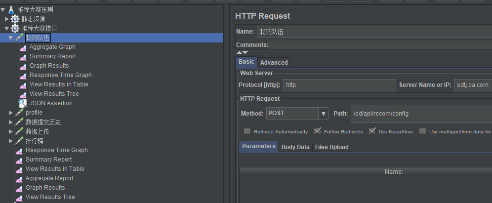
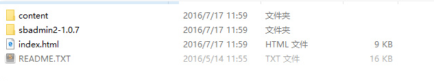
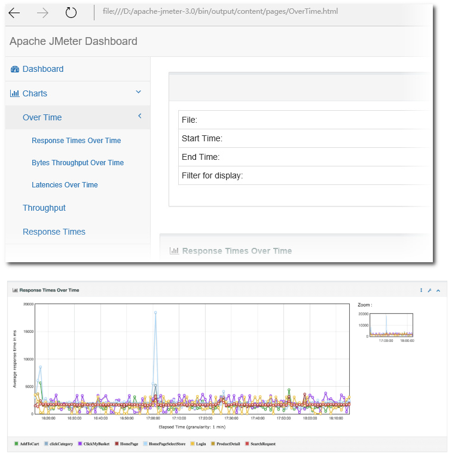

# Jmeter

Jmeter 是一个用来测试的软件, 基于java开发, 需要在java环境下运行


## 配置



## 生成报告

参考资料: [http://www.aloo.me/2016/07/17/JMeter%E6%80%A7%E8%83%BD%E6%B5%8B%E8%AF%953-0%E6%97%B6%E4%BB%A3%E4%B9%8B-%E5%A4%9A%E7%BB%B4%E5%BA%A6%E7%9A%84%E5%9B%BE%E5%BD%A2%E5%8C%96HTML%E6%8A%A5%E5%91%8A/](http://www.aloo.me/2016/07/17/JMeter%E6%80%A7%E8%83%BD%E6%B5%8B%E8%AF%953-0%E6%97%B6%E4%BB%A3%E4%B9%8B-%E5%A4%9A%E7%BB%B4%E5%BA%A6%E7%9A%84%E5%9B%BE%E5%BD%A2%E5%8C%96HTML%E6%8A%A5%E5%91%8A/)


可以生成一个html文件的数据报告

打开以下配置, 可以配置在user.properties或者jmeter.properties中

```
jmeter.save.saveservice.bytes = true
jmeter.save.saveservice.label = true
jmeter.save.saveservice.latency = true
jmeter.save.saveservice.response_code = true
jmeter.save.saveservice.response_message = true
jmeter.save.saveservice.successful = true
jmeter.save.saveservice.thread_counts = true
jmeter.save.saveservice.thread_name = true
jmeter.save.saveservice.time = true
# the timestamp format must include the time and should include the date.
# For example the default, which is milliseconds since the epoch: 
jmeter.save.saveservice.timestamp_format = ms
# Or the following would also be suitable
jmeter.save.saveservice.timestamp_format = yyyy/MM/dd HH:mm:ss
jmeter.save.saveservice.assertion_results_failure_message = true

```

生成报告有两种情况

a. 在压力测试结束时报告

基本命令格式：

```
jmeter -n -t <test JMX file> -l <test log file> -e -o <Path to output folder>
# 样例： 
jmeter -n -t jmeter/推荐大赛.jmx -l jmeter/log1.jtl -e -o jmeter-test/
```

b. 使用已有的压力测试日志文件(csv, jtl)生成报告

基本命令格式：

```
jmeter -g <log file> -o <Path to output folder>
# 样例：
jmeter -g D:\apache-jmeter-3.0\bin\testLogFile -o ./output
```

两个样例都会在\apache-jmeter-3.0\bin\output目录下产生如下文件(夹):



用浏览器打开index.html文件，即可查看各种图形化报告:




## 命令行

For load testing, you must run JMeter in this mode (Without the GUI) to get the optimal results from it. To do so, use the following command options:

-n
This specifies JMeter is to run in non-gui mode
-t
[name of JMX file that contains the Test Plan].
-l
[name of JTL file to log sample results to].
-j
[name of JMeter run log file].
-r
Run the test in the servers specified by the JMeter property "remote_hosts"
-R
[list of remote servers] Run the test in the specified remote servers
-g
[path to CSV file] generate report dashboard only
-e
generate report dashboard after load test
-o
output folder where to generate the report dashboard after load test. Folder must not exist or be empty
The script also lets you specify the optional firewall/proxy server information:

-H
[proxy server hostname or ip address]
-P
[proxy server port]
Example
```
jmeter -n -t my_test.jmx -l log.jtl -H my.proxy.server -P 8000
```
If the property jmeterengine.stopfail.system.exit is set to true (default is false), then JMeter will invoke System.exit(1) if it cannot stop all threads. Normally this is not necessary.


