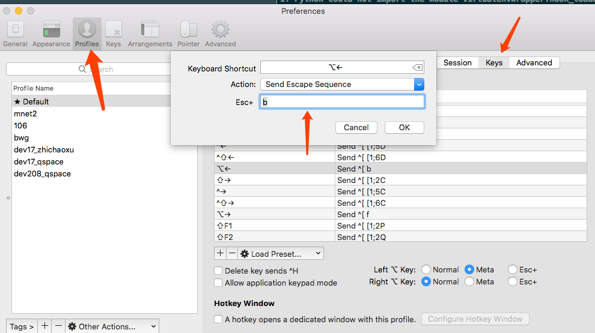
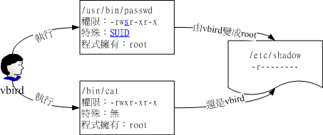

[TOC]

# Linux 学习

参考资料

1. 鸟哥私房菜 http://cn.linux.vbird.org/linux_basic/linux_basic.php
2. Linux Tools Quick Tutorial https://linuxtools-rst.readthedocs.io/zh_CN/latest/index.html#

## 1. Linux 基础

### 1.1 Linux哲学思想

>1. 一切皆文件
>2. 由众多功能单一的程序组成, 一个程序只做一件事情.
>3. 尽量避免用户交互.
>4. 使用文本文件保存配置信息.

### 1.2 终端: terminal

用户界面:

>1. GUI: GNome, KDE
>2. CLI: bash, zsh, sh, csh, tcsh, ksh ...

远程连接:

ssh协议: secure shell

#### terminal 操作快捷键


[Mac下快捷键](https://support.apple.com/zh-cn/guide/terminal/keyboard-shortcuts-trmlshtcts/mac)

[Base快捷键](https://github.com/hokein/Wiki/wiki/Bash-Shell%E5%B8%B8%E7%94%A8%E5%BF%AB%E6%8D%B7%E9%94%AE)

光标定位

mac 的 iterm 的 option + 左右方向被绑定了其他功能。需要设置快捷键映射



|操作|快捷键|
|--|--|
|重新定位插入点|在按住 Option 键的同时将指针移到新的插入点。|
|移到行首|Control-A|
|移到行尾|Control-E|
|前移一个字符|右箭头键|
|后移一个字符|左箭头键|
|前移一个字词|Option-右箭头键|
|后移一个字词|Option-左箭头键|

编辑操作

|操作|快捷键|
|--|--|
|删除到行的开头，清空当前行|Control-U|
|删除到行的结尾|Control-K|
|向前删除到字词的结尾|Option-D（选中将 Option 键用作 Meta 键后可用）|
|向后删除到字词的开头|Control-W|
|删除一个字符|Delete|
|向前删除一个字符|向前删除（或使用 Fn-Delete）|
|转置两个字符|Control-T|

#### Iterm2 快捷键

|操作|快捷键|说明
|--|--|--|
|打开命令剪贴板|Cmd + shift + H||
|快照返回| Cmd + Shift + B|查看之前时间点的面板变化|


### 1.2.1 shell 外壳

shell 是离用户最近的程序, 是用户用来连入计算机时所使用的外壳程序.

最开始 unix 中的shell 称作 shell, 之后又有别人开发了csh(接近c语言), ksh(比csh功能更强大, 有商业版社区版) 等. 
linux 中的开源shell 称作 bash. Linux发行版默认都是bash. 
zsh 功能更强大但是还不太流行. 

### 1.2.2 启动ssh

用电脑通过ssh连接虚拟机中
```
1. 查看虚拟机系统是否监听预tcp协议的22端口
~]# ss -tnl

2. 查看虚拟机的ip,  eno16777736 下面的 inet后面的地址即虚拟机的ip, 如果没有inet项, 则需要手动启动网络. 
~]# ip addr list

3. 网络没启动的情况下手动启动网络
编辑eno16777736网卡配置文件
vim /etc/sysconfig/network-scripts/ifcfg-eno16777736  
找到 ONBOOT=yes //将“no”改为“yes”, 表示是否开机启动网卡的

重启网卡
service network restart 

3. 用ping命令尝试虚拟机是否与电脑联通
在电脑上ping虚拟机,或者用虚拟机ping电脑都可以, 如果能够ping通则可以通过ssh连接.
ping (ip)

4.  如果ping不通, 查看虚拟机的防火墙设置, 确保防火墙处于关闭状态
    查看防火墙
~]# iptables -L -n 
    停止服务
    
    centos7 中
~]# systemctl disable firewalld.service
    禁用防火墙
~]# systemctl stop firewalld.service
    
    centos6中
~]# service iptables stop
~]# chkconfig iptables off

5. 可以下载Xshell, 使用ssh ip 命令连接虚拟机中的终端, 根据提示输入用户名 (root) 和密码 即可连接.

```


### 1.2.3 查看所用shell类型

```
echo $SEHLL
```

### 1.2.4 终端设备: terminal

输入和输出设备（键盘 + 显示器）。

>1. 物理终端: 控制台又叫console, 控制台终端可认为是一个PC对应的一套键盘和显示器，所有虚拟终端对应的都是同一控制台终端。
>2. 虚拟终端 tty: 软件模拟出来的终端, centos 可以有6个虚拟终端, 通过 ctrl+alt+F[1-6]能够打开相应的虚拟终端
>3. 图形终端: 通过ctrl+alt+F7 能打开图形终端
>4. 串行终端 ttyS: 与机器的串口对应，每一个串口对应一个串行终端，串口对应的是物理终端。
>5. 伪终端 pts：虚拟终端和串行终端的数目是有限的，然而，网络终端和图形终端窗口的数目确实不受限制的，这是通过伪终端实现的。

对应的文件路径

/dev/console
/dev/tty# [1,6]
/dev/ttyS# 
/dev/pts/#

在终端中输入 tty 命令可以显示的路径是当前所处的虚拟终端的文件路径

### 1.2.5 启动GUI

在某一虚拟终端中输入命令 startX 即可打开图形界面

### 1.3 系统安装

### 1.3.1 用到的命令

```
查看当前所用的字符集
localectl   

查看所有可用的字符集
localectl list-locales

设置字符集
localectl set-locale LANG=zh_CN.utf8

```

### 1.4 命令行基础

### 1.4.1 CLi 接口

命令行接口基础
[root@localhost ~]# COMMAND

>1. root: 当前登陆的用户
>2. localhost 当前主机的主机名, 非完整格式.
>3. ~ : dirName 当前所在的目录(current directory) , 相对路径
>4. \# : 命令提示符. 有 #(管理员账号, 为root. 拥有最高权限, 能执行所有操作) , $(普通用户, 非root用户; 不具有管理员权限, 不能执行系统管理类操作) 两种


建议平常使用非管理员账号登陆. 

### 1.4.2 几个基础命令

~]# tty: 查看当前的终端设备
~]# ifconfig: 查看活动接口的ip
~]# echo: 回显
~]# ping: 测试目标主机与当前主机之间的连通性

关机命令:
~]# systemctl poweroff //关机
~]# systemctl reboot //重启

### 1.4.3 程序

程序的组成部分: 二进制程序文件,  库文件,  配置文件,  帮助文件
二进制, 库文件 是可执行文件.
配置文件, 帮助文件: 可被查看内容的文件

### 1.4.4 命令的通用格式

command options arguments

命令本身也是一个可执行的程序文件, 二进制格式,  有可能会调用共享库文件

OPTIONS: 选项用来指定命令的运行特性. 调用命令的某个功能
选项有两种形式:
短选项: -C, 如 -l, -d  一个'-' 也可以没有'-', 如果一个命令使用了多个短选项, 多数可合并.  如 ~]# ls -l -d /var  === ~]# ls -ld /var
长选项: --word. 如 --help  两个'-';

有的选项可以带参数, 与命令参数不同. 

ARGUMENTS: 命令参数, 是命令的作用对象. (命令对什么生效).  如 ~]# ls /var (作用在var路径上). 
有的命令可以带多个参数, 参数之间以空格分割, 如 ls -ld /var /etc

### 1.4.5 命令存放目录

系统程序文件主要存放目录: /bin  /sbin  /usr/bin  /usr/sbin
普通命令: /bin   /usr/bin  /usr/local/bin 
管理命令: /sbin   /usr/sbin   /usr/local/sbin

共享库: /lib,  /lib64,  /usr/lib,  /usr/lib64,  /usr/local/lib,  /usr/local/lib64
32bit库: /lib, /usr/lib, /usr/local/lib
64bit库: /lib64, /usr/lib64, /usr/local/lib64

注意： 并非所有命令都有一个在某目录下的与之对应的可执行程序文件

命令必须遵循特定的格式规范：  如exe,  msi,  ELF(LINUX)

命令分为两类:

>1. 由shell程序自带的命令: 内置命令(builtin)
>2. 独立的可执行程序文件.

### 1.4.6 环境变量

查看当前的环境变量, 命令会从左到右在以下文件夹中查找命令
~]# echo $PATH

### 1.4.7 查看命令类型

通过以下命令可以查看命令类型是内置命令还是独立的命令
~]# type COMMAND 
如 type ls

### 1.4.8 获取命令帮助

对于内部命令: help COMMAND
如 ~]# help type

外部命令:
1. 获取简要帮助   ~]# ls --help
2. 使用手册 manual  
   位置: /usr/share/man
 # man COMMAND

### 1.4.9 几个基础命令

```
~]# cd  // change directory
~]# ls  // list  列出文件,
~]# ls -a  // list all 列出所有文件,包括隐藏文件
~]# ls -A  // list all 列出所有文件,不包括 .  .. 文件
~]# ls -l  // list long 列出文件的详细信息
~]# ls -lh  // list long human readable 列出文件的详细信息， 文件大小以容易读的形式表示(如k, M),换算后的数值可能不精确
~]# ls -ld  // list long directory 列出目录的详细信息
~]# ls -r  // list reverse 逆序列出目录
~]# ls -lr  // list reverse 逆序列出目录详细信息
~]# ls -R  // list recursive 递归列出目录文件
~]# ls -l ./ --block-size=M 以 MB 显示文件大小

~/# cat  /etc/fstable // concatenate  文本文件查看工具
~/# cat -n /etc/fstable // concatenate number 查看文本文件并给每行编号显示(不影响实际文件)
~/# cat -E /etc/fstable // concatenate end  每行末尾显示"$" 付号

~/# tac  /etc/fstable //   每行逆序文本文件查看工具
~/# tac -n /etc/fstable //  number 行逆序查看文本文件并给每行编号显示(不影响实际文件)
~/# tac -E /etc/fstable //  end  行逆序 每行末尾显示"$" 付号

~/# file /etc/fstable  // 查看文件类型

~]# echo [SHORT-OPTION] [STRING]// 回显, echo 后面可以直接接字符串, 用引号包裹. 双引号(弱引用), 单引号(强引用, 变量不再起作用)
~]# echo "你好" // 直接打印字符串 
~]# echo -n "你好" // not  打印结果后不换行.
~]# echo -e "\n你好" // escape 执行转义字符. \n  换行符, \b 删除功能,  \t 制表符
如 
~]# echo -e abc\n123'
abc
123
~]# shutdown // 关机命令
~]# shutdown -h // 关机
~]# shutdown -r // 重启
~]# shutdown -c // 取消关机
~]# shutdown -r +10 '注意保存信息,马上要重启了' // 10分钟后重启, 命令后面可以接wall信息, 会发给每个终端用户.

date  // 显示日期时间
date +%Y-%m-%d-%H:%M:%S  // 显示为 2016-10-19-01:05:13
 
```
### 1.4.10 Linux 文件详细信息


```
drwxr-xr-x.  2 root root   18 10月 17 02:42 account
drwxr-xr-x.  2 root root    6 8月  12 2015 adm
drwxr-xr-x. 17 root root 4096 10月 17 09:48 cache
drwxr-xr-x.  2 root root    6 11月 21 2015 crash
drwxr-xr-x.  3 root root   32 10月 17 02:43 db
```

一共10位, 第一位 文件类型, 后9位表示文件权限, 每3位一组 rwx(读, 写, 执行)
d 文件类型: 
- 文件(file),
d 目录, 
b  (block) 块设备文件,
c 字符设备文件(character), 
l 付号链接文件(symbolic link file), 
s 套接字文件(socket), 
p 命令管道文件(pipe)

rwxr-xr-x
rwx 文件属主的权限owner: 
r-x 文件属组的权限group
r-x 其他用户(非属主, 非属组)的权限

2 : 数字表示文件被硬链接的次数
root : 文件的属主
root : 文件的属组
18 : 数字表示文件的大小, 单位是字节
10月 17 02:42 : 文件最近一次被修改的时间
account : 文件名

### 1.4.11 clock date Linux 时钟相关

Linux将时钟分为系统时钟(System Clock)和硬件(Real Time Clock，简称RTC)时钟两种。系统时间是指当前Linux Kernel中的时钟，而硬件时钟则是主板上由电池供电的那个主板硬件时钟，这个时钟可以在BIOS的"Standard BIOS Feture"项中进行设置。

在Linux中，用于时钟查看和设置的命令主要有date、hwclock和clock。其中，clock和hwclock用法相近，只不过clock命 令除了支持x86硬件体系外，还支持Alpha硬件体系。

```
1.在虚拟终端中使用date命令来查看和设置系统时间
    查看系统时钟的操作：
    ~]# date
    设置系统时钟的操作：
    ~]#  date 091713272003.30
    通用的设置格式：
    ~]#  date 月日时分年.秒
    2.使用hwclock或clock命令查看和设置硬件时钟
    查看硬件时钟的操作：
    ~]#  hwclock --show 或
    ~]#  clock --show
    2003年09月17日 星期三 13时24分11秒 -0.482735 seconds
    设置硬件时钟的操作：
    ~]#  hwclock --set --date="09/17/2003 13:26:00"
    或者
    ~]#  clock --set --date="09/17/2003 13:26:00"
    通用的设置格式：hwclock/clock --set --date=“月/日/年时：分：秒”。
    3.同步系统时钟和硬件时钟
    Linux系统(笔者使用的是Red Hat 8.0，其它系统没有做过实验)默认重启后，硬件时钟和系统时钟同步。如果不大方便重新启动的话(服务器通常很少重启)，使用clock或hwclock命令来同步系统时钟和硬件时钟。
    硬件时钟与系统时钟同步：
    ~]#  hwclock --hctosys
    或者
    ~]#  clock --hctosys
    上面命令中，--hctosys表示Hardware Clock to SYStem clock。
    系统时钟和硬件时钟同步：
    ~]#  hwclock --systohc
    或者
    ~]#  clock --systohc
    
    4. 日历
    ~]# cal 命令显示日历
    ~]# cal 2015 显示2015年的日历
    ~]# cal 10 2015  显示2015年10月的日历
```   
 
## 2. 一个系统的功能

>1. 文件管理
>2. 目录管理
>3. 运行程序
>4. 设备管理
>5. 软件管理
>6. 进程管理
>7. 网络管理
 
 ### 2.1 linux文件系统
 
 ### 2.1.1 
 
 linux是 rootfs 根文件系统
 
 ### 2.1.2 文件目录
 >1. /home: 家目录.
 >1. /boot: 系统启动相关的 文件, 如内核, initrd, 以及grud(bootloader)
 >2. /dev: device  设备文件. 
 
 设备文件包括块设备和字符设备.
 * 块设备: 随机访问, 类似硬盘, 按数据块为单位访问
 * 字符设备: 线性访问(类似键盘, 显示器, 一个字符一个字符输入输出), 按字符为单位 
 * 设备号: 主设备号(major), 次设备号(minor), 设备文件没有字节熟悉, 有
 >3. /etc : 配置文件, 大部分是纯文本格式. 
 >4. /lib: 库文件
库是封装好的一些功能, 可以被其他程序调用.
* 静态库. (后缀 .a ). 程序会将所需要的库封装在一起, 这种库为静态库.
* 动态库(window下为.dll, linux下为.so 共享对象 shared object), 程序在运行时调用系统的库自己不封装该库, 这样的库可以被多个程序共用. 这种库是动态库

库可以被调用, 但不能被执行(没有执行入口)

>5. /media: 挂载点, 常用来挂载移动设备(光驱, 移动硬盘之类)
>6. /mnt: 挂载点目录, 额外的临时文件系统的挂载点
>7. /opt: option, 可选目录, 第三方程序的安装目录
>8. /proc: 伪文件系统, 内核映射文件. 其中大部分文件为内核的一些可调参数, 内核的统计数据等. 将内核的一些属性状态等映射模拟为文件的形式, 实际上并不是文件.
>9. /sys: 伪文件系统. 与硬件设备相关的 属性映射文件.
>10. /tmp: 临时文件, 一般会自动清理一个月内没有被访问过的文件 /var/tmp
>11. /var: 可变化的文件. 
>12. /bin: binary 可执行文件, 用户命令. 通常是与系统启动相关的命令
>13. /sbin: 管理命令
>14. /usr: universal shared read-only 用户之间的全局共享只读文件.
* /usr/bin: /usr/lib, /usr/sbin : 一般是系统启动后系统运行所需的一些命令
* /usr/local, /usr/local/bin, /usr/local/sbin, /usr/local/lib. : 通常是第三方应用的一些命令库

### 2.2 目录管理

* ls
* cd
* pwd
### 2.2.1 mkdir命令, 创建目录
```
~#] mkdir ./aa/bb //在aa目录下创建bb目录, 如果目录aa不存在, 则报错
~#] mkdir -p ./aa/bb/cc // parent, 如果某个目录不存在, 则创建该目录并在其下创建子目录
~#] mkdir -pv ./aa/bb/cc // -v verbose 打印创建目录的详情.
~#] mkdir -pv aa/{bb,cc}/dd/ee // 用大括号同时建立多个同级和下级目录  
```
### 2.2.2 tree 命令. 显示目录树

tree命令可以通过 yum install tree -y 来安装
```
~#] tree /tmp // 显示tmp目录下的目录树结构
```

### 2.2.3 rmdir 删除目录

删除空目录

```
rmdir /tmp  // 删除目录
```

### 2.2.4 文件创建和删除

```
touch a.html //创建文件
touch -a a.html // 修改文件的访问时间为当前时间
touch -m a.html // 修改文件的修改时间为当前时间
touch -m -t 201801020304.05 a.html// 修改文件的修改时间为2018年1月2号3:04:05
stat 目录或文件 // 查看文件或目录的状态
rm a.html // 删除文件. 默认会提示, 因为rm命令是rm -i 命令的别名
rm -f a.html // 强制删除文件不提示
rm -r aa // 递归删除, 可以删除目录
```
### 2.2.5 复制文件或目录 cp 命令

```
cp SRC DEST // 复制文件从原路径到目标路径.  可以复制一个文件到一个文件, 或复制多个文件到一个目录
cp file1 file2 file3 // 复制多个文件到一个目录
cp /etc/passwd /tmp/  // 把 passwd文件复制到 tmp目录下
cp /etc/passwd /tmp/test  // 如果test不存在, 则复制passwd到tmp目录下并重命名为test. 如果test是一个目录, 则复制到tmp/test 目录下

```

### 2.2.6 移动文件或目录 mv 命令

```
mv SRC DEST  // 移动文件 从源目录到目标目录
mv /tmp/root.inittab /var/tmp/abc  // 如果abc是目录, 则移动到 abc 目录下, 如果abc不存在, 则移动到tmp目录下并重命名为abc. 如果abc是文件并且存在, 则移动后会覆盖原文件
mv abc aaa  // 把当前目录下的abc 移动到当前目录下并命名为aaa, 即文件重命名

```

### 2.2.7 复制文件并且设置属性 install 命令

```
install 源 一般都是文件
install SRC DEST // 复制文件到目标文件
install SRC ... DIRECTORY  // 复制多个文件到目标路径
install -d DIRECTORY ... // 可以用于创建目录, 可创建多个
install -m SRC DEST // 可以指定权限
```
## 3. bash 介绍及特性

### 3.1 shell 简介

shell 启动时刻: 在系统启动之后需要提供给用户一个输入命令的地方, 此时shell便启动了.  
linux允许同一个用户运行多个shell进程.
进程的生命周期是从启动到关闭为止, 进程由内核来管理.
在每个进程看来当前主机上只存在内核和当前进程, 而意识不到其他进程的存在. 
shell 中可以有子shell

### 3.2 bash 特性

>1. 支持命令历史
>2. 支持管道, 重定向
>3. 支持命令别名
>4. 支持命令行编辑
>5. 支持命令行展开
>6. 支持文件名通配
>7. 支持使用变量
>8. 支持编程

### 3.3 命令行编辑
光标跳转快捷键
ctrl + A 光标跳到行首
ctrl + E 光标跳到行尾
ctrl + D 删除光标后面的字符
ctrl + U 删除光标至命令行首的内容
ctrl + K 删除光标至命令行尾的内容
ctrl + 左右箭头 可以一次跳一个单词(有的shell不支持)
ctrl + L 清屏

### 3.4 命令历史

shell 中输入的命令会存到暂存中. 
```
history 命令 可以查看命令历史. 
history -c  // 清空命令历史
history -n // 从历史文件中读取所有未被读取的行
history -d 500 // 删除第500 条记录
history -w // 保存命令历史到历史文件中
HISTSIZE 变量 是命令历史保存的数量, echo $HISTSIZE 可以查看命令历史保存的数量
!25 // 执行命令历史中的第25条命令
!-4 // 执行命令历史中倒数第4条数据
!! // 执行上一条命令
!'字符串' // 执行命令历史中最近一个以指定字符串开头的命令. 如 !man 则执行最近的一条以man开头的命令
!$  // 引用上一个命令的最后一个参数
ESC, .  
ALT + .  // 也可以引用上一个命令的最后一个参数
```

### 3.5 命令补全

按 tab 键可以补全命令.

命令补全在$path 路径下查找

路径补全在当前所选路径下补全路径

### 3.6 命令别名 alias

alias CMDALIAS=CMD [OPTIONS] [ARGUMENTS]

在shell 中定义的别名仅在当前shell 的生命周期中有效. 

```
alias  // 查看当前shell定义的命令别名
alias cls=clear // 给clear定义别名 cls

```

### 3.7 命令替换

使用$(COMMAND) 或 `COMMAND` (反引号) 把命令中某个子命令替换为执行结果的过程

```
touch ./file-$(date +%F-%H-%M-%S).txt  // 执行之后会创建 file-2016-11-27-12-42-43.txt 这种格式的文件. 在执行后 $中的命令会执行. 得到执行后的结果
echo "当前目录是`pwd`" //输出当前目录
```

### 3.8 bash支持的引号

>1. `` : 反引号, 命令替换
>2. "" : 双引号, 弱引用, 可以实现变量替换
>3. '' : 单引号, 强引用, 不完成变量替换


### 3.9 文件名通配, globbing

*, ?, [] 等

>1. * : 匹配任意长度的任意字符
>2. ? : 匹配任意单个字符
>3. [] : 可以指定一个范围 
>4. [:space:] : 空白字符
>5. [:punct:] 标点符号
>6. [:lower:] 小写
>7. [:upper:] 大写
>8. [:alpha:] 大小写字母
>9. [:digit:] 数字
>10. [:alnum:] 数字和大小写

```
ls a* // 显示所有文件名以a开头的文件
ls a*3* // 显示文件名中以a开头包含3的文件
ls [a-z]*[0-9] //显示文件名以字母开头, 以数字结尾的文件
ls ab? //显示文件名以ab开头后面是一个任意字符的文件
```

## 4. LINUX 用户及权限

资源访问用户分为三类, 文件属主, 文件属组, 其他用户

用户是获取资源或者服务的凭证或标识. 

用户操作计算机时会创建进程, 访问计算机中的资源需要靠进程来访问. 进程被创建后也有自己的属主.  用户访问资源的权限实际上取决于当前进程的属主与当前文件的权限. 

安全上下文(secure context)

用户管理相关的命令有

useradd, userdel, usermod, passwd, chsh, chfn, finger, id, change

组管理相关的命令：

groupadd, groupdel, groupmod, gpasswd

权限管理相关命令：

chown, chgrp, chmod, umask

#### 4.1 文件权限

参考鸟哥[http://cn.linux.vbird.org/linux_basic/0220filemanager_4.php](http://cn.linux.vbird.org/linux_basic/0220filemanager_4.php)

文件权限有三种 rwx.
对于文件来说: 
r -- 可读, 可以使用 cat类的命令查看文件, 对于二进制文件的可读不是查看文本
w -- 可写, 可以编辑或删除该文件
x -- 可执行(excutable), 可以在命令提示符下当做命令提交给内核运行

对于目录来说:
r -- : 可读, 可以使用ls列出内部的所有文件
w -- : 可写, 可以在目录中创建文件
x -- : 可以使用cd切换进此命令, 也可以使用 ls -l 查看内部文件的详细信息.

几种权限的组合情况

八进制表示,  二进制表示
0 000 --- : 无权限
1 001 --x : 可执行
2 010 -w- : 写
3 011 -wx : 写执行
4 100 r-- : 可读
5 101 r-x : 读执行
6 110 rw- : 读写
7 111 rwx : 读写执行

755 rwxr-xr-x : 表示属主, 属组, 其他用户的权限情况
640 rw-r----- : 分别用八进制和字母表示的权限

**这九个字符中还包含特殊权限SUID, SGID, SBIT:**

set 权限. x位可以出现 s. 如下
```
[root@www ~]# ls -ld /tmp ; ls -l /usr/bin/passwd /usr/bin/locate /var/lib/mlocate/mlocate.db
drwxrwxrwt 7 root root 4096 Sep 27 18:23 /tmp
-rwsr-xr-x 1 root root 22984 Jan 7 2007 /usr/bin/passwd
-rwx--s--x 1 root slocate 23856 Mar 15 2007 /usr/bin/locate
```

Set UID:
当 s 这个标志出现在文件拥有者的 x 权限上时,如上 /usr/bin/passwd 这个文件的权限状态，此时就被称为 Set UID，简称为 SUID 的特殊权限。基本上SUID有这样的限制与功能：
    SUID 权限仅对二进位程序(binary program)有效(不能够用在 shell script 上面)
    运行者对於该程序需要具有 x 的可运行权限
    本权限仅在运行该程序的过程中有效 (run-time)
    运行者将具有该程序拥有者 (owner) 的权限

以passwd文件为例:
vbird 对於 /usr/bin/passwd 这个程序来说是具有 x 权限的，表示 vbird 能运行 passwd；passwd 的拥有者是 root 这个帐号；vbird 运行 passwd 的过程中，会『暂时』获得 root 的权限；/etc/shadow 就可以被 vbird 所运行的 passwd 所修改。但如果 vbird 使用 cat 去读取 /etc/shadow 时，他能够读取吗？因为 cat 不具有 SUID 的权限，所以 vbird 运行 『cat /etc/shadow』 时，是不能读取 /etc/shadow 的。我们用一张示意图来说明如下：
图 SUID程序运行的过程示意图



SGID:
与 SUID 不同的是，SGID 可以针对文件或目录来配置！

```
[root@www ~]# ll /usr/bin/locate /var/lib/mlocate/mlocate.db
-rwx--s--x 1 root slocate   23856 Mar 15  2007 /usr/bin/locate
-rw-r----- 1 root slocate 3175776 Sep 28 04:02 /var/lib/mlocate/mlocate.db
```

如果是对文件来说， SGID 有如下的功能：
- SGID 对二进位程序有用,程序运行者对於该程序来说，需具备 x 的权限
- 运行者在运行的过程中将会获得该程序群组的权限

如果针对的是目录,SGID 有如下的功能：
- 使用者若对於此目录具有 r 与 x 的权限时，该使用者能够进入此目录；
- 使用者在此目录下的有效群组(effective group)将会变成该目录的群组；

Sticky Bit:
这个 Sticky Bit, SBIT 目前只针对目录有效作用是：
    当使用者对於此目录具有 w, x 权限，亦即具有写入的权限时；
    当使用者在该目录下创建文件或目录时，仅有自己与 root 才有权力删除该文件

换句话说：当甲这个使用者於 A 目录是具有群组或其他人的身份，并且拥有该目录 w 的权限， 这表示『甲使用者对该目录内任何人创建的目录或文件均可进行 "删除/更名/搬移" 等动作。』 不过，如果将 A 目录加上了 SBIT 的权限项目时， 则甲只能够针对自己创建的文件或目录进行删除/更名/移动等动作，而无法删除他人的文件。

举例来说，我们的 /tmp 本身的权限是『drwxrwxrwt』， 在这样的权限内容下，任何人都可以在 /tmp 内新增、修改文件，但仅有该文件/目录创建者与 root 能够删除自己的目录或文件。这个特性也是挺重要的啊！你可以这样做个简单的测试：

以 root 登陆系统，并且进入 /tmp 当中；
touch test，并且更改 test 权限成为 777 ；
以一般使用者登陆，并进入 /tmp；
尝试删除 test 这个文件！

SUID/SGID/SBIT 权限配置

其中 SUID 为 u+s ，而 SGID 为 g+s ，SBIT 则是 o+t 罗！来看看如下的范例：
```
# 配置权限成为 -rws--x--x 的模样：
[root@www tmp]# chmod u=rwxs,go=x test; ls -l test
-rws--x--x 1 root root 0 Aug 18 23:47 test

# 承上，加上 SGID 与 SBIT 在上述的文件权限中！
[root@www tmp]# chmod g+s,o+t test; ls -l test
-rws--s--t 1 root root 0 Aug 18 23:47 test
```

#### 4.2 用户管理

用户: UID,  /ect/passwd 该文件下保存有每个用户的id号
组: GID, /etc/group 该文件保存有每个组的属性

影子口令: 
用户:  /etc/shadow
组:  /etc/gshadow

#### 4.3 用户类别

>1. 管理员 id: 0
>2. 普通用户 id: 1 - 2^16. 普通用户包括系统用户和一般用户
>3. 系统用户: id: 1-499
>4. 一般用户: id: 500-60000

#### 4.4 组类别

用户组类别:

>1. 管理员组
>2. 普通组. 普通组包括系统组和一般组
>3. 系统组
>4. 一般组

用户组类别可以分为私有组合基本组

>1. 私有组: 创建用户时, 如果没有为其指定所属的组, 系统会自动为其创建一个与用户名同名的组. 
>2. 基本组: 用户的默认组
>3. 附加组: 又称为额外组, 是默认组以为的其他组

#### 4.5 passwd 文件
/etc/passwd 文件保存了用户信息.每行是用冒号隔开的七个字段组成, 代表每个用户的各个信息

```
# cat /etc/passwd  // 输出类似下面这样的
root:x:0:0:root:/root:/bin/bash
bin:x:1:1:bin:/bin:/sbin/nologin
daemon:x:2:2:daemon:/sbin:/sbin/nologin
adm:x:3:4:adm:/var/adm:/sbin/nologin
lp:x:4:7:lp:/var/spool/lpd:/sbin/nologin
...

```

各字段分别为:

account: 用户名
password: 密码占位符 指向 /etc/shadow (保存加密后的密码)
UID: 用户id
GID: 用户组id 基本组id
GECOS: 可选, 用户注释信息. 通常可以保存一些用户的信息,如电话号码, 地址等.
HOMEDIR: 家目录
SHELL: 用户登陆后的默认shell,  /sbin/nologin 是不可以登陆shell

#### 4.6 shadow 文件
影子化了的密码文件， 包含系统账户的密码信息和密码的日期信息
man 5 shadow 可以查看shadow的一些字段信息
```
root:$6$XOQTrddvJiGvlL1A$Q28innaohIyP2vUPxhbjdES4mAh/dJqzdMvYviJ.w4GMnoEBsVj1eYjvryQxAdkJVQRMmq3tpDQHKiHrXJOwV1::0:99999:7:::

x3927:$6$AprF2iCMOtXUSKrP$9rYNfvqWXO2me2Awsk1TAEHo34L0r7eBgigX/RYoAAz.aQY44uJsupEINVcqeZ5hRF4hEzb4V9cw8ROpgBFPG0:17091:0:99999:7:::
```
>* account: 登陆名
>* encrypted password: 加密的密码 由3段用$符号分割的文本组成 分别是加密方法， salt， 加密后的密码密文 1表示加密方法是md5.  若没有密码则用 ！！ 表示
>* salt: 加密的盐
>* password: 用户的密码, 保存的是加密之后的
>* 最后一次更改密码的日期。
>* 密码最小使用期限
>* 密码最多使用期限
>* 密码警告时间段
>* 密码禁用期
>* 账户过期日期

加密方法:
>1. 对称加密: 加密和解密使用同一个密码
>2. 公钥加密: 每个密码都成对儿出现. 一个是公钥(public key), 一个是私钥(secret key). 
>3. 单向加密: 也叫散列加密. 或指纹加密. 可以加密, 不能解密.常用于提取数据特征码.  

单向加密有2个特征:
>1. 雪崩效应
>2. 定长输出. 

常用的单向加密算法有 
MD5: message digest, 信息摘要 128位定长输出
SHA1: secure hash algorithm 安全哈希算法 160位定长输出

#### 4.7 添加用户

useradd 和 adduser 是一样的命令
which useradd //查看useradd命令所在的路径
useradd USERNAME // 添加用户

```bash
adduser tom // 增加用户tom
passwd tom // 为tom设置密码
```
#### 4.8 查看组

cat /etc/group

四个字段分别是 组名， 密码占位符， 组id， userlist(该组所包含的用户) 

#### 4.9 添加组

groupadd GROUPNAME // 添加组


