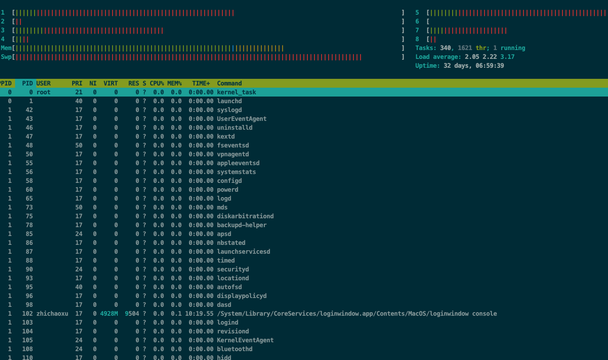
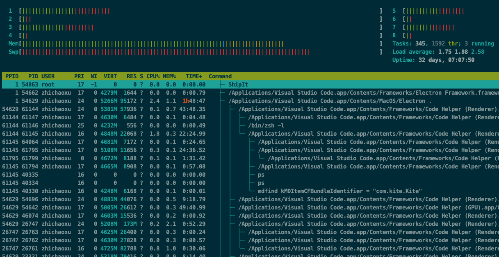

# 系统信息

## 查看 cpu 信息

### pidstat

当前运行的进程信息

```
[deploy@centos ~]$ pidstat
Linux 3.10.107-1-tlinux2_kvm_guest-0049 (centos) 	12/10/19 	_x86_64_	(4 CPU)

12:22:26      UID       PID    %usr %system  %guest    %CPU   CPU  Command
12:22:26        0         1    0.01    0.01    0.00    0.01     1  systemd
12:22:26        0         2    0.00    0.00    0.00    0.00     3  kthreadd
12:22:26        0         3    0.00    0.00    0.00    0.00     0  ksoftirqd/0
12:22:26        0         7    0.00    0.00    0.00    0.00     0  migration/0
12:22:26        0         9    0.00    0.03    0.00    0.03     1  rcu_sched
12:22:26        0        10    0.00    0.00    0.00    0.00     0  watchdog/0
12:22:26        0        11    0.00    0.00    0.00    0.00     1  watchdog/1
12:22:26        0        12    0.00    0.00    0.00    0.00     1  migration/1
12:22:26        0        13    0.00    0.00    0.00    0.00     1  ksoftirqd/1
12:22:26        0        16    0.00    0.00    0.00    0.00     2  watchdog/2
12:22:26        0        17    0.00    0.00    0.00    0.00     2  migration/2
```

### vmstat

虚拟内存信息

输出信息 processes, memory, paging, block IO, traps, disks and cpu activity.

```shell
[deploy@VM_centos ~]$ vmstat 1
procs -----------memory---------- ---swap-- -----io---- -system-- ------cpu-----
 r  b   swpd   free   buff  cache   si   so    bi    bo   in   cs us sy id wa st
 1  0      0 3666964 235192 2263272    0    0     0    11    1    0  1  0 99  0  0
 0  0      0 3666824 235192 2263272    0    0     0     0  893 1102  1  1 99  0  0
 0  0      0 3666824 235192 2263272    0    0     0    56  905 1100  1  1 99  0  0
 0  0      0 3666824 235192 2263272    0    0     0     4  948 1119  1  0 99  0  0
 0  0      0 3666824 235192 2263276    0    0     0     0  874 1074  1  1 98  0  0
 0  0      0 3666824 235192 2263276    0    0     0     0  903 1087  1  1 99  0  0
 0  0      0 3666824 235192 2263276    0    0     0     0  917 1080  2  0 98  0  0
 0  0      0 3666824 235192 2263276    0    0     0     0  914 1091  1  1 99  0  0
```

### 查看某进程的线程数量

pstree -p <pid>

```
 ✘ user@user-MB2  ~  pstree -p 79105
-+= 00001 root /sbin/launchd
 \-+= 79105 user /Applications/Google Chrome.app/Contents/MacOS/Google Chrome
   |--- 00456 user /Applications/Google Chrome.app/Contents/Frameworks/Google Chrome Framework.framework/Versions/78.0.
   |--- 00682 user /Applications/Google Chrome.app/Contents/Frameworks/Google Chrome Framework.framework/Versions/78.0.
   |--- 16602 user /Applications/Google Chrome.app/Contents/Frameworks/Google Chrome Framework.framework/Versions/78.0.
   |--- 19912 user /Applications/Google Chrome.app/Contents/Frameworks/Google Chrome Framework.framework/Versions/78.0.
   |--- 19934 user /Applications/Google Chrome.app/Contents/Frameworks/Google Chrome Framework.framework/Versions/78.0.
```

### top 命令
 
查看当前运行的进程

```
[root@VM_centos ~]$ top
top - 13:05:59 up 76 days, 19:50,  1 user,  load average: 0.06, 0.07, 0.05
Tasks: 134 total,   1 running, 133 sleeping,   0 stopped,   0 zombie
%Cpu(s):  1.0 us,  0.4 sy,  0.0 ni, 98.6 id,  0.0 wa,  0.0 hi,  0.0 si,  0.0 st
KiB Mem :  8039920 total,  3887140 free,  1625240 used,  2527540 buff/cache
KiB Swap:        0 total,        0 free,        0 used.  6049064 avail Mem

  PID USER      PR  NI    VIRT    RES    SHR S  %CPU %MEM     TIME+ COMMAND
14360 root      20   0   45228  26236   5404 S   1.0  0.3 193:54.30 sap1009
14344 root      20   0    7076   6096    692 S   0.7  0.1 682:16.60 sap1002
19986 root    20   0 4894488 107568  17716 S   0.7  1.3   0:27.48 gunicorn
19988 root    20   0 4956528 154400  17692 S   0.7  1.9   0:28.48 gunicorn
13833 root    20   0 4918756 239012  17768 S   0.3  3.0  73:32.06 gunicorn
13837 root    20   0 4848664 170320  17820 S   0.3  2.1  74:42.08 gunicorn
19968 root    20   0  224748  16912   1604 S   0.3  0.2   0:00.75 supervisord
19985 root    20   0  407368  61988   5892 S   0.3  0.8   0:25.52 gunicorn
19987 root    20   0 4928284 136708  17652 S   0.3  1.7   0:27.40 gunicorn
```

第一行是任务队列信息
top - 14:06:34 up 537 days, 6 min, 6 users, load average: 0.41, 0.45, 0.43
```
|任务队列信息|	含义|
|--|--|
|14:06:34	| 当前时间|
|537 days	| 系统运行时间|
|6 min	| 用户在线时间|
|6 users	| 在线用户数|
|load average: 0.41, 0.45, 0.43	| 系统负载，即任务队列的平均长度。1分钟前、5分钟前、15分钟前平均负载|

2)第二行为进程的信息

|进程信息	|含义|
|--|--|
|Tasks: 1 total	|进程总数|
|0 running	|正在运行的进程数|
|1 sleeping	|睡眠的进程数|
|0 stopped	|停止的进程数|
|0 zombie	|僵尸进程数|

第三行为cpu信息

|cpu信息	| 含义|
|--|--|
|6.1% us	| 用户空间占用CPU百分比|
|1.5% sy	| 内核空间占用CPU百分比|
|0.0% ni	| 用户进程空间内改变过优先级的进程占用CPU百分比|
|92.2% id	| 空闲CPU百分比|
|0.0% wa	| 等待输入输出的CPU时间百分比|
|0.0% hi	| 硬件中断|
|0.0% si	| 软件中断|
|0.0%st	| 实时|

第四、五行为内存信息。

内容如下：

|物理内存信息	| 含义|
|--|--|
|Mem: 191272k total	| 物理内存总量|
|173656k used	| 使用的物理内存总量|
|17616k free	| 空闲内存总量|
|22052k buffers	| 用作内核缓存的内存量|
|交换区信息	| 含义|
|Swap: 192772k total	| 交换区总量|
|0k used	| 使用的交换区总量|
|192772k free	| 空闲交换区总量|
|123988k cached	| 缓冲的交换区总量|

按 f 进入配置页面, 可以选择显示的列

查看某进程的各线程
```
# -d 刷新时间 -H 线程模式
top -H -p <pid> -d 0.3

top - 13:08:13 up 76 days, 19:52,  1 user,  load average: 0.09, 0.08, 0.05
Threads:   1 total,   0 running,   1 sleeping,   0 stopped,   0 zombie
%Cpu(s):  0.8 us,  0.0 sy,  0.0 ni, 99.2 id,  0.0 wa,  0.0 hi,  0.0 si,  0.0 st
KiB Mem :  8039920 total,  3885124 free,  1626588 used,  2528208 buff/cache
KiB Swap:        0 total,        0 free,        0 used.  6047584 avail Mem

  PID USER      PR  NI    VIRT    RES    SHR S %CPU %MEM     TIME+ COMMAND
13818 qspace    20   0  145444  21700   5568 S  0.0  0.3   1:17.31 gunicorn

```

## htop 用法

htop 用来查看进程占用, 比 top 交互更好



如 
```
# 按 PID 排序, 2秒刷新, 查看指定进程的
$ htop  --sort-key=PID --delay=2 --pid=67533
```
参数:
```
--sort-key=<Column> 按指定列排序
--pid=<PID> 查看指定进程
--delay=1 刷新时间
-u --user=USERNAME Show only the processes of a given user
-t --tree 以树形式查看
```

以树形式查看

```
htop -d=2 -t
```



