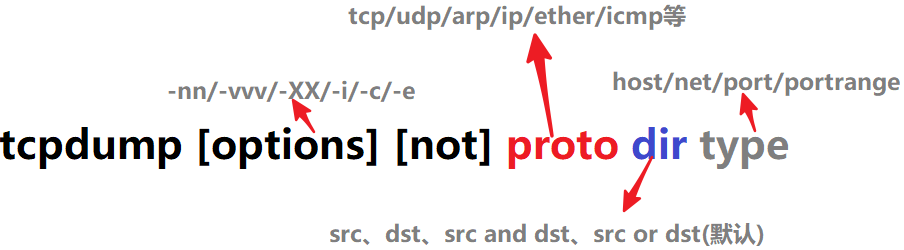

# tcpdump

## 命令格式




## 参数

```
man tcpdump
...
tcpdump [ -AbdDefhHIJKlLnNOpqStuUvxX# ] [ -B buffer_size ]
        [ -c count ]
        [ -C file_size ] [ -G rotate_seconds ] [ -F file ]
        [ -i interface ] [ -j tstamp_type ] [ -m module ] [ -M secret ]
        [ --number ] [ -Q in|out|inout ]
        [ -r file ] [ -V file ] [ -s snaplen ] [ -T type ] [ -w file ]
        [ -W filecount ]
        [ -E spi@ipaddr algo:secret,...  ]
        [ -y datalinktype ] [ -z postrotate-command ] [ -Z user ]
        [ --time-stamp-precision=tstamp_precision ]
        [ --immediate-mode ] [ --version ]
        [ expression ]
... 

-l：使标准输出变为缓冲行形式；
-c：抓包次数；
-nn：直接以 IP 及 Port Number 显示，而非主机名与服务名称；
-s ：< 数据包大小 & gt; 设置每个数据包的大小；
-i：指定监听的网络接口；
-r：从指定的文件中读取包；
-w：输出信息保存到指定文件；
-a：将网络地址和广播地址转变成名字；
-d：将匹配信息包的代码以人们能够理解的汇编格式给出；
-e：在输出行打印出数据链路层的头部信息；
-f：将外部的 Internet 地址以数字的形式打印出来；
-t：在输出的每一行不打印时间戳；
-v ：输出稍微详细的报文信息；--vv 则输出更详细信息。
expression: 是正则表达式, 可以用来过滤
```

## 案例

查看网卡

## 参考资料

- [tcpdump 抓包使用小结](https://wsgzao.github.io/post/tcpdump/)