# 数学知识

## 方差 variance (Var)

表示一组数据的离散程度, 在概率和统计中定义不同. 

在统计中, 方差表示一个变量与总体平均数的差异. 
计算方式为, 每项与平均数差值的平方的平均数
计算公式: 

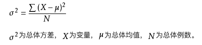

方差刻画了随机变量的取值对于其数学期望的离散程度。（标准差、方差越大，离散程度越大）

## 标准差 Standard Deviation

又常称均方差，方差是实际值与期望值之差平方的平均值，而标准差是方差算术平方根。 如下面公式, S^2 为方差, 则 S 为标准差

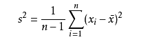

标准差与方差不同的是，标准差和变量的计算单位相同，比方差清楚，因此很多时候我们分析的时候更多的使用的是标准差。

## 数学期望 mean

在概率论和统计学中，数学期望(mean)（或均值，亦简称期望）是试验中每次可能结果的概率乘以其结果的总和，是最基本的数学特征之一。它反映随机变量平均取值的大小。

“期望值”也许与每一个结果都不相等。期望值是该变量输出值的平均数。

某城市有10万个家庭，没有孩子的家庭有1000个，有一个孩子的家庭有9万个，有两个孩子的家庭有6000个，有3个孩子的家庭有3000个。
则此城市中任一个家庭中孩子的数目是一个随机变量，记为X。它可取值0，1，2，3。
其中，X取0的概率为0.01，取1的概率为0.9，取2的概率为0.06，取3的概率为0.03。
则，它的数学期望，即此城市一个家庭平均有小孩1.11个. 

## 导数 Derivative

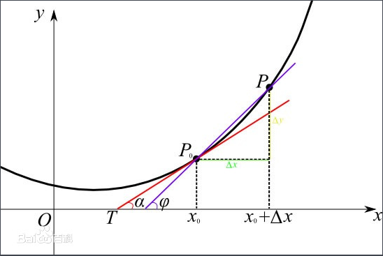

导数是微积分中的重要基础概念, 但对于函数 y=f(x), 当 x 在一个点 x0 上产生一个增量Δx 时, 函数增量 Δy 与 Δx 的比值在 Δx 趋近0时的极限a如果存在, a 即为在x0处的导数, 记作 f(x0) 或 df(x0)/dx

导数是函数的局部兴致, 一个函数在某一点的导数描述了该函数在这一点附近的变化率, 如果函数的 x 和 f(x) 都是实数的话, 函数在该点的导数就是该函数所代表的曲线在这一点上的切线斜率. 导数的本质是通过极限的概念对函数进行局部的线性逼近. 

不是所有函数都有导数, 一个函数也不一定在所有的点上都有导数. 若某函数在一个点的导数存在, 则称其在这一点可导, 否则称为不可导. 然后, 可导的函数一定连续, 不连续的函数一定不可导. 

### 求导数

求导数步骤

1. 求增量: Δy = f(x + Δx) - f(x)
2. 算比值: 
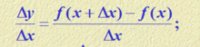

3. 求极限:
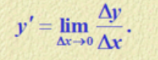

### 常见函数导数

常数导数为0
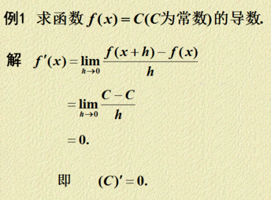

三角函数导数
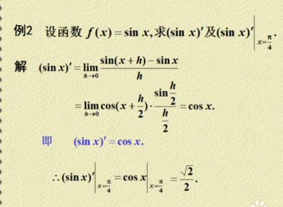

二项式导数
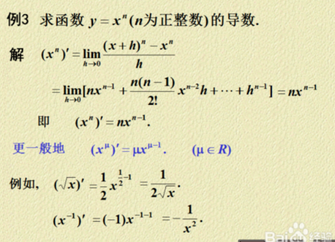

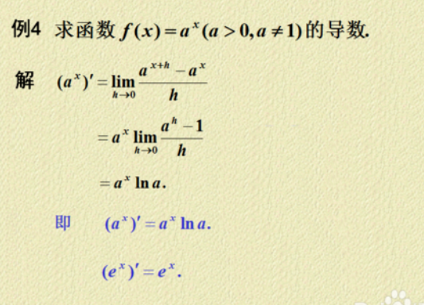

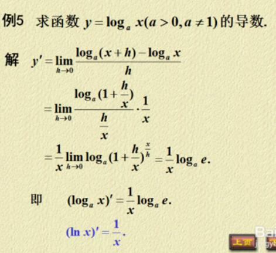

## 排列组合公式

排列 A - Arrangement:

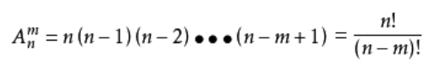

如 A(6, 2) = 6! / 2! = 6*5*4*3

组合 C - Combination:

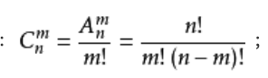

C(n, m) = C(n, n - m)

如 C(6,2) = 6! / (4! * 2!) = 6 * 5 / 2 = 15

## 二项式定理 Binomial theorem

二项式定理描述二项式的 n 次幂的代数展开. 
如
(x+y)^4 = x^4 + 4x^3y + 6x^2y^2 + 4xy^3 + y^4

推导

如 (a+b)^4, 
1. 每个取a, 则得到 1个 a^4. 
2. a^3b 为 3个取 a, 1个取 b 的结果, 共有 C(4,3) = 4 个组合
3. a^2b^2 为 2个取 a, 2个取 b 的结果, 共有 C(4,2) = 6 个组合
3. ab^3 为 1个取 a, 3个取 b 的结果, 共有 C(4,1) = 4 个组合

如下图得到 a^3b

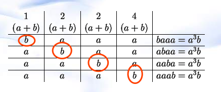

总结:

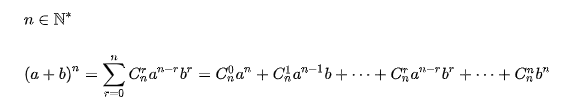

## 对数

对数是对幂的逆运算

如 y = a^x,  则 x = log(a)y

### 自然对数 (Natural logarithm)

参考 https://www.zhihu.com/question/24264370
是以e为底的对数. 记为 y = lnx
e 的定义如下, 约等于 2.718281828459

常数e的含义是单位时间内，持续的翻倍增长所能达到的极限值

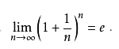

## 偏导数

参考 https://www.jianshu.com/p/235495b42e59

偏导数是对于多元函数, 固定其他变量, 保留一个自变量求得的斜率, 在几何上表示一个图形中, 对于某一点在一个确定方向上的斜率. 

在一元函数中，导数就是函数的变化率。对于二元函数研究它的“变化率”，由于自变量多了一个，情况就要复杂的多。

在 xOy 平面内，当动点由 P(x0,y0) 沿不同方向变化时，函数 f(x,y) 的变化快慢一般说来是不同的，因此就需要研究 f(x,y) 在 (x0,y0) 点处沿不同方向的变化率。

在这里我们只学习函数 f(x,y) 沿着平行于 x 轴和平行于 y 轴两个特殊方位变动时， f(x,y) 的变化率。

偏导数的表示符号为:∂。

偏导数反映的是函数沿坐标轴正方向的变化率。

在数学中，一个多变量的函数的偏导数是它关于其中一个变量的导数，而保持其他变量恒定（相对于全微分，全微分（英语：total derivative）是微积分学的一个概念，指多元函数的全增量△z}在其中所有变量都允许变化）记为dz。偏导数在向量分析和微分几何，以及机器学习中是很有用的。

的线性主部，记为{\displaystyle \operatorname {d} z}

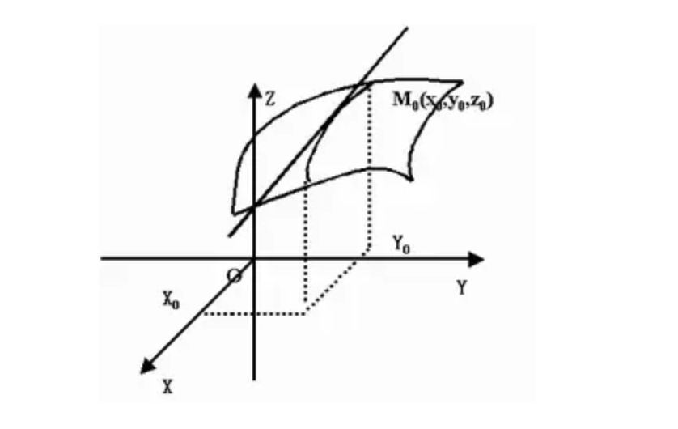

### x方向的偏导

设有二元函数 z=f(x,y) ，点(x0,y0)是其定义域D 内一点。把 y 固定在 y0而让 x 在 x0有增量 △x ，相应地函数 z=f(x,y) 有增量（称为对 x 的偏增量）△z=f(x0+△x,y0)-f(x0,y0)。

偏导数如果 △z 与 △x 之比当 △x→0 时的极限存在，那么此极限值称为函数 z=f(x,y) 在 (x0,y0)处对 x 的偏导数，记作 f'x(x0,y0)或。函数 z=f(x,y) 在(x0,y0)处对 x 的偏导数，实际上就是把 y 固定在 y0看成常数后，一元函数z=f(x,y0)在 x0处的导数。

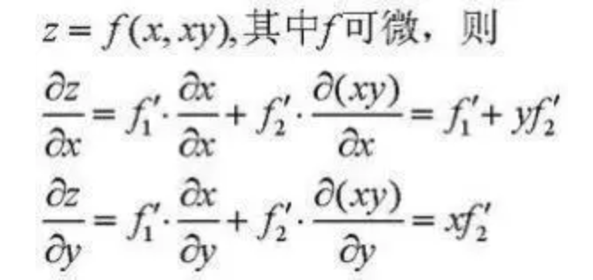

### y方向的偏导

同样，把 x 固定在 x0，让 y 有增量 △y ，如果极限存在那么此极限称为函数 z=(x,y) 在 (x0,y0)处对 y 的偏导数。记作f'y(x0,y0)。

### 相关求法

当函数 z=f(x,y) 在 (x0,y0)的两个偏导数 f'x(x0,y0) 与 f'y(x0,y0)都存在时，我们称 f(x,y) 在 (x0,y0)处可导。如果函数 f(x,y) 在域 D 的每一点均可导，那么称函数 f(x,y) 在域 D 可导。

此时，对应于域 D 的每一点 (x,y) ，必有一个对 x (对 y )的偏导数，因而在域 D 确定了一个新的二元函数，称为 f(x,y) 对 x (对 y )的偏导函数。简称偏导数。

按偏导数的定义，将多元函数关于一个自变量求偏导数时，就将其余的自变量看成常数，此时他的求导方法与一元函数导数的求法是一样的。

### 几何意义

表示固定面上一点的切线斜率。

偏导数 f'x(x0,y0) 表示固定面上一点对 x 轴的切线斜率；偏导数 f'y(x0,y0) 表示固定面上一点对 y 轴的切线斜率。

高阶偏导数：如果二元函数 z=f(x,y) 的偏导数 f'x(x,y) 与 f'y(x,y) 仍然可导，那么这两个偏导函数的偏导数称为 z=f(x,y) 的二阶偏导数。二元函数的二阶偏导数有四个：f"xx，f"xy，f"yx，f"yy。

注意：

f"xy与f"yx的区别在于：前者是先对 x 求偏导，然后将所得的偏导函数再对 y 求偏导；后者是先对 y 求偏导再对 x 求偏导。当 f"xy 与 f"yx 都连续时，求导的结果与先后次序无关。

假设ƒ是一个多元函数。例如：

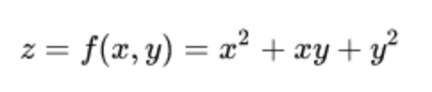

因为曲面上的每一点都有无穷多条切线，描述这种函数的导数相当困难。偏导数就是选择其中一条切线，并求出它的斜率。通常，最感兴趣的是垂直于y轴（平行于xOz平面）的切线，以及垂直于x轴（平行于yOz平面）的切线。

一种求出这些切线的好办法是把其他变量视为常数。例如，欲求出以上的函数在点（1, 1, 3）的与xOz平面平行的切线。下图显示了函数的图像以及这个平面

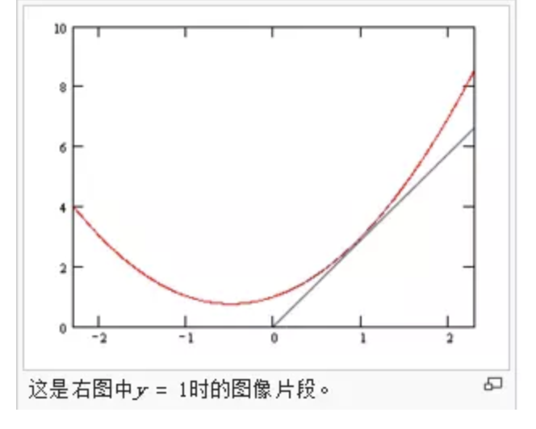

下图中显示了函数在平面y = 1上是什么样的。

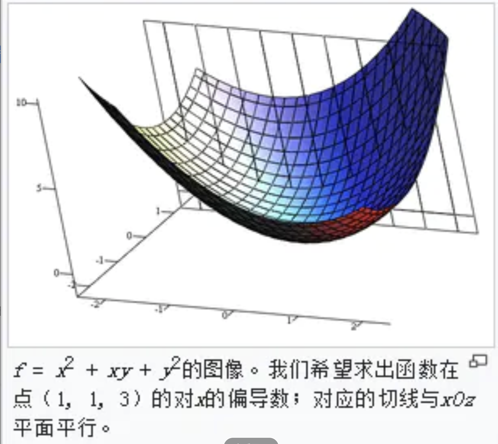

我们把变量y视为常数，通过对方程求导，我们发现ƒ在点（x, y, z）的。我们把它记为：

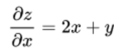

于是在点（1, 1, 3）的与xOz平面平行的切线的斜率是3。

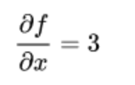

在点（1, 1, 3），或称“f在（1, 1, 3）的关于x的偏导数是3”。

### 定义

函数f可以解释为y为自变量而x为常数的函数：

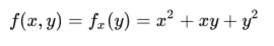

也就是说，每一个x的值定义了一个函数，记为fx，它是一个一元函数。也就是说：

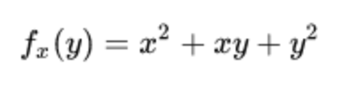

一旦选择了一个x的值，例如a，那么f(x,y)便定义了一个函数fa，把y映射到a2 + ay + y2：

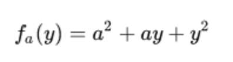

在这个表达式中，a是常数，而不是变量，因此fa是只有一个变量的函数，这个变量是y。这样，便可以使用一元函数的导数的定义：

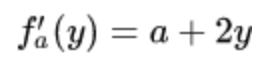

以上的步骤适用于任何a的选择。把这些导数合并起来，便得到了一个函数，它描述了f在y方向上的变化：

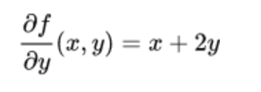

这就是f关于y的偏导数，在这里，∂是一个弯曲的d，称为偏导数符号。为了把它与字母d区分，∂有时读作“der”、“del”、“dah”或“偏”，而不是“dee”。

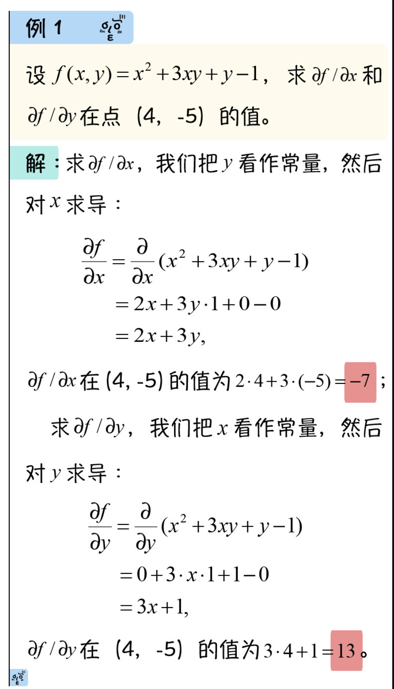

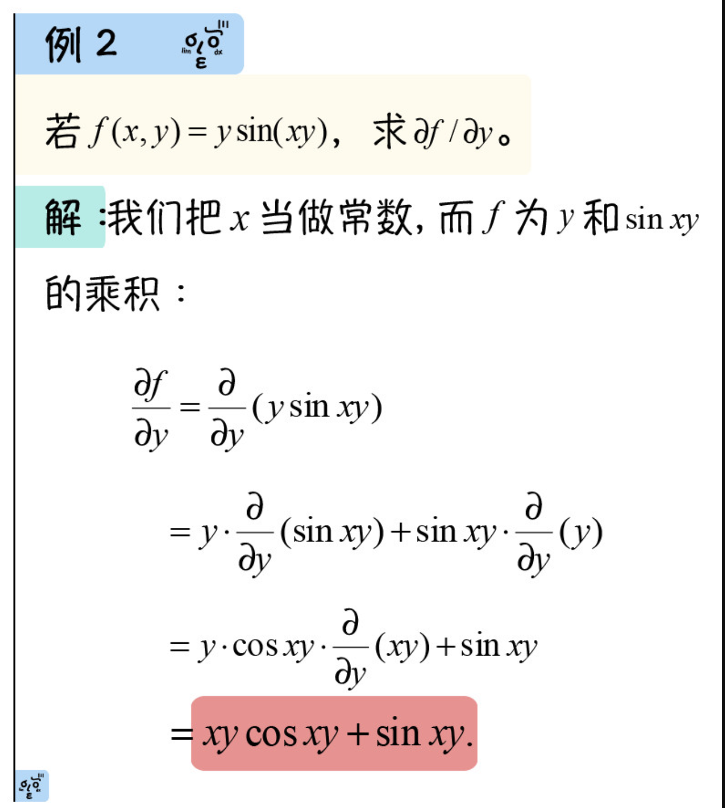

