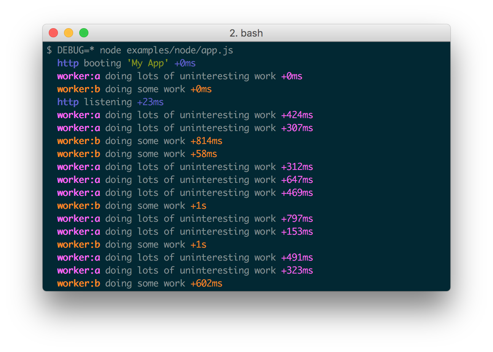

[TOC]

# 有用的 npm 包整理

----

## node 相关

### fs-extra

[fs-extra](https://www.npmjs.com/package/fs-extra)

提供一些文件管理的方法,  类似mkdir, copy, ensureDir... 的方法,是对fs模块的扩展, 可以使用fs的所有方法, 安装fs-extra后可以不再require fs模块

### klaw-sync

[klaw-sync](https://www.npmjs.com/package/klaw-sync)
循环读取文件目录

### chokidar 文件监听 watch file

[https://www.npmjs.com/package/chokidar](https://www.npmjs.com/package/chokidar)

gulp, karma, PM2,browserify, webpack, BrowserSync, Microsoft's Visual Studio Code, and many others项目中都使用该包作为watch file库 

### scribe

用来处理node中的logger

[https://www.npmjs.com/package/scribe](https://www.npmjs.com/package/scribe)

### cors 处理跨域

主要用来处理跨域, 结合express使用.

[https://github.com/expressjs/cors](https://github.com/expressjs/cors)

### chalk

node控制台中输出彩色的文案 

```
const chalk = require('chalk');
 
console.log(chalk.blue('Hello world!'));

```

[https://www.npmjs.com/package/chalk](https://www.npmjs.com/package/chalk)

### ws websocket

ws 服务端用来实现websocket

[https://www.npmjs.com/package/ws](https://www.npmjs.com/package/ws)

### http-proxy-middleware 请求代理转发中间件

[https://www.npmjs.com/package/http-proxy-middleware](https://www.npmjs.com/package/http-proxy-middleware)

### commander 命令行处理

[https://npm.taobao.org/package/commander](https://npm.taobao.org/package/commander)

用于node脚本命令行参数处理


### nodemon node进程监视器

用于管理node服务

[https://www.npmjs.com/package/nodemon](https://www.npmjs.com/package/nodemon)


### keygrip 用来做验证

[https://www.npmjs.com/package/keygrip](https://www.npmjs.com/package/keygrip)

### memory-fs 用来在内存中创建文件目录, 

可以在内存中进行读写操作, 极大提高IO效率. webpack devserver 就使用了该机制.

[https://juejin.im/entry/5769f8dc128fe10057d2f4ae](https://juejin.im/entry/5769f8dc128fe10057d2f4ae)

```JavaScript

var MemoryFileSystem = require("memory-fs");
var fs = new MemoryFileSystem(); // Optionally pass a javascript object
 
fs.mkdirpSync("/a/test/dir");
fs.writeFileSync("/a/test/dir/file.txt", "Hello World");
fs.readFileSync("/a/test/dir/file.txt"); // returns Buffer("Hello World")
 
// Async variants too
fs.unlink("/a/test/dir/file.txt", function(err) {
    // ...
});
 
fs.readdirSync("/a/test"); // returns ["dir"]
fs.statSync("/a/test/dir").isDirectory(); // returns true
fs.rmdirSync("/a/test/dir");
 
fs.mkdirpSync("C:\\use\\windows\\style\\paths");

```

### colors
 
console.log加颜色

[https://www.npmjs.com/package/colors](https://www.npmjs.com/package/colors)


### http-proxy 转发http请求

[https://www.npmjs.com/package/http-proxy](https://www.npmjs.com/package/http-proxy)

http-proxy-middleware的转发使用的也是该包

### recursive-copy 

复制文件。 把一个目录中的文件复制到另外一个文件

[https://www.npmjs.com/package/recursive-copy](https://www.npmjs.com/package/recursive-copy)

```javascript

var copy = require('recursive-copy');
 
copy('src', 'dest', function(error, results) {
    if (error) {
        console.error('Copy failed: ' + error);
    } else {
        console.info('Copied ' + results.length + ' files');
    }
});

```

### json-server 建立json服务

建立json服务, 可以用来mock数据

[https://www.npmjs.com/package/json-server](https://www.npmjs.com/package/json-server)

----

### urllib node发送url请求

[https://npm.taobao.org/package/urllib](https://npm.taobao.org/package/urllib)

```javascript

var urllib = require('urllib');

urllib.request('http://cnodejs.org/', function (err, data, res) {
  if (err) {
    throw err; // you need to handle error
  }
  console.log(res.statusCode);
  console.log(res.headers);
  // data is Buffer instance
  console.log(data.toString());
});

```

### rimraf

rimraf build

可以在node中使用的功能类似 rm -rf 的命令
[https://github.com/isaacs/rimraf](https://github.com/isaacs/rimraf)

### mkdirp

可以在node中使用的功能类似 mkdir 的命令

### markdown mermaid

[mermaid.cli](https://github.com/mermaidjs/mermaid.cli)

用于markdown生成甘特图等的命令行工具

### execa

执行shell命令
对 child_process.exec的封装, 提供了promise接口

[https://www.npmjs.com/package/execa](https://www.npmjs.com/package/execa)

### shelljs

https://www.npmjs.com/package/shelljs

执行shell命令的js库, 兼容windows/linux/OS X

### ora

命令行 loading

[https://www.npmjs.com/package/ora](https://www.npmjs.com/package/ora)


## Browserify 浏览器环境

### superagent HTTP请求库

发送http请求

[docs](http://visionmedia.github.io/superagent/)

[http://npm.sankuai.com/package/superagent](http://npm.sankuai.com/package/superagent)

### winston Logging库

[https://www.npmjs.com/package/winston](https://www.npmjs.com/package/winston)

A multi-transport async logging library for node.js. 

### debug 打印日志库

[debug](https://www.npmjs.com/package/debug)

node log 工具，也可以用于浏览器环境



### inquirer 交互式命令行库

[inquirer](https://www.npmjs.com/package/inquirer) 命令行交互式库


### ware

中间件工具，一个库如果以中间件的形式执行任务，可以用该库实现


[文档](https://github.com/segmentio/ware)

```
var ware = require('ware');
var middleware = ware()
  .use(function (req, res, next) {
    res.x = 'hello';
    next();
  })
  .use(function (req, res, next) {
    res.y = 'world';
    next();
  });

middleware.run({}, {}, function (err, req, res) {
  res.x; // "hello"
  res.y; // "world"
});
```

### MetalSmith

以插件的形式处理静态文件。
常用做脚手架中的模板替换工具

[https://www.npmjs.com/package/metalsmith](https://www.npmjs.com/package/metalsmith)


----

## webpack 插件

### 查看项目的包关系

[Webpack Visualizer](http://chrisbateman.github.io/webpack-visualizer/)

可以查看分析当前项目中各个模块文件的占用情况

### http-proxy-middleware 请求转发中间件

[https://www.npmjs.com/package/http-proxy-middleware](https://www.npmjs.com/package/http-proxy-middleware)

### happypack

[happypack npm地址](https://www.npmjs.com/package/happypack)

[happypack 原理解析](http://taobaofed.org/blog/2016/12/08/happypack-source-code-analysis/)

利用多线程来加速wepack的构建速度


----

## gulp 插件

### webpack-stream

[webpack-stream](https://www.npmjs.com/package/webpack-stream)

用于在gulp任务流中插入webpack处理过程

## gulp-footer 

[https://www.npmjs.com/package/gulp-footer](https://www.npmjs.com/package/gulp-footer)

在文件底部插入另一个文件内容

## gulp-concat

连接多个文件

## gulp-replace

替换文件中指定的内容

## gulp-rename

重命名文件

## gulp-clone

在内存中复制文件


## 其他

[postCss github地址](https://github.com/postcss/postcss#plugins)

[其他相关文章](http://www.w3cplus.com/blog/tags/516.html)

用来预处理css, 可以增加 autoprefixer, 引入变量混合等

### lerna

[lerna](https://www.npmjs.com/package/lerna)

在一个项目中管理多个子packages的发布

### prettier

[官网](https://github.com/prettier/prettier)

用来格式化代码

### husky 包 git hook

[https://www.npmjs.com/package/husky](https://www.npmjs.com/package/husky)

用来设置git hook

### git-hooks

[https://www.npmjs.com/package/git-hooks](https://www.npmjs.com/package/git-hooks)

### normalizr

用于把一个嵌套的数据结构扁平化

[https://github.com/paularmstrong/normalizr](https://github.com/paularmstrong/normalizr)


### redux-form

表单处理库

[https://redux-form.com/7.3.0/](https://redux-form.com/7.3.0/)

### react-styleguidist

用来生成react项目文档

[https://www.npmjs.com/package/react-styleguidist](https://www.npmjs.com/package/react-styleguidist)

### semver

语义化版本判断库

[https://www.npmjs.com/package/semver](https://www.npmjs.com/package/semver)
