[TOC]

# 文件系统

## 基本概念

### 文件系统和文件

文件系统: 一种用于持久存储的系统抽象

文件: 文件系统中一个单元的相关数据在操作系统中的抽象

### 文件系统的功能

分配文件磁盘空间:
- 管理文件块
- 管理空闲空间
- 分配算法(策略)

管理文件:
- 定位文件及其内容
- 命名文件
- 文件系统的分层(如常用文件)
- 文件系统类型(组织文件的不同方式)


提供的便利及特征
- 保护: 数据安全
- 可靠性/持久性

### 文件和块

文件属性: 名称, 大小, 位置...

文件头: 存储文件信息, 文件属性, 跟踪哪一块存储属于逻辑上文件结构的哪个偏移

### 文件描述符

文件使用模式

```
open(name, flag):
...
...
read(f, ...)
...
close(f)
```

当文件打开后, 内核会创建一些元数据来跟踪该文件
- 操作系统为每个进程维护一个打开文件表
- 一个打开文件描述符是这个表中的索引.

文件描述符实际上在内核中用文件元数据来管理打开的文件
- 文件指针: 最近一次的读写位置.
- 文件打开次数: 当最后一个进程关闭文件后, 允许从打开文件表中删除.
- 文件磁盘位置: 缓存数据访问信息
- 访问权限

操作系统的内部视角
- 块的集合(块是逻辑转换单元, 扇区是物理转换单元, 即每次以扇区为单位读取)
- 块大小 <> 扇区大小: 在 UNIX 中, 块的大小是4kb

### 目录

目录是一类特殊的文件

### 别名

- 硬链接: 多个文件指向同一个文件
- 软连接: 以"快捷方式"指向其他文件
- 通过存储真实文件的逻辑名称来实现

### 文件系统

- 磁盘文件系统: FAT, NTFS, ext2/3, ISO9660 等存储在磁盘或光盘等存储设备上
- 数据库文件系统: 文件根据其特征是可被寻址的
- 日志文件系统: 记录文件系统的修改/事件
- 网络/分布式文件系统: 如 NFS, SMB, AFS, GFS
    - 网络文件系统: 如虚拟网中文件的访问
- 特殊/虚拟文件系统: 不是为了存数据, 而是以文件的形式提供其他资源的管理. 

## 虚拟文件系统

分层结构:
- 上层: 虚拟(逻辑)文件系统
- 底层: 特定文件系统模块

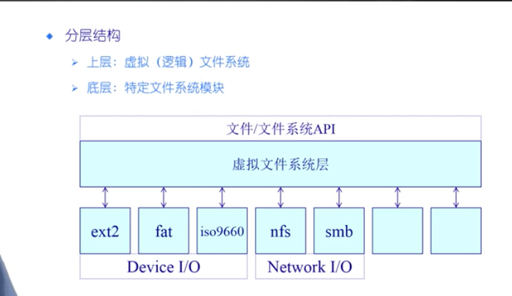

目的: 对所有不同文件系统的抽象
功能:
- 提供相同的文件和文件系统接口
- 管理所有文件和文件系统关联的数据结构
- 高效查询例程, 遍历文件系统
- 与特定文件系统模块的交互

### 文件系统的结构

- 卷控制块(superblock)
    - 每个文件系统一个
    - 文件系统详细信息
    - 块, 块大小, 空余块, 计数, 指针等
- 文件控制块(vnode or inode)
    - 每个文件一个
    - 文件详细信息
    - 许可, 拥有者, 大小, 数据库位置等
- 目录节点(dentry)
    - 每个目录项一个(目录和文件)
    - 将目录项数据结构及树型布局编码成树型数据结构
    - 指向文件控制块, 父节点, 项目列表等

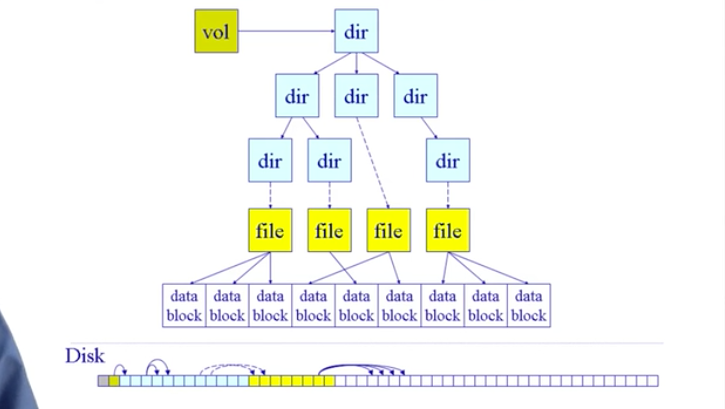

## 数据块缓存

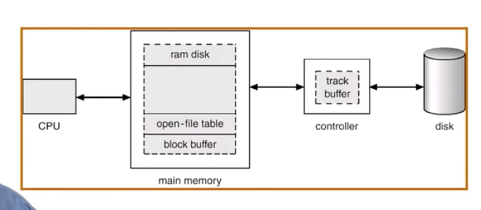

- 按需读取
- 数据块使用后被缓存
- 两种数据块缓存方式
    - 普通缓冲区缓存
    - 页缓存

## 打开文件的数据结构

- 打开文件描述
    - 文件状态信息
    - 目录项, 当前文件指针, 文件操作设置等
- 打开文件表
    - 一个进程一个
    - 一个系统级的
    - 每个卷控制块儿也会保存一个列表
    - 所以如果有文件被打开将不能被卸载
    
## 文件分配

- 大多数文件都很小
    - 需要对小文件提供强力支持
    - 块空间不能太大
- 一些文件非常大
    - 必须支持大文件
    - 大文件访问也需要相当高效


如何为一个文件分配数据块

- 分配方式
    - 连续分配: 适合只读的情况
    - 链式分配: 
    - 索引分配
- 指标
    - 高效, 如存储利用
    - 表现, 如访问速度


### 链式分配

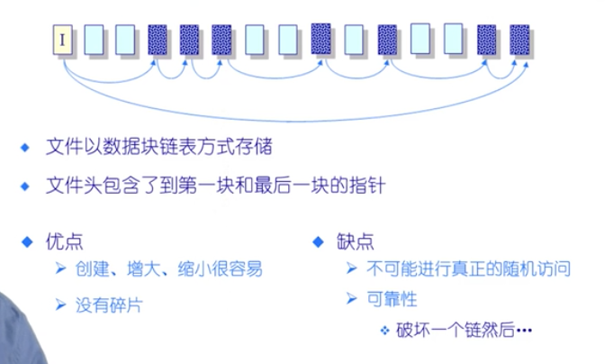

优势
- 创建, 增大,缩小很容易
- 没有碎片

缺点:
- 不能进行真正的随机访问
- 可靠性不够, 如果突然断电, 链信息可能丢失

### 索引分配

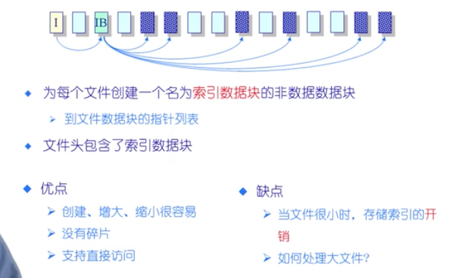

通过索引分级来支持大文件.

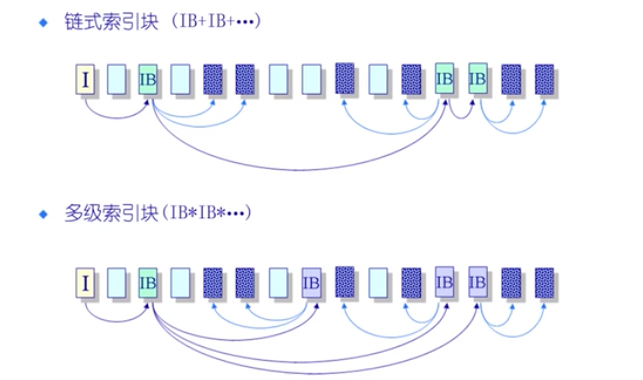

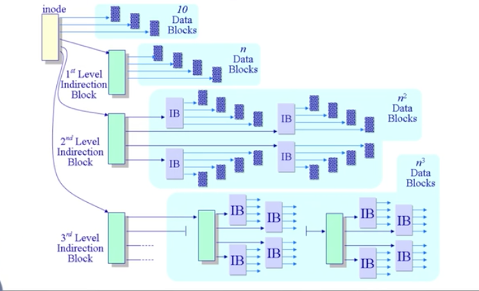


## 空闲空间列表

- 跟踪再存储中的所有未分配的数据块
- 空闲空间列表存储在哪里?
- 空闲空间列表的最佳数据结构是什么样的


用位图代表空闲数据块儿
-  1110001010...
- i = 0  则, 数据块 i 是空闲, 反之则已分配

管理空闲数据块

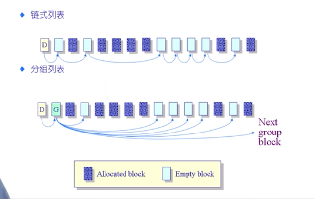

## 多磁盘管理 RAID

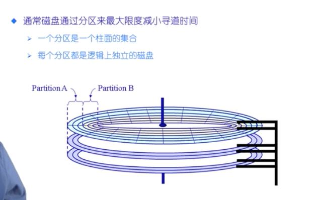

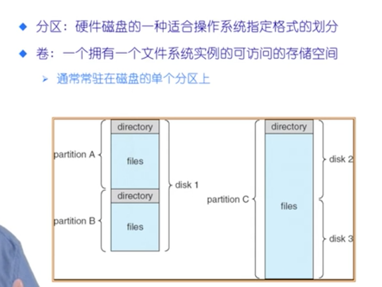

多磁盘好处
- 并行增加吞吐量
- 可靠性和可用性

RAID - 冗余磁盘阵列
- 各种磁盘管理技术
- RAID levels: 不同 RAID 分类(如, RAID-0, RAID-1, RAID-5)

实现
- 软件层面: 操作系统内核
- 硬件层面: RAID硬件控制器

RAID-0 提高吞吐量
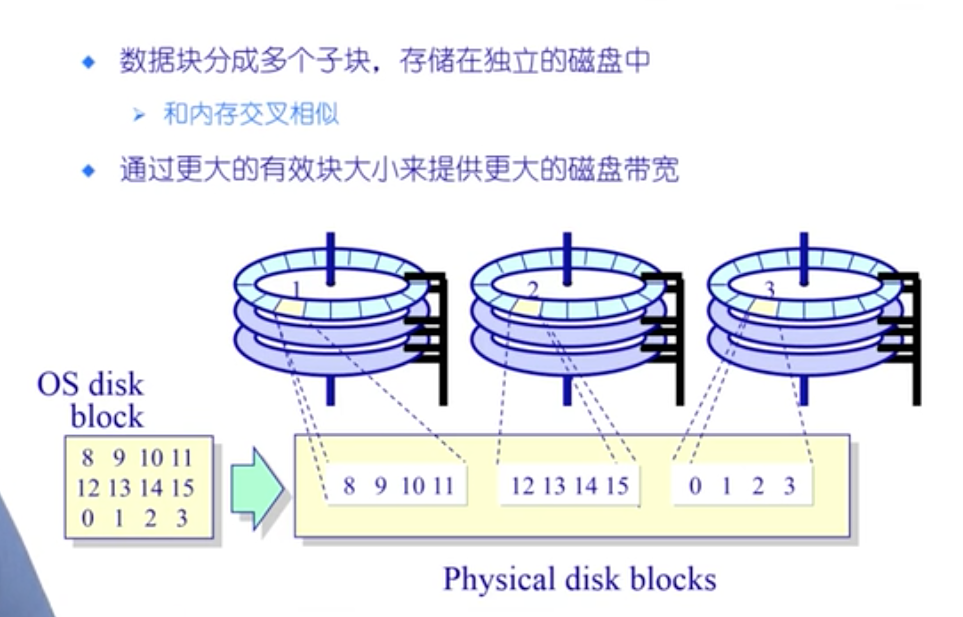

RAID-1 做镜像使用, 可以容错, 以块为单位进行冗错校验

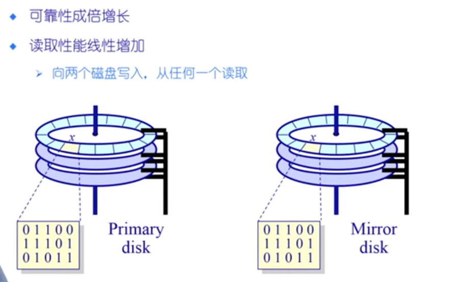

RAID-4, 通过 parity 盘来恢复其他盘的损坏数据. 如通过保存纠错码的机制
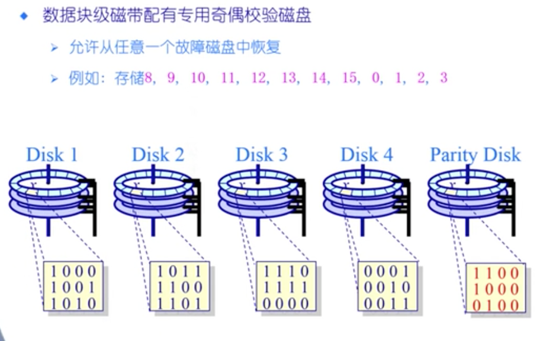

RAID-5
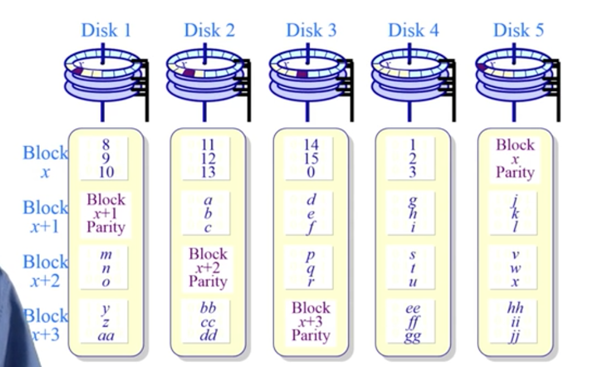

## 磁盘调度

磁盘结构

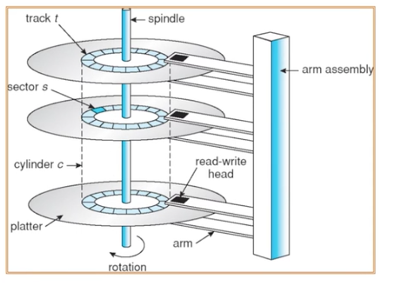

IO 时间组成

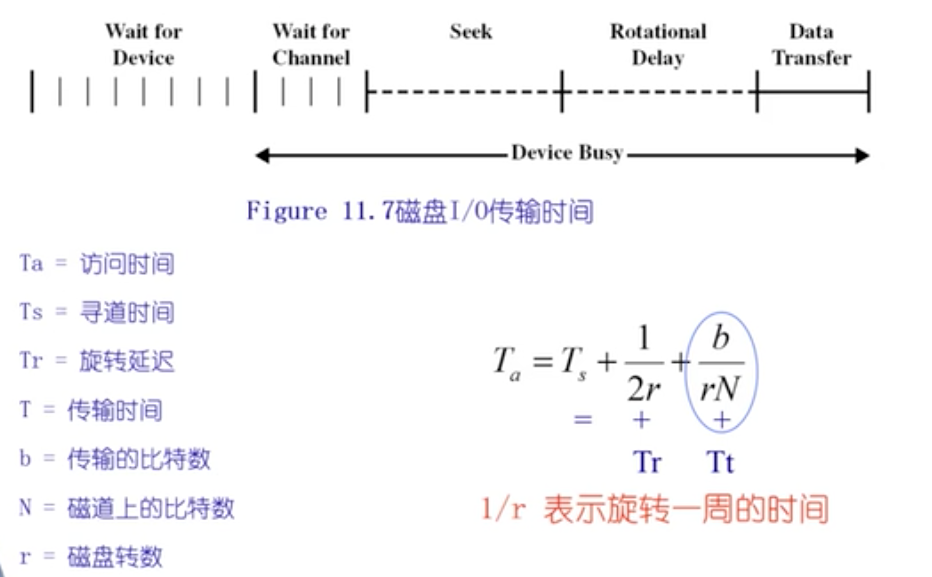

其中寻道时间开销最大

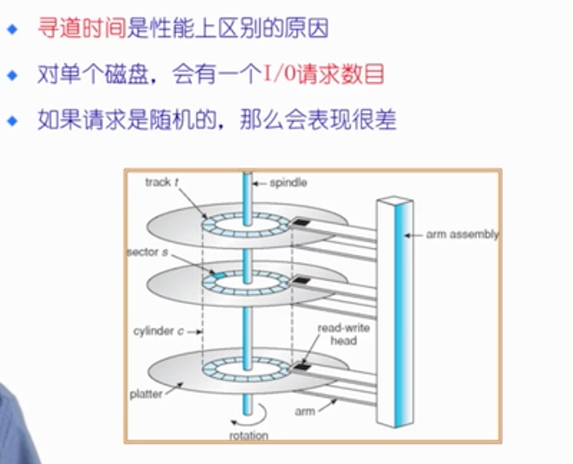

### 优化寻道时间

FIFO 策略, 简洁但是不高效

最小移动策略, 好处: 总移动路径最小
问题: 远处的请求长时间得不到响应. 

SCAN 方法
磁头再一个方向上移动, 满足所有未完成的请求, 直到到达该数据的位置.

CSCAN
仅在一个方向上扫描


