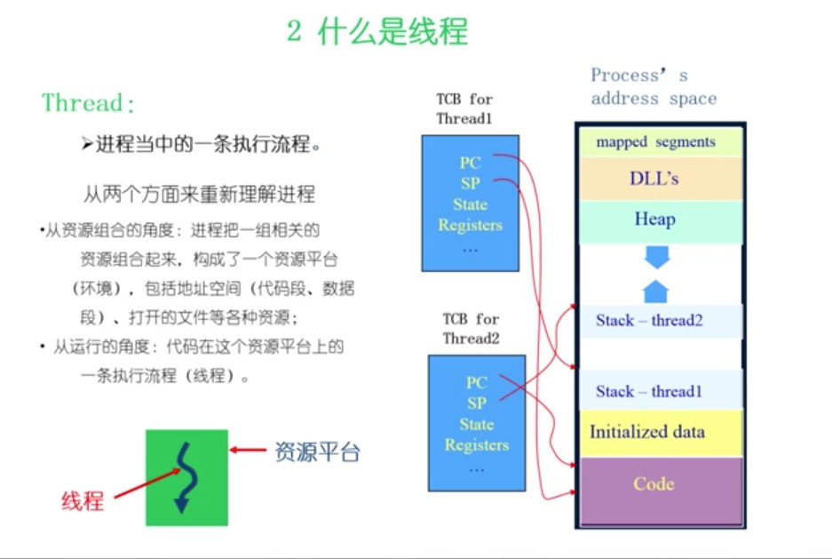
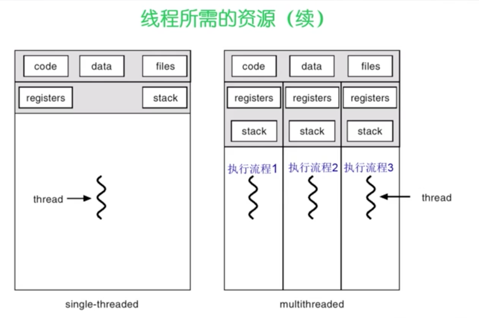
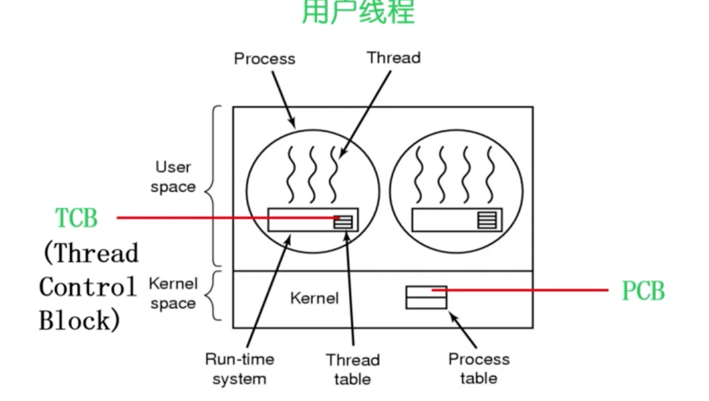
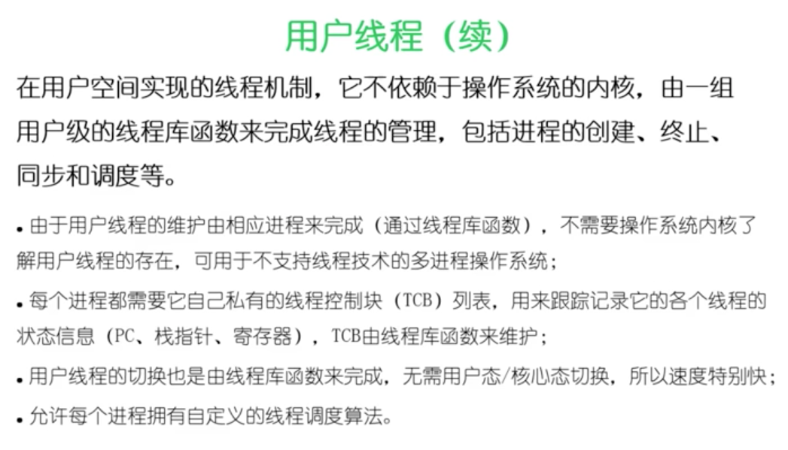
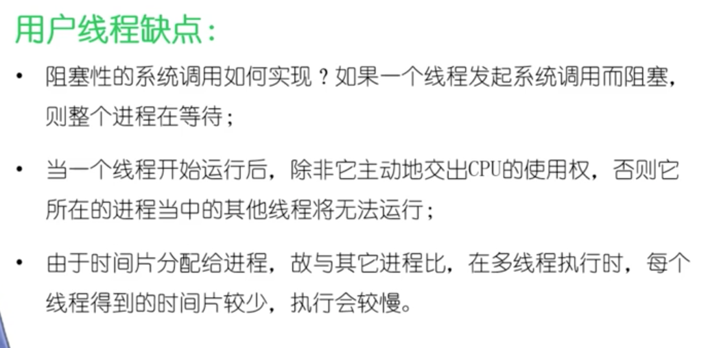
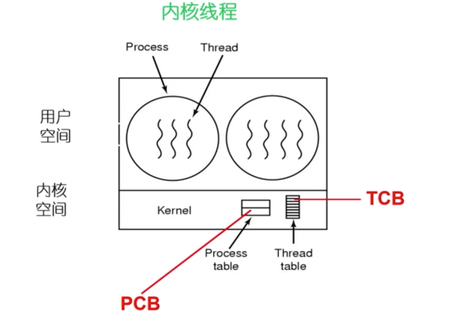

# 进程

程序: 是有序代码的集合
进程: 一个具有一定独立功能的程序在一个数据集合上的一次动态执行过程

## 进程组成

一个进程应该包括:
- 程序的代码
- 程序处理的数据
- 程序计数器中的值, 指示吓一条将运行的指令
- 一组通用的寄存器的当前值, 堆,栈
- 一组系统资源

## 进程控制结构 PCB

进程控制块, process control block

进程的创建: 生成一个 PCB
进程终止: 回收它的 PCB
进程的组织管理: 通过对 PCB 的组织管理来实现

PCB 包含的信息
- 进程标识信息. 如本进程的标识. 及父进程标识, 用户标识
- 处理机状态信息保存区. 保存进程的运行现场信息
    - 用户可见寄存器
    - 控制和状态寄存器
    - 栈指针, 如程序计数器, 程序状态字
- 进程控制信息
    - 调度和状态信息
    - 进程间通信信息
    - 存储管理信息
    - 进程所用资源
    - 有关数据结构连接信息. 如父子进程的连接信息
    

## 线程 Thread

进程当中的一条执行流程

从资源组合的角度, 进程把一组相关的资源组合起来, 构成一个资源平台, 包括地址空间, 打开的文件等各种资源
从运行的角度: 代码再这个资源平台上的一条执行流程(线程). 

 
线程优点
- 一个进程中可以同时存在多个线程
- 各个线程之间可以并发的执行
- 各个线程之间可以共享地址空间和文件等资源

线程的缺点
- 一个线程崩溃, 会影响该进程的所有线程

线程可以共享代码段, 数据段. 有独立的寄存器, 堆栈.

## 线程与进程的比较

- 进程是资源分配的单位, 线程是 CPU 调度单位
- 进程拥有一个完整的资源平台, 而线程只独享必不可少的资源, 如寄存器和栈
- 线程同游具有就绪, 阻塞, 执行3种状态, 同样具有状态之间的转换关系
- 线程能减少并发执行的时间和空间开销
    - 线程创建时间段
    - 线程的终止时间段 
    - 同一进程内的线程切换时间比进程短. 因为线程共享页表, 不需要切换页表
    - 由于同一进程的各线程间共享内存和文件资源, 可直接进行不通过内核的通信. 
    
## 线程管理

内核线程的系统, 以线程作为调度的基本单位

