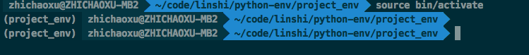
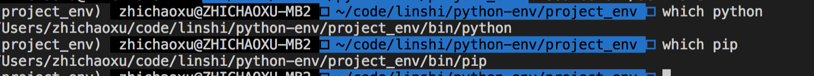
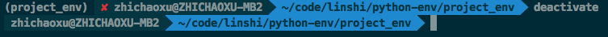

[TOC]

# python 学习

python 是解释型语言 (interpreted language)

## 安装

安装 python3
mac 上可以安装 python3, 与系统自带的 python2.7 可以共存

```
~]# brew install python3
```

## 包管理


首先查找全局变量
其他的模块需要通过 import 引入
如
```
import os
from os.path import basename, dirname
```

### python 查找模块的路径

包的查找路径保存在 sys.path 变量中, 不同系统不一样, 输出如下.

```
import sys
print(sys.path)

# 输出

[
    '/Users/zhichaoxu/code/practice/py-practice/basic', '/usr/local/Cellar/python/3.7.2/Frameworks/Python.framework/Versions/3.7/lib/python37.zip', '/usr/local/Cellar/python/3.7.2/Frameworks/Python.framework/Versions/3.7/lib/python3.7', '/usr/local/Cellar/python/3.7.2/Frameworks/Python.framework/Versions/3.7/lib/python3.7/lib-dynload', '/Users/zhichaoxu/Library/Python/3.7/lib/python/site-packages', '/usr/local/lib/python3.7/site-packages'
]
```

会按顺序从第一个开始搜索

#### sys.path.insert

path 很容易被劫持, 通过 sys.path.insert(0, '/path/to/my/packages') 可以确保 python 首先载入自己的包.

可以使用 site 模块控制包的搜索路径

#### PYTHONPATH 变量可以增加默认的包搜索目录. 多个 path 使用:分号

```
export PYTHONPATH=/path/to/dir1:/path/to/dir2
```

#### 模块和包的区别是什么?

包是一个模块或模块/子模块的集合, 一般情况下被压缩到一个压缩包种, 其中包含1.依赖信息 2.将文件拷贝到标准的包搜索路径的指令 3. 编译指令

#### 第三方包

在Linux系统上至少有3种安装第三方包的方法。

1. 使用系统自带的包管理系统(deb, rpm, 等)
2. 通过社区开发的各种工具，例如 pip ， easy_install 等
3. 从源文件安装

这三个方面，几乎完成同样的事情。即：安装依赖，编译代码（如果需要的话），将一个包含模块的包复制的标准软件包搜索位置。

##### 第三方包的来源

1. 系统的包管理器中的发行版专用包
2. [Python Package Index (or PyPI)](https://docs.python.org/3/library/sys.html)
3. 大量的源代码服务器, 例如 Launchpad, GitHub, BitBucket 等

##### 通过系统的发行版专用包安装

```
# 如
~]# sudo apt-get install python-simplejson
```

##### 使用 pip 安装

easy_install 是 python 自带的一个包安装器, pip 是 easy_install 的改进版, 提供更好的提示信息, 删除 pkg 等功能. 

pip是一个用来安装和管理Python包的工具，就如同Python Packet Index一样。 pip并没有随着Python一起安装，因此我们需要先安装它。Linux下，一般这样安装：

```
~]# sudo apt-get install python-pip
```

mac 安装 pip
```
sudo easy_install pip
# 指定源
sudo easy_install -i https://pypi.tuna.tsinghua.edu.cn/simple  pip
```

pip 升级
```
~]# sudo pip install pip --upgrade
```
pip 安装包
```
pip install simplejson
```

删除包
```
pip uninstall simplejson
```

从 git 安装包

```
~]# sudo pip install git+http://hostname_or_ip/path/to/git-repo#egg=packagename
~]# sudo pip install hg+http://hostname_or_ip/path/to/hg-repo#egg=packagename
~]# sudo pip install svn+http://hostname_or_ip/path/to/svn-repo#egg=packagename
```

从本地安装

```
sudo pip install git+file:///path/to/local/repository
```

pip 从 setup.py 中获取模块的安装信息. 

默认安装到系统目录, 使用 --user可以安装到~/.local 目录下

```
pip install --user
```

pip 源设置

pip 的配置文件为 ~/.pip/pip.conf
window上，而为C:\Users\用户名\pip\pip.ini

```
[global]
# 清华的源
index-url = https://pypi.tuna.tsinghua.edu.cn/simple
trusted-host = pypi.tuna.tsinghua.edu.cn
# 代理设置
# proxy = http://127.0.0.1:8080
```


##### 从源码安装

下载源码安装包, 如下执行 setup.py

```
cd /path/to/package/direction
python setup.py install
```

##### 安装需要编译的包

有些包在安装前需要被编译, 如包含 c/c++ 的 python 包

虽然 pip 可以处理编译安装的源码，但我个人更喜欢使用发行版的包管理器提供的包。 它将会安装编译好的二进制文件。

如果你还是想用 pip 安装，下面是在Ubuntu系统上需要做的。

编译器的相关工具：
```
$ sudo apt-get install build-essential
```
Python开发环境（头文件等）：
```
$ sudo aptitude install python-dev-all
```
如果你的系统没有 python-dev-all ，看看这些相似的名字 python-dev , python2.X-dev 等等。

确保你已经安装了 psycopg2 （PostgreSQL RDBMS adapter for Python），你将需要PostgreSQL的开发文件。
```
$ sudo aptitude install  postgresql-server-dev-all
```
完成这些依赖的安装后，你就能运行 pip install 了。
```
$ sudo pip install psycopg2
```
还需要注意一点： 并不是所有的包都能通过pip编译安装！ 。 但如果你对编译安装很有自信，或者已经对于如何在自己的目标平台安装有足够的经验。 那就大胆的手动安装吧！

## Python 开发环境

### virtualenv

可以用来创建一个独立的 python 环境. 管理自身的依赖

使用 pip 安装 virtualenv

```
sudo pip3 install virtualenv
```

1. 创建一个独立的环境

```
virtualenv --distribute project_env

# 输出

Using base prefix '/usr/local/Cellar/python/3.7.2/Frameworks/Python.framework/Versions/3.7'
New python executable in /Users/xxxx/code/linshi/python-env/project_env/bin/python3.7
Also creating executable in /Users/xxxx/code/linshi/python-env/project_env/bin/python
Installing setuptools, pip, wheel...
done.
```

在该目录下会生成以下文件目录
这里只列出了将被讨论的目录和文件

```
.

|-- bin

|   |-- activate  # <-- 这个virtualenv的激活文件

|   |-- pip       # <-- 这个virtualenv的独立pip

|   `-- python    # <-- python解释器的一个副本

`-- lib

    `-- python2.7 # <-- 所有的新包会被存在这
```

2. 激活该环境

```
~]# cd project_env
~]# source bin/activate
```

激活后会以下面的形式显示


检查下当前的 python



3. 离开该环境



### virtualenvwrapper

virtualenvwrapper是一个建立在 virtualenv 上的工具, 通过它可以方便的创建/激活/管理/销毁虚拟环境. 

1. 安装
```
sudo pip install virtualenvwrapper
```

2. 安装后需要配置

```
if [ `id -u` != '0' ]; then

  export VIRTUALENV_USE_DISTRIBUTE=1        # <-- Always use pip/distribute

  export WORKON_HOME=$HOME/.virtualenvs       # <-- Where all virtualenvs will be stored

  source /usr/local/bin/virtualenvwrapper.sh

  export PIP_VIRTUALENV_BASE=$WORKON_HOME

  export VIRTUALENVWRAPPER_PYTHON=`which python` # 指定 python 的版本

  export PIP_RESPECT_VIRTUALENV=true

fi
```

将该配置添加到 ~/.bashrc 中

设置 WORKON_HOME 和 source /usr/local/bin/virtualenvwrapper.sh 只需要几行代码，别的部分是按照我个人喜好添加的。

将上面的配置添加到 ~/.bashrc 的末尾，然后将下面的命令运行一次：

$ source ~/.bashrc
如果你关闭所有的shell窗口和标签，然后再打开一个新的shell窗口或标签时， ~/.bashrc 也会被执行，此时将会自动的更新你的 virtualenvwrapper 配置。 效果就跟执行上面的命令一样。

新建/激活/关闭/删除虚拟空间需要执行下面的命令：

```
$ mkvirtualenv -a <project_path> -p <python_bin> my_project_venv 

$ workon my_project_venv

$ deactivate

$ rmvirtualenv my_project_venv
```
Tab补全在virtualenvwrapper中是可用的哦～

### 使用 pip 和 virtualenv 进行依赖管理

pip 结合 virtualenv 可以为你的项目提供基本的依赖管理

可以通过 pip freeze 命令来查看当前已安装到包版本. 

```
pip freeze -l
```

可以把依赖导出到文件requirements中

```
pip freeze -l > requirements.txt 
```

从一个依赖文件安装包
```
pip install -r requirements.txt
```

## anaconda 

管理 python 环境

[官网](https://www.anaconda.com/what-is-anaconda/)

anaconda 是一个安全, 可扩展的数据处理平台, 方便团队管理数据资源, 项目, 以及合作.

特点:

1. 自带很多库
2. 可以用来做包管理工具. anaconda 来源于包管理起 conda, 可以进行库的更新, 安装, 以及处理依赖关系
3. 强大的环境管理, 提供了环境切换和管理的能力


## 模块


## 参考资料

- [官方文档](https://docs.python.org/3/library/stdtypes.html#set-types-set-frozenset)
- [简明 Python 教程](https://bop.mol.uno/05.installation.html)
- [A Byte of Python](https://python.swaroopch.com/)
- [Python开发生态环境简介](https://github.com/dccrazyboy/pyeco/blob/master/pyeco.rst)