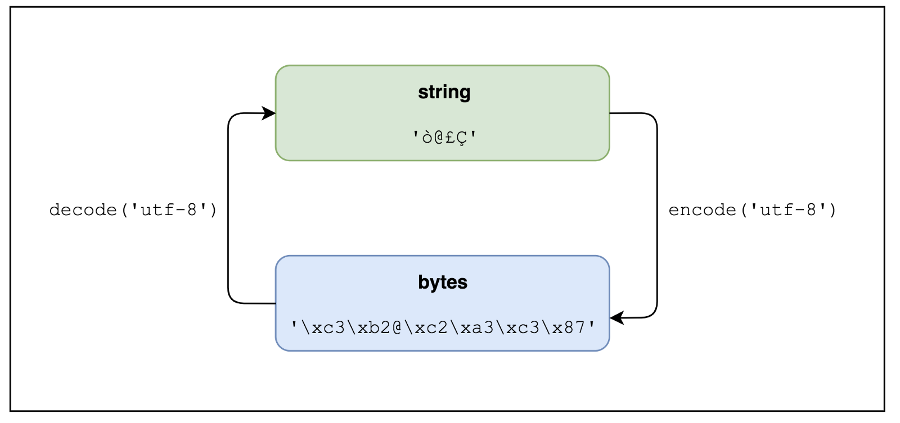
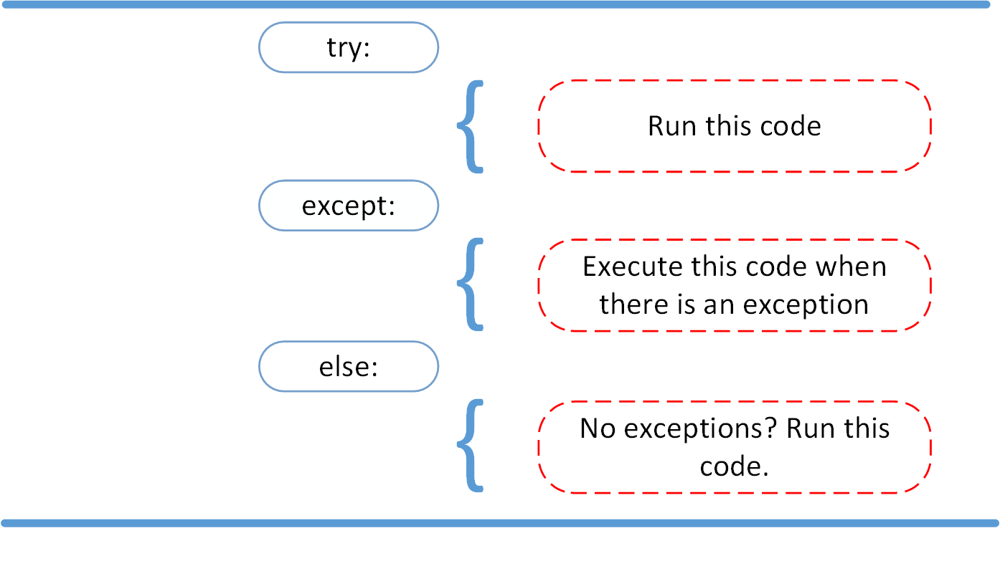
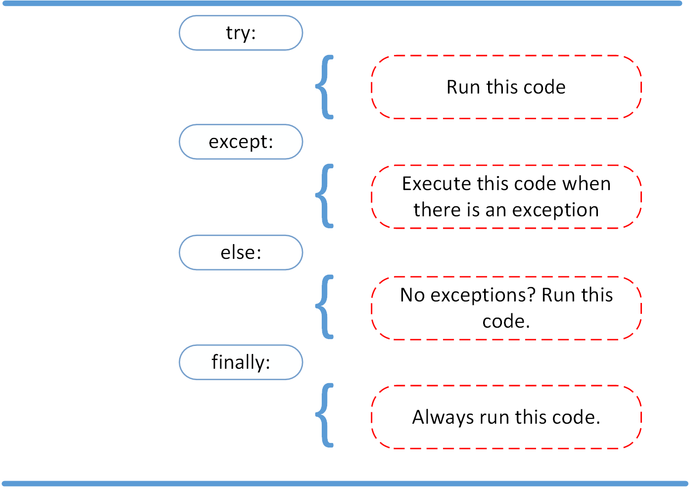

[TOC]

# python 学习

python 是解释型语言 (interpreted language)

[python 官方教程 tutorial ](https://docs.python.org/3/tutorial/index.html)
[python 标准库 standard library](https://docs.python.org/3/library/index.html)
[realy python 教程](https://realpython.com/)

## 安装

安装 python3
mac 上可以安装 python3, 与系统自带的 python2.7 可以共存

```
~]# brew install python3
```

## python 启用

1. 交互式： 执行 python，进入 python 环境，然后执行相应指令。交互式设置参数 python - arg1 arg2
2. python -c command [arg] ...：直接执行某个指令。
3. 把 python 模块作为脚本使用。 python -m module [arg] ... 会执行模块的源文件。如果脚本运行完需要进入交互模式，则增加 -i 参数

### 字符编码

python 文件默认使用 utf-8编码
指定编码，在文件第一行或 shebang 后面一行指定

```python
#!/usr/bin/env python3
# -*- coding: utf-8 -*-
```

### 注释

以 # 开头，可以是一行，或一行结尾

## 数据类型

[文档 Built-in Types](https://docs.python.org/3/library/stdtypes.html#typesseq)

### 字符串

python3 中字符串默认使用 unicode 编码。

python2 中定义unicode字符串前面加个 u，r 表示不转义

```
>>> u'Hello\u0020World !'
u'Hello World !'
>>> ur'Hello\\u0020World !'
u'Hello\\\\u0020World !'
```

python3 中， 通过 encode 可以转为 bytes，输出时前面会带字母 b

```
>>> a_s = '哈哈 hello!'
>>> a_b = a_s.encode('utf-8')
>>> a_b
b'\xe5\x93\x88\xe5\x93\x88 hello!'
>>> type(a_b)
<class 'bytes'>
>>> a_s2 = a_b.decode('utf-8')
>>> a_s2
'哈哈 hello!'
>>> type(a_s2)
<class 'str'>
```

string 和 bytes 转化如下图




### Tuples 元组

Tuples 是一种不可变的序列。

创建方式有：

- Using a pair of parentheses to denote the empty tuple: ()
- Using a trailing comma for a singleton tuple: a, or (a,)
- Separating items with commas: a, b, c or (a, b, c)
- Using the tuple() built-in: tuple() or tuple(iterable)

```
>>> t1 = (1,)
>>> t1
(1,)
# 一项的话后面必须带逗号
>>> t2 = (2)
>>> t2
2
>>> t3 = (4,5,6)
>>> t3
(4, 5, 6)
>>> tuple('abded')
('a', 'b', 'd', 'e', 'd')
>>> tuple([3,4,6,7,8])
(3, 4, 6, 7, 8)
```


## 表达式


## 包管理


首先查找全局变量
其他的模块需要通过 import 引入
如
```
import os
from os.path import basename, dirname
```

### python 查找模块的路径

包的查找路径保存在 sys.path 变量中, 不同系统不一样, 输出如下.

```
import sys
print(sys.path)

# 输出

[ 
    '', '/Users/zhichaoxu/code/practice/py-practice/basic', '/usr/local/Cellar/python/3.7.2/Frameworks/Python.framework/Versions/3.7/lib/python37.zip', '/usr/local/Cellar/python/3.7.2/Frameworks/Python.framework/Versions/3.7/lib/python3.7', '/usr/local/Cellar/python/3.7.2/Frameworks/Python.framework/Versions/3.7/lib/python3.7/lib-dynload', '/Users/zhichaoxu/Library/Python/3.7/lib/python/site-packages', '/usr/local/lib/python3.7/site-packages'
]
```

会按顺序从第一个开始搜索, 第一个空字符串表示当前目录

### sys.path

修改 sys.path
1. 通过环境变量 PYTHONPATH 来添加。 
2. 在 site-packages 目录下创建 .pth 文件，将目录列出来。python 运行时会读取该文件。如下

```
# myapp.pth
path/to/dir1
path/to/dir2
```
3. 运行过程中修改 sys.path

```python
import sys
sys.path.insert(0, 'path/to/dir1')
sys.path.insert(0, 'path/to/dir2')
```
path 很容易被劫持, 通过 sys.path.insert(0, '/path/to/my/packages') 可以确保 python 首先载入自己的包.

可以使用 site 模块控制包的搜索路径

### PYTHONPATH 变量可以增加默认的包搜索目录. 多个 path 使用:分号

```
export PYTHONPATH=/path/to/dir1:/path/to/dir2
```

### 模块和包的区别是什么?

包是一个模块或模块/子模块的集合, 一般情况下被压缩到一个压缩包种, 其中包含1.依赖信息 2.将文件拷贝到标准的包搜索路径的指令 3. 编译指令

#### 第三方包

在Linux系统上至少有3种安装第三方包的方法。

1. 使用系统自带的包管理系统(deb, rpm, 等)
2. 通过社区开发的各种工具，例如 pip ， easy_install 等
3. 从源文件安装

这三个方面，几乎完成同样的事情。即：安装依赖，编译代码（如果需要的话），将一个包含模块的包复制的标准软件包搜索位置。

##### 第三方包的来源

1. 系统的包管理器中的发行版专用包
2. [Python Package Index (or PyPI)](https://docs.python.org/3/library/sys.html)
3. 大量的源代码服务器, 例如 Launchpad, GitHub, BitBucket 等

##### 通过系统的发行版专用包安装

```
# 如
~]# sudo apt-get install python-simplejson
```

##### 使用 pip 安装

easy_install 是 python 自带的一个包安装器, pip 是 easy_install 的改进版, 提供更好的提示信息, 删除 pkg 等功能. 

pip是一个用来安装和管理Python包的工具，就如同Python Packet Index一样。 pip并没有随着Python一起安装，因此我们需要先安装它。Linux下，一般这样安装：

```
~]# sudo apt-get install python-pip
```

mac 安装 pip
```
sudo easy_install pip
# 指定源
sudo easy_install -i https://pypi.tuna.tsinghua.edu.cn/simple  pip
```

pip 升级
```
~]# sudo pip install pip --upgrade
```
pip 安装包
```
pip install simplejson
```

删除包
```
pip uninstall simplejson
```

从 git 安装包

```
~]# sudo pip install git+http://hostname_or_ip/path/to/git-repo#egg=packagename
~]# sudo pip install hg+http://hostname_or_ip/path/to/hg-repo#egg=packagename
~]# sudo pip install svn+http://hostname_or_ip/path/to/svn-repo#egg=packagename
```

从本地安装

```
sudo pip install git+file:///path/to/local/repository
```

pip 从 setup.py 中获取模块的安装信息. 

默认安装到系统目录, 使用 --user可以安装到~/.local 目录下

```
pip install --user
```

pip 源设置

pip 的配置文件为 ~/.pip/pip.conf
window上，而为C:\Users\用户名\pip\pip.ini

```
[global]
# 清华的源
index-url = https://pypi.tuna.tsinghua.edu.cn/simple
trusted-host = pypi.tuna.tsinghua.edu.cn
# 代理设置
# proxy = http://127.0.0.1:8080
```


##### 从源码安装

下载源码安装包, 如下执行 setup.py

```
cd /path/to/package/direction
python setup.py install
```

##### 安装需要编译的包

有些包在安装前需要被编译, 如包含 c/c++ 的 python 包

虽然 pip 可以处理编译安装的源码，但我个人更喜欢使用发行版的包管理器提供的包。 它将会安装编译好的二进制文件。

如果你还是想用 pip 安装，下面是在Ubuntu系统上需要做的。

编译器的相关工具：
```
$ sudo apt-get install build-essential
```
Python开发环境（头文件等）：
```
$ sudo aptitude install python-dev-all
```
如果你的系统没有 python-dev-all ，看看这些相似的名字 python-dev , python2.X-dev 等等。

确保你已经安装了 psycopg2 （PostgreSQL RDBMS adapter for Python），你将需要PostgreSQL的开发文件。
```
$ sudo aptitude install  postgresql-server-dev-all
```
完成这些依赖的安装后，你就能运行 pip install 了。
```
$ sudo pip install psycopg2
```
还需要注意一点： 并不是所有的包都能通过pip编译安装！ 。 但如果你对编译安装很有自信，或者已经对于如何在自己的目标平台安装有足够的经验。 那就大胆的手动安装吧！

## Python 开发环境

### virtualenv

可以用来创建一个独立的 python 环境. 管理自身的依赖

使用 pip 安装 virtualenv

```
sudo pip3 install virtualenv
```

1. 创建一个独立的环境

```
virtualenv -p /usr/local/bin/python3.7 <dest path>

# 输出

Using base prefix '/usr/local/Cellar/python/3.7.2/Frameworks/Python.framework/Versions/3.7'
New python executable in /Users/xxxx/code/linshi/python-env/project_env/bin/python3.7
Also creating executable in /Users/xxxx/code/linshi/python-env/project_env/bin/python
Installing setuptools, pip, wheel...
done.
```

在该目录下会生成以下文件目录
这里只列出了将被讨论的目录和文件

```
.

|-- bin

|   |-- activate  # <-- 这个virtualenv的激活文件

|   |-- pip       # <-- 这个virtualenv的独立pip

|   `-- python    # <-- python解释器的一个副本

`-- lib

    `-- python2.7 # <-- 所有的新包会被存在这
```

2. 激活该环境

```
~]# cd project_env
~]# source bin/activate
```

激活后会以下面的形式显示


检查下当前的 python


3. 离开该环境


### virtualenvwrapper

virtualenvwrapper是一个建立在 virtualenv 上的工具, 通过它可以方便的创建/激活/管理/销毁虚拟环境. 

1. 安装
```
sudo pip install virtualenvwrapper
```

2. 安装后需要配置

```
if [ `id -u` != '0' ]; then

  export VIRTUALENV_USE_DISTRIBUTE=1        # <-- Always use pip/distribute

  export WORKON_HOME=$HOME/.virtualenvs       # <-- Where all virtualenvs will be stored

  source /usr/local/bin/virtualenvwrapper.sh

  export PIP_VIRTUALENV_BASE=$WORKON_HOME

  export VIRTUALENVWRAPPER_PYTHON=`which python` # 指定 python 的版本

  export PIP_RESPECT_VIRTUALENV=true

fi
```

将该配置添加到 ~/.bashrc 中

设置 WORKON_HOME 和 source /usr/local/bin/virtualenvwrapper.sh 只需要几行代码，别的部分是按照我个人喜好添加的。

将上面的配置添加到 ~/.bashrc 的末尾，然后将下面的命令运行一次：

$ source ~/.bashrc
如果你关闭所有的shell窗口和标签，然后再打开一个新的shell窗口或标签时， ~/.bashrc 也会被执行，此时将会自动的更新你的 virtualenvwrapper 配置。 效果就跟执行上面的命令一样。

新建/激活/关闭/删除虚拟空间需要执行下面的命令：

```
$ mkvirtualenv -a <project_path> -p <python_bin> my_project_venv 

$ workon my_project_venv

$ deactivate

$ rmvirtualenv my_project_venv
```
Tab补全在virtualenvwrapper中是可用的哦～

add2virtualenv 为当前环境添加环境变量 

```
# 添加环境变量
$ add2virtualenv a/b/c 
==> Warning: Converting "a/b/c" to "/Users/3927/code/project/server/a/b/c"
# 删除环境变量
$ add2virtualenv -d a/b/c 
```

### 使用 pip 和 virtualenv 进行依赖管理

pip 结合 virtualenv 可以为你的项目提供基本的依赖管理

可以通过 pip freeze 命令来查看当前已安装到包版本. 

```
pip freeze -l
```

可以把依赖导出到文件requirements中

```
pip freeze -l > requirements.txt 
```

从一个依赖文件安装包
```
pip install -r requirements.txt
```

## anaconda 

管理 python 环境

[官网](https://www.anaconda.com/what-is-anaconda/)

anaconda 是一个安全, 可扩展的数据处理平台, 方便团队管理数据资源, 项目, 以及合作.

特点:

1. 自带很多库
2. 可以用来做包管理工具. anaconda 来源于包管理起 conda, 可以进行库的更新, 安装, 以及处理依赖关系
3. 强大的环境管理, 提供了环境切换和管理的能力


## 模块

模块是一个包含 python 定义和语句的文件。
模块名是文件名。 模块内可以通过 __name__ 变量获取模块名

### 定义模块

文件 fibo.py

```python
print(__name__)

def fib(n)
    a, b = 0, 1
    while a < n:
        a, b = b, a + b
        print()
  
def fib2(n)
    a, b = 0, 1
    result = []
    while a < n:
        result.append(a)
        a, b = b, a + b
    return result
```

### 引用

引用模块

```python
import fibo

fibo.fib(99)
fibo.fib2(99)
```

使用 from 引用变量

```python
from fibo import fib, fib2

fib(999)
fib2(999)
```

使用 * 引用所有变量。通常不这样用

```
from fibo import *
fib(999)
```

使用 as 重命名

```python
import fibo as fibLib
```

变量使用 as 重命名

```python
from fibo import fib as fibonacci
```

### 执行模块

模块文件可以直接执行，直接执行时，__name__ 会被设为 '__main__'

```
python fibo.py
```

### 模块查找路径

1. 内置模块
2. 根据 sys.path 指定的顺序查找

sys.path 的初始化规则

1. 脚本所在的目录，如果没有指定运行的脚本文件，则为当前路径
2. 环境变量 PYTHONPATH 指定的目录
3. 安装的默认位置

### 模块编译

为提高加载速度，python 会缓存编译后的模块文件。
编译文件缓存在 __pycache__目录下。 文件名格式为 <module>.<version>.pyc
每次运行时会检查缓存文件和源文件的版本。通过检查2个文件的修改时间来判断。
该过程自动完成。 

以下情况不会检查缓存的模块版本

1. 在命令行中执行模块，直接加载源文件，重新编译，不会缓存编译结果。
2. 没有源文件的模块。直接使用缓存文件。

对于无源版本需要满足2个条件，1. 编译模块在源目录下 2. 没有模块的源文件

### Standard Modules 标准模块

python 内置的模块库。如 sys 模块

官方文档 [https://docs.python.org/3/library/index.html]

### dir 方法

dir 函数可以返回一个模块定义的所有的名称，包括变量，模块，函数


```python
>>> import fibo
fibo
>>> dir(fibo)
['__builtins__', '__cached__', '__doc__', '__file__', '__loader__', '__name__', '__package__', '__spec__', 'fib', 'fib2']
>>> import sys
>>> dir(sys)
['__breakpointhook__', '__displayhook__', '__doc__', '__excepthook__', '__interactivehook__', '__loader__', '__name__', '__package__', '__spec__', '__stderr__', '__stdin__', '__stdout__', '_clear_type_cache', '_current_frames', '_debugmallocstats', '_framework', '_getframe', '_git', '_home', '_xoptions', 'abiflags', 'api_version', 'argv', 'base_exec_prefix', 'base_prefix', 'breakpointhook', 'builtin_module_names', 'byteorder', 'call_tracing', 'callstats', 'copyright', 'displayhook', 'dont_write_bytecode', 'exc_info', 'excepthook', 'exec_prefix', 'executable', 'exit', 'flags', 'float_info', 'float_repr_style', 'get_asyncgen_hooks', 'get_coroutine_origin_tracking_depth', 'get_coroutine_wrapper', 'getallocatedblocks', 'getcheckinterval', 'getdefaultencoding', 'getdlopenflags', 'getfilesystemencodeerrors', 'getfilesystemencoding', 'getprofile', 'getrecursionlimit', 'getrefcount', 'getsizeof', 'getswitchinterval', 'gettrace', 'hash_info', 'hexversion', 'implementation', 'int_info', 'intern', 'is_finalizing', 'maxsize', 'maxunicode', 'meta_path', 'modules', 'path', 'path_hooks', 'path_importer_cache', 'platform', 'prefix', 'ps1', 'ps2', 'set_asyncgen_hooks', 'set_coroutine_origin_tracking_depth', 'set_coroutine_wrapper', 'setcheckinterval', 'setdlopenflags', 'setprofile', 'setrecursionlimit', 'setswitchinterval', 'settrace', 'stderr', 'stdin', 'stdout', 'thread_info', 'version', 'version_info', 'warnoptions']
```

不传参数，则返回当前模块所定义的变量

```python
>>> dir()
['__annotations__', '__builtins__', '__doc__', '__loader__', '__name__', '__package__', '__spec__']
>>> import sys, fibo
fibo
>>> abc = 666
>>> dir()
['__annotations__', '__builtins__', '__doc__', '__loader__', '__name__', '__package__', '__spec__', 'abc', 'fibo', 'sys']
```

dir 不会列出内置函数和变量名。可以通过 builtins 模块获取

```python
import builtins

print(dir(builtins))
```

### Packages 包

包是 python 使用点语法来管理模块命名空间的方式。

如以下的模块结构

```
pkg
├── __init__.py
├── effects
│   ├── __init__.py
│   ├── echo.py
│   └── surround.py
└── formats
    ├── __init__.py
    ├── mp4.py
    └── wav.py
```

mp4.py 文件内容

```python
def convert(file):
    print('{file}格式化为mp4'.format(file=file))
```

#### 引用方式

通过点语法引用模块，使用时也需要用点语法引用全名称

```python
import pkg.formats.mp4

pkg.formats.mp4.convert('十年')
```

语法2

```python
from  pkg.mp4 import mp4

mp4.convert('十年')
```

语法3

引用模块中的变量

```python
from pkg.formats.mp4 import convert

convert('十年')
```

语法4，使用 * 

```python
from pkg.formats.mp4 import *

convert('十年')
```

#### 子包引用，需要使用相对路径

如在 mp4.py 中引入 wav.py

```python
from . import mp4
```

跨文件夹引入， 在 mp4.py 中引入 echo.py

```python
from ..effects import echo
```

注意事项

1. 通过点语法引用包的时候不能引用当前包的目录之外。
2. 包内可以使用绝对路径，但会对包名发生依赖，不利于包的移植。因此包内一般使用相对路径

#### 文件__init__.py

包目录中必须包含 __init__.py 文件，才能将该目录作为模块。该文件用于运行包的初始化代码，通常该文件为空，但是也可以在其中增加功能。 导入一个包时，首先会导入了它的__init__.py 文件。 因此可以在 __init__.py 中批量导入所需要的模块。

init 文件中可以通过 __all__ 指定要导出的模块，通过 * 引入子模块时会引入这些变量


init 文件为空时

```python
# formats/__init__.py 为空
>>> from pkg import formats
>>> dir(formats)
['__builtins__', '__cached__', '__doc__', '__file__', '__loader__', '__name__', '__package__', '__path__', '__spec__']
```

init 文件导入模块

```python
# formats/__init__.py
from . import mp4
from . import wav
```

在 init 文件中引入子模块后，会导出引入的变量

```python
>>> from pkg import formats
>>> dir(formats)
['__builtins__', '__cached__', '__doc__', '__file__', '__loader__', '__name__', '__package__', '__path__', '__spec__', 'mp4', 'wav']
```

#### __all__ 属性

当使用 * 导入时，默认会导入所有的变量。 
通过使用 __all__ 属性可以精确控制要导出的内容
如果值是空列表，则没有东西会被导入

```python
# 文件 module/fibo.py 仅导出 fib fib2

__all__ = ['fib', 'fib2']


def fib(n):
    a, b = 0, 1
    while a < n:
        print(a, end=' ')
        a, b = b, a+b
    print()


def fib2(n):
    result = []
    a, b = 0, 1
    while a < n:
        result.append(a)
        a, b = b, a + b
    return result


def fib3(n):
    result = []
    a, b = 0, 1
    while a < n:
        result.append(a)
        a, b = b, a + b
    return result
```

使用 * 导入时，只会导入 __all__ 定义的变量

```python
>>> from module.fibo import *
module.fibo
>>> fib
<function fib at 0x10d6fb730>
>>> fib2
<function fib2 at 0x10d6fb6a8>
>>> fib3
Traceback (most recent call last):
  File "<stdin>", line 1, in <module>
NameError: name 'fib3' is not defined
```

通过名称可以导入__all__没有指定的内容

```python
>>> import module.fibo
>>> module.fibo.fib
<function fib at 0x10d6fb730>
>>> module.fibo.fib3
<function fib3 at 0x10d6fb7b8>
```

#### 模块延迟加载

包目录结构

```
delay
├── __init__.py
├── a.py
└── b.py
```

delay/__init__.py 文件
延迟加载模块， 在方法被调用的时候才会加载该模块

```python
def A(arg):
    from .a import echo1
    return echo1(arg)


def B(arg):
    from .b import echo2
    return echo2(arg)
```
文件 a.py 内容

```python
def echo1(content):
    print('a-echo1输出{content}'.format(content=content))


def echo2(content):
    print('a-echo2输出{content}'.format(content=content))
```

文件 b.py 内容

```python
def echo1(content):
    print('b-echo1输出{content}'.format(content=content))


def echo2(content):
    print('b-echo2输出{content}'.format(content=content))
```

执行结果

```
>>> from pkg import delay
>>> delay.A(678)
a-echo1输出678
>>> delay.B(678)
b-echo2输出678
```

#### 包入口文件 __main__.py

如果存在 __main.py 文件，则在顶级目录运行时，会默认执行该文件。
如果代码打包为 zip 文件，同样适用该原则。

如文件目录为
```
myapp/
    spam.py
    bar.py
    grok.py
    __main__.py
```

```
$ zip -r myapp.zip *.py
$ python3 myapp.zip # 会执行 __main__.py 文件
```

#### 手动导入模块 importlib

使用 importlib.import_module()可以手动导入模块

```python
>>> import importlib
>>> math = importlib.import_module('math')
>>> math.sin(3)
0.1411200080598672
>>> mod = importlib.import_module('urllib.request')
>>> mod.urlopen('http://baidu.com')
```

#### 私有包安装

输出 sys.path 可以看到有2个 python 的 site-packages 目录，其中用户自己的优先级更高。

安装私有包命令

```
$ pip install --user <pkgname>
$ python3 setup.py install --user
```

#### 包发布

包文件目录参考
```
mypkg
├── Doc
│   └── documentation.txt
├── MANIFEST.in
├── README.txt
├── mypkg
│   ├── __init__.py
│   ├── bar.py
│   ├── examples
│   │   └── helloword.py
│   ├── foo.py
│   └── utils
│       ├── __init__.py
│       ├── grok.py
│       └── spam.py
└── setup.py
```

根目录需要包含 setup.py 和 MANIFEST.in

```python
# setup.py
from distutils.core import setup

setup(name='mypkg',
      version='1.0',
      author='x3927',
      author_email='3927@gmail.com',
      url='http://xxx.com/mypkg',
      packages=['mypkg', 'mypkg.utils'],
      )
```
MANIFEST.in 文件，列出包中需要包含的非源码文件
```
# MANIFEST.in
include *.txt
recursive-include examples *
recursive-include Doc *
```

发布包

```
$ python3 setup.py sdist
```
该命令会在 dist 目录下创建一个 zip 或 tar.gz 文件。该文件可以发送给别人使用，或上传至 https://pypi.org/

## 错误和异常 Errors and Exceptions

[官方文档](https://docs.python.org/3/tutorial/errors.html)

[其他教程](https://realpython.com/python-exceptions/)

### syntax error 和 exception error
错误优先级: 语法验证通过才会触发 异常错误

syntax error

```python
>>> print( 0 / 0 ))
  File "<stdin>", line 1
    print( 0 / 0 ))
                  ^
SyntaxError: invalid syntax
```
exception 错误

```python
>>> print( 0 / 0)
Traceback (most recent call last):
  File "<stdin>", line 1, in <module>
ZeroDivisionError: integer division or modulo by zero
```
### raise 触发 Exception

使用 raise 可以触发异常

```python
x = 10
if x > 5:
    raise Exception('x should not exceed 5. The value of x was: {}'.format(x)
```
输出
```
Traceback (most recent call last):
  File "<input>", line 4, in <module>
Exception: x should not exceed 5. The value of x was: 10
```

### AssertionError 断言异常

使用 assert 断言语句, 不满足条件时触发错误
语法 AssertionError

> assert condition msg

```python
>>> import sys
>>> assert ('linux' in sys.platform), "This code runs on Linux only."
Traceback (most recent call last):
  File "<stdin>", line 1, in <module>
AssertionError: This code runs on Linux only.
```

### try except 来捕获异常

语句块 try ... except ... 

```python
>>> def linux_interaction():
...     assert ('linux' in sys.platform), "Function can only run on Linux systems."
...     print('Doing something.')
... 
>>> try:
...     linux_interaction()
... except:
...     print('非 linux 系统)
... 

非 linux 系统
```

except 指定捕获的错误

```python
try:
    linux_interaction()
except AssertionError as error:
    print(error)
    print('The linux_interaction() function was not executed')
```

输出

```shell
Function can only run on Linux systems.
The linux_interaction() function was not executed
```

### try ... except ... else 语句



无异常时触发 else

```python
try:
    linux_interaction()
except AssertionError as error:
    print(error)
else:
    print('Executing the else clause.')
```

### finally 语句



```python
try:
    linux_interaction()
except AssertionError as error:
    print(error)
else:
    try:
        with open('file.log') as file:
            read_data = file.read()
    except FileNotFoundError as fnf_error:
        print(fnf_error)
finally:
    print('Cleaning up, irrespective of any exceptions.')
```


## classes 类

语法

```
class ClassName：
    <statement-1>
    .
    .
    .
    <statement-N>
```

类定义域函数定义（def 语句）一样，必须被执行才会起作用

### 私有属性

python 中的类没有私有属性，通常习惯以下划线开头的变量作为私有属性

## 复合语句

复合语句是包含其他语句的语句，会以某种方式影响或控制所包含其它语句的执行。 通常，复合语句会跨越多行。
一个复合语句由多个子句组成，子句由句头和句体组成，
句头是从开始到冒号结束，句体是由一个字句控制的一组语句。
子句体可以是在子句头的冒号之后与其同处一行的一条或由分号分割的多条简单语句，或者也可以是在其之后缩进的一行或多行语句。


### with 语句

[官方文档](https://docs.python.org/zh-cn/3/reference/compound_stmts.html#the-with-statement)
[浅谈 Python 的 with 语句](https://www.ibm.com/developerworks/cn/opensource/os-cn-pythonwith/)

with 语句用于包装带有使用上下文管理器定义的方法的代码块的执行。

```
with_stmt ::=   "with" with_item (',' with_item)* ":" suite
with_item ::=   expression ["as" target]
```

with 语句的执行过程

1. 对上下文表达式求值以获得一个上下文管理器
2. 载入上下文管理器的__exit__()以便后续使用
3. 发起调用上下文管理器的__enter__()方法
4. 如果 with 语句中包含一个目标，来自__enter__()的返回值将被赋值给它。注意：with 语句会保证如果 __enter__() 方法返回时未发生错误，则__exit__()将总是被调用。因此，如果在对目标列表赋值期间发生错误，则会将其视为在语句体内发生的错误。
5. 执行预聚体。
6. 发起调用上下文管理器的 __exit__() 方法。 如果语句体的退出是由异常导致的，则其类型、值和回溯信息将背作为参数传递给__exit__()。否则的话，将提供3个 None 参数。如果语句体的退出是由异常导致的，并且来自 __exit__() 方法的返回值为假，则该异常会被重新引发。如果返回值为真，则该异常会被一直，并会继续执行 with 语句之后的语句。 如果语句体由于异常以外的原因退出，则来自__exit__()的返回值会被忽略，并会在该类退出正常的发生位置急需执行。

#### 基本语法和工作原理

语法:

```python
with context_expression [as target(s)]:
    with-body
```

这里 context_expression 要返回一个上下文管理器对象，该对象并不赋值给 as 子句中的 target(s) ，如果指定了 as 子句的话，会将上下文管理器的 __enter__() 方法的返回值赋值给 target(s)。target(s) 可以是单个变量，或者由“()”括起来的元组（不能是仅仅由“,”分隔的变量列表，必须加“()”）。

Python 对一些内建对象进行改进，加入了对上下文管理器的支持，可以用于 with 语句中，比如可以自动关闭文件、线程锁的自动获取和释放等。假设要对一个文件进行操作，使用 with 语句可以有如下代码：

示例1： 文件操作

```python
with open(r'somefileName') as somefile:
    for line in somefile:
        print line
        # ...more code
```

这里使用了 with 语句，不管在处理文件过程中是否发生异常，都能保证 with 语句执行完毕后已经关闭了打开的文件句柄。如果使用传统的 try/finally 范式，则要使用类似如下代码：

```python
somefile = open(r'somefileName')
try:
    for line in somefile:
        print line
        # ...more code
finally:
    somefile.close()
```

比较起来，使用 with 语句可以减少编码量。已经加入对上下文管理协议支持的还有模块 threading、decimal 等


## 参考资料

- [官方入门教程](https://docs.python.org/zh-cn/3/tutorial/index.html)
- [官方标准库文档](https://docs.python.org/zh-cn/3/library/index.html)
- [官方语法文档](https://docs.python.org/zh-cn/3/reference/index.html)
- [官方文档](https://docs.python.org/zh-cn/3/)
- [简明 Python 教程](https://bop.mol.uno/05.installation.html)
- [A Byte of Python](https://python.swaroopch.com/)
- [Python开发生态环境简介](https://github.com/dccrazyboy/pyeco/blob/master/pyeco.rst)
- [Python Cookbook](https://python3-cookbook.readthedocs.io/zh_CN/latest/index.html)
- [内置数据类型](https://docs.python.org/3/library/stdtypes.html#printf-style-string-formatting)
