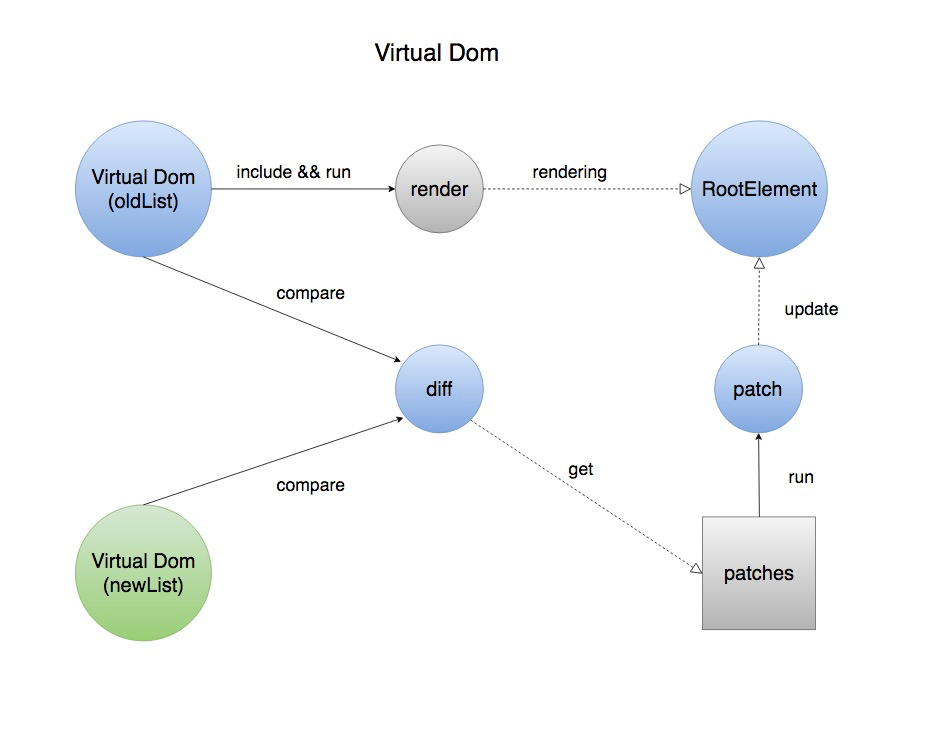

# React 学习

文档： [https://reactjs.org/docs/typechecking-with-proptypes.html](https://reactjs.org/docs/typechecking-with-proptypes.html)

## react 基础 基本概念

### React.createElement

创建一个react元素

```javascript

// 创建一个element元素
const element = React.createElement(
  'h1',
  {className: 'greeting'},
  'Hello, world!'
);

// 生成的元素为

{
	type: 'h1',
	props: {
	    className: 'greeting',
	    children: 'Hello, world'
  	}
}

```

jsx语法作为语法糖也会转为 React.createElement 来创建元素。

### ReactDOM.render 

把一个dom元素作为根元素， 渲染react组件

```
ReactDOM.render(
  element,
  container,
  [callback]
)
```

### props

props作为组件的参数传递到组件中， 可以在组件内获取该属性

props

### state

```

this.setState({
	name: '令狐冲'	
})

this.setState((preState, Props) => ({
	value: preState.value++
	}))
```

1. 在constructor中初始化state, 可以直接给this.state赋值
2. 其它的生命周期中或方法中不可以直接修改state， 需要用this.setState({name: '修改后的名字'})来修改
3. state是异步一次性更新的。 react会把该组件的所有的state的改变组合一次性完成更新

### lifting state up 提取公共state 

如果几个组件会被相同的state影响， 可以提取该state到他们共同的父组件中

各子组件通过props获取父组件的state状态并渲染

### Compositon vs Inheritance

### propTypes 类型检查

react内置的类型检查方法

#### 各种验证类型

```javascript

import PropTypes from 'prop-types';
import React from 'react'

/**
 * prop-types 类型检查。
 * 类型不符合会在控制台提示
 */
class PropTypeComp extends React.Component{
    render () {
        return (<div>
            <p>类型检查 PropTypes</p>
            <p>{this.props.content}</p>
            <p>{this.props.bool}</p>
        </div>)
    }
}

console.log('PropTypes：', PropTypes)

PropTypeComp.propTypes = {
   // You can declare that a prop is a specific JS primitive. By default, these
  // are all optional.
  optionalArray: PropTypes.array,
  optionalBool: PropTypes.bool,
  optionalFunc: PropTypes.func,
  optionalNumber: PropTypes.number,
  optionalObject: PropTypes.object,
  optionalString: PropTypes.string,
  optionalSymbol: PropTypes.symbol,

  // Anything that can be rendered: numbers, strings, elements or an array
  // (or fragment) containing these types.
  optionalNode: PropTypes.node,

  // A React element.
  optionalElement: PropTypes.element,

  // You can also declare that a prop is an instance of a class. This uses
  // JS's instanceof operator.
  optionalMessage: PropTypes.instanceOf(Message),

  // You can ensure that your prop is limited to specific values by treating
  // it as an enum.
  optionalEnum: PropTypes.oneOf(['News', 'Photos']),

  // An object that could be one of many types
  optionalUnion: PropTypes.oneOfType([
    PropTypes.string,
    PropTypes.number,
    PropTypes.instanceOf(Message)
  ]),

  // An array of a certain type
  optionalArrayOf: PropTypes.arrayOf(PropTypes.number),

  // An object with property values of a certain type
  optionalObjectOf: PropTypes.objectOf(PropTypes.number),

  // An object taking on a particular shape
  optionalObjectWithShape: PropTypes.shape({
    color: PropTypes.string,
    fontSize: PropTypes.number
  }),

  // You can chain any of the above with `isRequired` to make sure a warning
  // is shown if the prop isn't provided.
  requiredFunc: PropTypes.func.isRequired,

  // A value of any data type
  requiredAny: PropTypes.any.isRequired,

  // You can also specify a custom validator. It should return an Error object if the validation fails. Don't `console.warn` or throw, as this won't work inside `oneOfType`.
  customProp: function(props, propName, componentName) {
    if (!/matchme/.test(props[propName])) {
      return new Error(
        'Invalid prop `' + propName + '` supplied to' +
        ' `' + componentName + '`. Validation failed.'
      );
    }
  },

  // You can also supply a custom validator to `arrayOf` and `objectOf`.
  // It should return an Error object if the validation fails. The validator
  // will be called for each key in the array or object. The first two
  // arguments of the validator are the array or object itself, and the
  // current item's key.

  customArrayProp: PropTypes.arrayOf(function(propValue, key, componentName, location, propFullName) {
    if (!/matchme/.test(propValue[key])) {
      return new Error(
        'Invalid prop `' + propFullName + '` supplied to' +
        ' `' + componentName + '`. Validation failed.'
      );
    }
  })
}

export default PropTypeComp;

```


#### 设置默认值

```javascript

class PropTypeComp extends React.Component{
    render () {
        return (
    	<div>
            <p>设置默认: {this.props.defaultVal}</p>
        </div>
        )
    }
}

PropTypeComp.defaultProps = {
    defaultVal: '我是默认值'
}

PropTypeComp.propTypes = {
    defaultVal: PropTypes.string
}

export default PropTypeComp;

```

### Refs and the DOM

在典型的REACT数据流中, 组件通过props与父组件相互作用, 也只有父组件能通过Props更改子组件. 但有时候需要在其他位置修改某个组件或元素.
为满足这些场景, REACT提供了一个ref属性可以获取到该组件, 并调用其中的方法

### Life cycle 生命周期

#### Mounting阶段

- constructor()
- componentWillMount()
- render()
- componentDidMount()

#### Update阶段

- componentWillRecieveProps(nextProps): 当组件的属性改变时会触发该方法. 在初始化mounting时不会触发, 如果父组件re-render,即使props没有改变也会触发该方法.
- shouldComponentUpdate(nextProps, nextState): return Boolean. 默认返回true, 返回false会阻止该次渲染, 但是不会阻止子组件的渲染. 初始化渲染或调用forceUpdate时不会触发该方法. 
- componentWillUpdate(nextProps, nextState)
- render()
- componentDidUpdate(prevProps, prevState)

#### UnMounting阶段

- componentWillUnmount()

#### Error Handling

- componentDidCatch() 可以捕获render或其他生命周期中暴露的错误.

## 强制使组件redender

```
this.setState(this.state)
// 或者
this.forceUpdate()
```

## 虚拟 dom 更新的 diff 算法

参考 
- [https://yq.aliyun.com/articles/610195](https://yq.aliyun.com/articles/610195)
- [https://holmeshe.me/understanding-react-js-source-code-virtual-dom-diff-IX/#The-old-amp-new-virtual-DOM-tree](https://holmeshe.me/understanding-react-js-source-code-virtual-dom-diff-IX/#The-old-amp-new-virtual-DOM-tree)
- [如何实现一个 Virtual DOM 算法](https://github.com/livoras/blog/issues/13)

虚拟 dom 更新时, 会对比新旧两个树的差异, 通过 diff 得到一个 patches, 
执行 patch更新真实dom



### diff 过程

- 遍历新旧2颗树, 采用深度优先算法O(n), 遍历每个节点进行同级元素比较, 记录节点的变化类型.
  - 变化类型有4种: 
    1. 标签名变更,则replace. 
    2. 属性变更; 
    3. text 内容变更. 
    4. 元素顺序变化发生的重排. 
  - 如果是顺序变化则使用 list diff 算法记录变化情况.
- diff 之后得到 patches: 保存了每个节点需要做的变化. 
- 执行 patch 操作, 更新真实 dom


#### list diff

采用动态规划算法获取最小编辑距离的算法, 复杂度为 O(max(m * n)) 如果节点被 remove 掉了, 则执行 list diff.


## Reconciliation 一致性算法

参考 [https://reactjs.org/docs/reconciliation.html](https://reactjs.org/docs/reconciliation.html)


