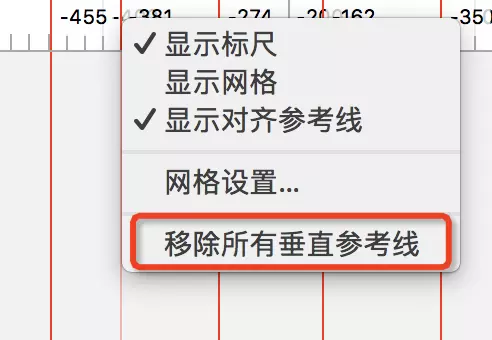

# sketch

## 常用操作

### 快捷键

A：新建画板（New Artboard）
R：插入矩形（Rectangle）
O：插入圆形（Oval）
T：插入文本（Text）
V：钢笔工具（Vector Point）
Z：放大（Zoom）：按住Z，然后框选想放大的地方
Enter：编辑
查看间距（Guides）：Alt（选中一个图层，按住alt，鼠标移动到另一个图层，可查看选中图层到指向图层的间距）
组合快捷键
shift+⌘+L：锁定图层
⌘+G：组合
shift+⌘+G：取消分组
⌘+D：复制​上一步操作
Ctrl+Option+⌘+1：隐藏左边菜单栏
Ctrl+Option+⌘+2：隐藏右边菜单栏
control+R：隐藏标尺+参考线、显示标尺+参考线
Ctrl+C：吸取颜色
Alt+⌘+C：复制图层样式
Alt+⌘+V：粘贴图层样式
Shift+⌘+H：隐藏图层
Shift+⌘+L：锁住图层
⌘+F：查找图层
⌘+T：变形工具
Shift+⌘+R：旋转工具
Shift+⌘+O：将字体转换成轮廓（转曲）
F：显示/取消填充
B：显示/取消描边
control+⌘+M：将当前图层用作蒙版
⌘+键盘的上/下/左/右：改变形状尺寸
⌘+~：切换不同的Sketch文件

调整图层顺序
alt+⌘+上：上移图层
alt+⌘+下：下移图层
Ctrl+alt+⌘+上：移到顶层
Ctrl+alt+⌘+下：移到底层
或者按住Alt键，再点击工具栏上的“上移一层”按钮，也可以使该图层置顶

放大
⌘+.：演示模式
⌘+1：以画布中心放大
⌘+2：以选择的图层为中心放大
⌘+0：恢复到画布实际大小
⌘++：视图放大
⌘+-：视图缩小
选择图层
tab：在图层面板从上往下选择图层
Shift+tab：在图层面板从下往上选择图层

操作
批量删除参考线
横向标尺和竖向标尺上各右键选择Remove All Guides删除

image.png

移动一个被遮盖的图层
这是一个重叠图层很麻烦的地方，正常情况下，你单击并拖动一个图层它会被立即选中，并移到新的位置。
大多数时候这是非常方便的，但如果你想移动一个完全在另一图层底下的图层，这就会变得非常碍事，因为会直接选中并移动最表面的图层。
解决这个问题，你需要按住 alt+⌘ 键，再来单击你需要的图层并移动它，你甚至可以单击画布上完全不同的区域，Sketch 仍会为你保留之前的选区。
