[TOC]

# svn 

参考文档
[中文文档](https://www.kancloud.cn/i281151/svn/197097)

## Subversion 包含的工具

1. svn 命令行客户端
2. svnversion 当前工作拷贝的修订记录
3. svnlook 检查版本库的工具
4. svnadmin 建立, 调整和修补版本库的工具
5. svndumpfilter 过滤 Subversion 版本库转储文件的工具
6. mod_dav_svn Apache Http服务器的一个插件, 可以让版本库在网络上课件
7. svnserve 一种单独运行的服务器, 可以作为进程由 SSH 调用, 另一种让版本库在网络上可见的方式.

## 创建一个svn仓库

### svnadmin create REPO_PATH

svnadmin 用来监控和修改svn版本库
svnadmin直接访问版本库(因此只可以在存放版本库的机器上使用), 通过路径访问版本库, 而不是url

在 指定路径 (REPO_PATH) 创建一个版本库

执行上面的命令后，自动在repos下建立多个文件， 分别是conf, db,format,hooks, locks, README.txt。

### 配置仓库

文件夹. 有以下几个文件authz, passwd, svnserve.conf
     其中authz 是权限控制，可以设置哪些用户可以访问哪些目录,   passwd是设置用户和密码的,    svnserve是设置svn相关的操作

1. 设置访问用户

编辑 passwd文件添加用户

```bash
[users]
# harry = harryssecret
# sally = sallyssecret
# 用户名=密码
hello=123
```

2. 设置权限

```
# 给hello用户添加读写权限
hello=rz
```

3. 最后设定snvserv.conf

```
anon-access = none # 使非授权用户无法访问
auth-access = write # 使授权用户有写权限
password-db = password
authz-db = authz   # 访问控制文件
realm = /opt/svn/repos # 认证命名空间，subversion会在认证提示里显示，并且作为凭证缓存的关键字。
采用默认配置. 以上语句都必须顶格写, 左侧不能留空格, 否则会出错.
```

### 启动svn服务

```bash
# -d 启动守护进程
# -r 从root目录启动
# svn默认端口是3690

svnserve -d -r REPO_PATH --listen-port 3690
```

## svn checkout

拷贝一个远端的仓库

```bash
# URL是远端仓库的路径 @REV 可以指定版本,  PATH 是要保存到的本地的路径. 
# 如果svn没有保存登陆信息, 则需要输入用户名和密码
svn checkout URL[@REV]... [PATH] [--username 用户名] [--password 密码]

```


## 快速入门

### 开始

确定 svn ra_local 模块是否已安装, 该模块可以允许访问 file:// 的路径

svn --version

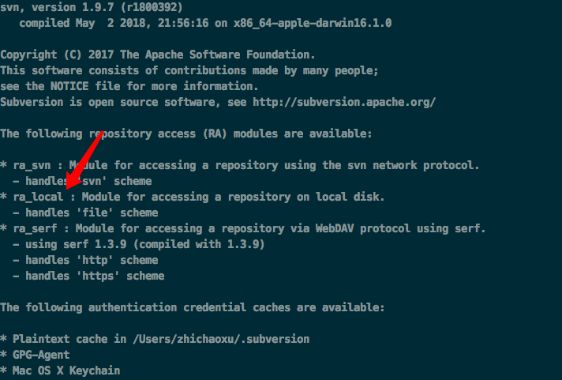

### 新建版本库

```
svnadmin create app-repos
```

目录下会生成相应的文件

```
~]# ls app-repos
README.txt conf       db         format     hooks      locks
```
### 版本库的结构

一个版本库可以有多个项目. 
每个项目有 trunk 和 branches 子目录.

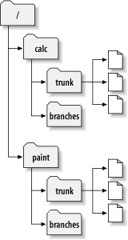

### 建立本地项目

建立如下目录结构, 你的文件应该包括三个顶级子目录，分别是branches、tags和trunk

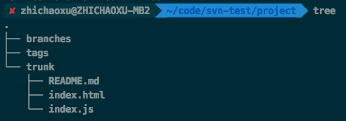

### 数据导入到版本库

本地项目导入到远程版本仓库中

```
~]# svn import ./project file:///Users/zhichaoxu/code/svn-test/repos/project -m 'initial import'
```

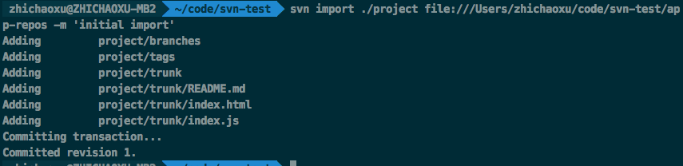

查看版本库中的项目信息
```
~]# svn list file:///Users/zhichaoxu/code/svn-test/app-repos/
```

### 建立working copy

从远程版本库中拉一个分支到本地进行开发

```
~]# svn checkout file:///Users/zhichaoxu/code/svn-test/app-repos/trunk project_copy
```

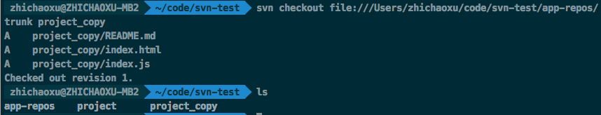

新拉下来的分支到目录如下

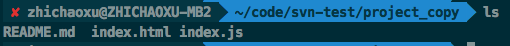

### 编辑, diff 以及 update

编辑一个文件, 执行 diff 查看更改
```
svn diff
```

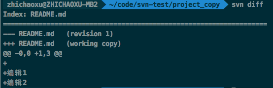

svn status 查看当前状态

svn commit 提交更改记录

svn update 更新版本库

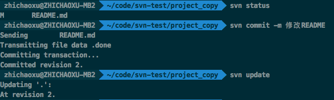

## svn 版本库理论介绍

参考 [https://www.kancloud.cn/i281151/svn/197106](https://www.kancloud.cn/i281151/svn/197106)


## 常用的工作流程和功能

更新 working copy

svn update


文件被修改后

svn add

svn delete

svn copy

svn move

检验修改

svn status

svn diff

合并别人的修改到 working copy

svn update

svn resolved

提交修改

svn commit

### 同步最新版本到自己当前的 working copy

svn update 可以同步最新的版本到本地

### working copy 中修改文件

#### 目录树修改

如果要增删文件设计到目录树的修改需要使用 svn 的命令, 通知到 svn
相关的操作有 
svn add file; 
svn delete file
svn copy src dest
svn move src dest

如果本地没有的文件, 可以直接操作版本库, 使用 URL工作。
相关的方法有

svn mkdir URL 
svn copy
svn move
svn delete

指定URL的操作方式有一些区别，使用 working copy 操作的时候会对操作进行累积, 再统一 commit, 
使用 URL 地址的时候每次操作都会进行一次 commit

#### 文件修改

如果修改已存在的文件, 直接修改即可, svn 会跟踪该文件的变化.

### 文件修改处理

修改提交之前可以使用 svn status; svn diff 查看更改的内容

也可以使用 svn revert 撤销部分修改

### 解决冲突

svn update 拉取仓库的更新时可能会产生冲突. 

```
~]# svn update
U  INSTALL
G  README
C  bar.c
Updated to revision 46.
Summary of conflicts:
  Text conflicts: 1 # 冲突文件
Conflict discovered in file 'confilict-test.md'.
# 需要选择冲突的处理方式
Select: (p) postpone, (df) show diff, (e) edit file, (m) merge,
        (mc) my side of conflict, (tc) their side of conflict,
        (s) show all options:
```

U表明本地没有修改，文件已经根据版本库更新。
G标示合并，标示本地已经修改过，与版本库没有重迭的地方，已经合并。
C表示冲突，说明服务器上的改动同你的改动冲突了，你需要自己手工去解决。

如果有冲突, 会提示处理冲突, 冲突的几种处理方式.

| 符号 | 说明 |
| --  |  -- |
| p | 标记冲突，暂不处理 |
| df | 显示所有冲突 |
| e | 编辑冲突 |
| mc | 冲突以本地文件为准 |
| tf | 冲突以远程仓库为准 |
| s | 显示所有选项 |


有冲突的文件会多生成3个文件

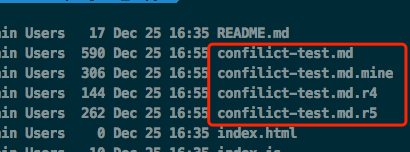

mine 是更新前的文件，没有冲突标志，只是你最新更改的内容。（如果Subversion认为这个文件不可以合并，.mine文件不会创建，因为它和工作文件相同。）
rOldREV 这是你的做更新操作以前的BASE版本文件，就是你在上次更新之后未作更改的版本, 这里就是 r4, 4是版本revision号
rNewREV 是SVN刚从服务器拉下来的版本. 这里就是 r5

文件内的标记如下

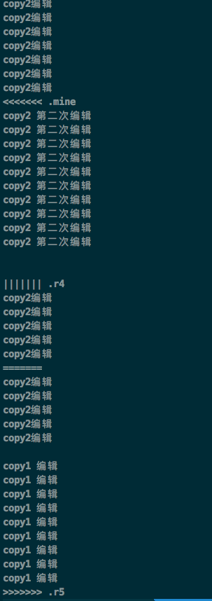

如果有冲突没有解决, 是无法提交的. 直到把多出来的3个临时文件删除

#### 解决冲突的方法

1. 手动解决冲突文件: 编辑文件中的冲突内容, 修改为要保留的部分
2. 用某个临时文件覆盖原工作文件 cp file.js.r5 file.js
3. 运行 svn revert 来放弃所做的修改

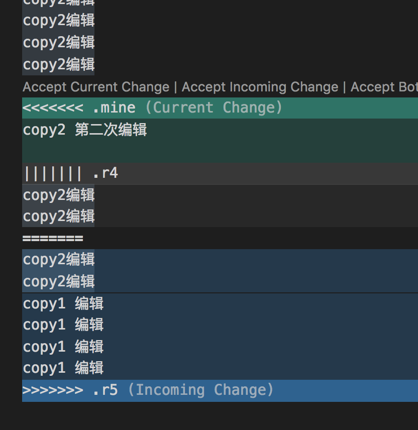

#### 冲突解决完成后

svn resolved PATH...

一旦解决了冲突, 需要执行命令 svn resolved, 此时会删除3个临时文件. 此时 svn 就不会认为该文件在冲突状态了.

#### 提交

冲突解决后, 需要提交修改

svn commit -m 'update content'

## 分支

[参考资料](https://www.kancloud.cn/i281151/svn/197117)


分支的文件夹需要自己规划, 建立文件夹目录.
如trunk; branches; tag 的目录结构

### 建立分支

比如项目名称为 skill-change
建立一个分支, 分支的具体目录位置由项目自身的策略决定, 可以在 skill-change/branches 下建立分支feature-dev 即 skill-change/branches/feature-dev, 或者在其他位置建立一个独立的目录如 skill-change/feature-dev

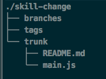

### 建立拷贝

- 方法1, 在本地通过 copy 建立一个拷贝

使用 svn copy 命令复制 trunk 目录到一个分支目录

```
~]# svn copy trunk branches/feature-dev
```
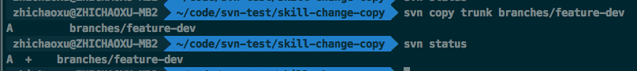

svn status 输出 A +
加号表示该目录树一个备份, 而非全新的目录. 当提交时, svn 会通过拷贝 /skill-change/trunk 建立分支目录, 而非通过网络上传所有数据.

- 方法2: 通过 copy 直接操作2个 url, 在远程仓库建立分支

通过 svn copy srcUrl destUrl -m [msg] 在远程仓库建立分支
执行 svn update . 同步本地目录

```
~]# svn copy file:///Users/zhichaoxu/code/svn-test/app-repos/skill-change/trunk file:///Users/zhichaoxu/code/svn-test/app-repos/skill-change/branches/feature-bugfix -m '建立分支 bugfix'

Committing transaction...
Committed revision 8.

~]# svn update .
Updating '.':
A    branches/feature-bugfix
A    branches/feature-bugfix/README.md
A    branches/feature-bugfix/main.js
```

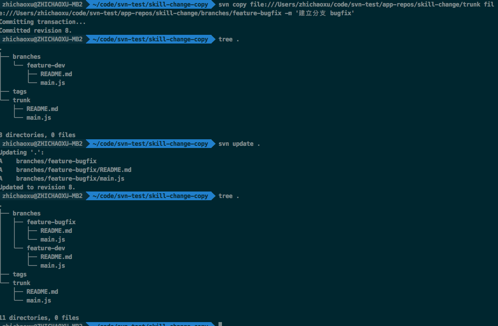

### 分支 diff

[官方文档](http://svnbook.red-bean.com/en/1.7/svn.ref.svn.c.diff.html)

Synopsis
svn diff [-c M | -r N[:M]] [TARGET[@REV]...]

svn diff [-r N[:M]] --old=OLD-TGT[@OLDREV] [--new=NEW-TGT[@NEWREV]] [PATH...]

svn diff OLD-URL[@OLDREV] NEW-URL[@NEWREV]

N 默认是 BASE
M 默认是当前目录的版本

显示两个路径的区别, 有三种方式. 

#### 用法1

svn diff -r N:M [...PATH] 可以查看2个版本号之间的更改. 可以指定目录. 
由下图可以看出 -r N:M 和 -r M:N 的输出是不同的. 
通常使用 svn diff -r oldRevision:newRevision 可以输出新版的变化.

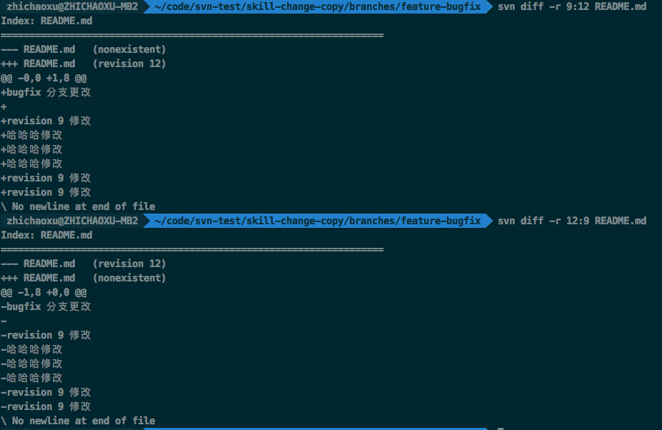

#### 用法2 查看当前项目和上次之间的区别的改动. 

svn diff

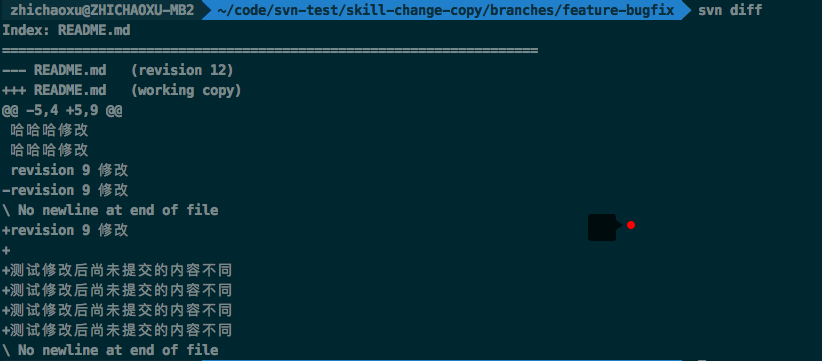

#### 用法3 比较两个 url 的区别

svn diff URL@revision1 URL@revision2

比较远程仓库中版本11和版本12的区别
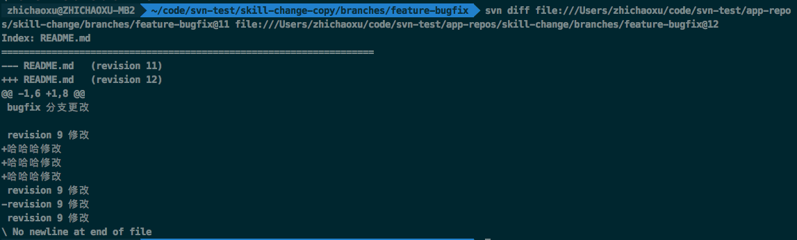

等价于 svn diff -r 11:12 URL

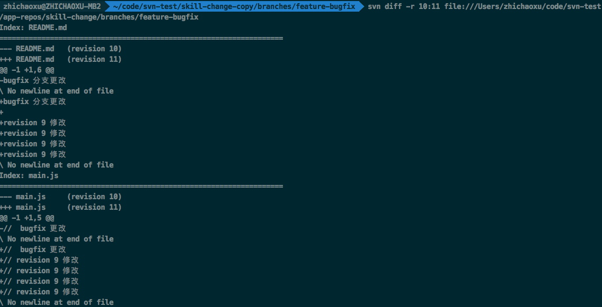

### 分支合并 merge

svn merge 把两个版本的不同应用到当前的工作路径. Apply the differences between two sources to a working copy path.

比较两个源文件, 并把不同应用到 WCPATH


三种使用方式

svn merge [-c M[,N...] | -r N:M ...] SOURCE[@REV] [TARGET_WCPATH]

svn merge --reintegrate SOURCE[@REV] [TARGET_WCPATH]

svn merge SOURCE1[@N] SOURCE2[@M] [TARGET_WCPATH]

#### 方式1

源文件版本号用 @N, @M 指定. 如果省略版本号, 则默认为 HEAD

#### 方式二

SOURCE 可以是 URL 或者 WCPATH, 与之对应的 URL 会被使用, 在版本号 N 和 M 的 URL 定义了要比较多两组源. 

WCPATH 是接收变化的工作路径, 默认为 . 

merge 操作在执行时慧考虑文件的祖先. 当你从一个分支合并到另一个分支，而这两个分支有各自重命名的文件时，这一点会非常重要。

#### 常用场景

##### 两个分支的合并

将分支feature-bugfix@14合并到分支feature-dev@7
分支bugfix版本号未14, 分支 dev 版本号为7

1. 执行 svn diff 查看2个分支的不同
```
~]# svn diff -r 7:HEAD ../feature-bugfix
```

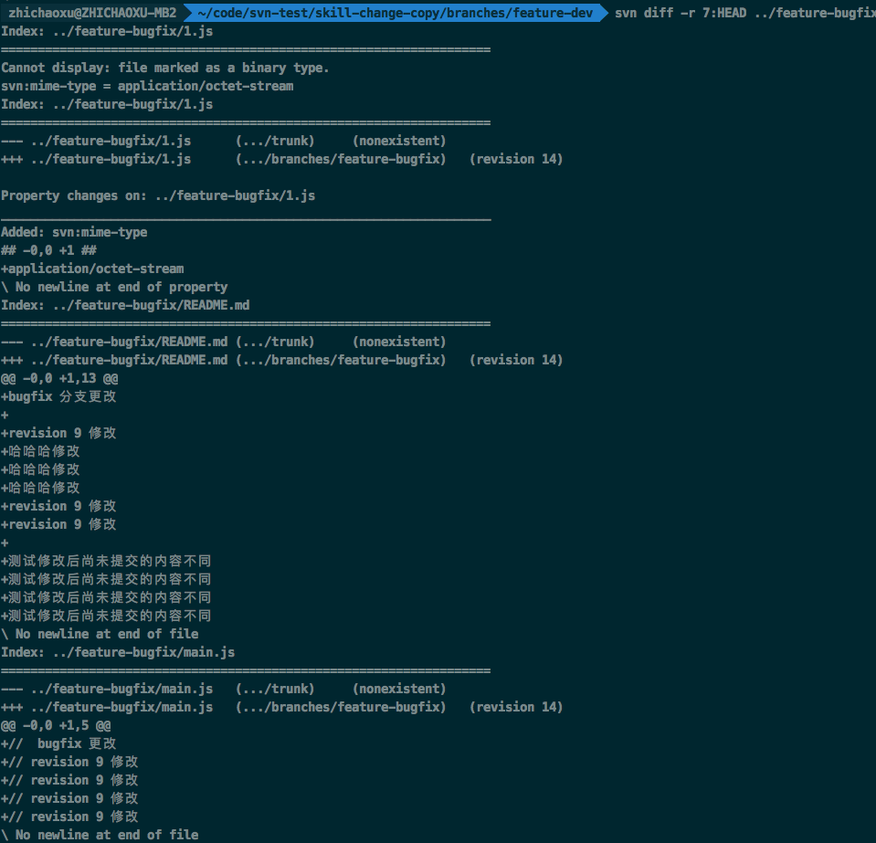

2. 执行 merge
```
~]# svn merge -r 7:HEAD ../feature-bugfix .
```

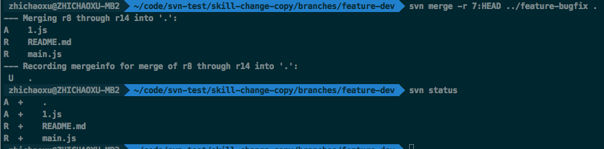

3. 提交

```
~]# svn status
~]# svn commit -m 'msg'
```

## 命令

### svn status

[官方文档](http://svnbook.red-bean.com/en/1.7/svn.ref.svn.c.status.html)

输出 working copy 和目录的状态。
svn status [PATH...]

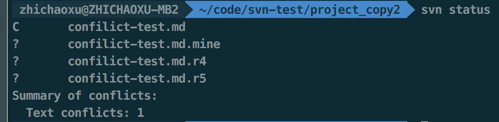
值的含义

| 符号 | 含义 |
| -- | -- |
| ' ' | 没有修改。|
| 'A' | 预定要添加的项目。|
| 'D' | 预定要删除的项目。|
| 'M' | 项目已经修改了。 |
| '?' | 项目不在版本控制之下。 |
| 'R' | 项目在工作拷贝中已经被替换了。 |
| 'C' | 项目与从版本库的更新冲突。 |
| 'X' | 项目与外部定义相关。 |
| 'I' | 项目被忽略（例如使用svn:ignore属性）。 |
| '!' | 项目已经丢失（例如，你使用svn移动或者删除了它）。这也说明了一个目录不是完整的（一个检出或更新中断）。 |
| '~' | 项目作为一种对象（文件、目录或链接）纳入版本控制，但是已经被另一种对象替代。, 第二列告诉一个文件或目录的属性的状态。 |
| ' ' | 没有修改。 |
| 'M' | 这个项目的属性已经修改。 |
| 'C' | 这个项目的属性与从版本库得到的更新有冲突。第三列只在工作拷贝锁定时才会出现。 |
| ' ' | 项目没有锁定。 |
| 'L' | 项目已经锁定。 第四列只在预定包含历史添加的项目出现。 |
| ' ' | 没有历史预定要提交。 |
| '+' | 历史预定要伴随提交。第五列只在项目跳转到相对于它的父目录时出现（见[“转换工作拷贝”一节]）。 |
| ' ' | 项目是它的父目录的孩子。 |
| 'S' | 项目已经转换。过期信息出现在第八列（只在使用--show-updates选项时出现）。 |
| ' ' | 这个项目在工作拷贝是最新的。 |
| '*' | 在服务器这个项目有了新的修订版本 。|

### svn revert

撤销所有目录更改
```
~]# svn revert -R .
```
## 其他操作

### svn 文件类型变更

无法提交, 报错 Node '/repos/branches/feature-bugfix/README.md' has unexpectedly changed kind

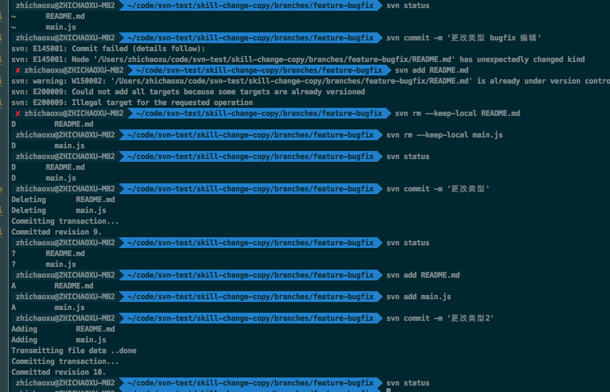


