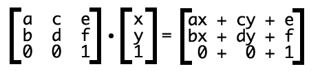
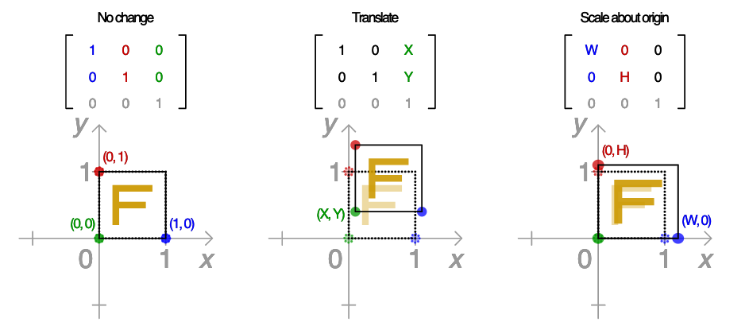
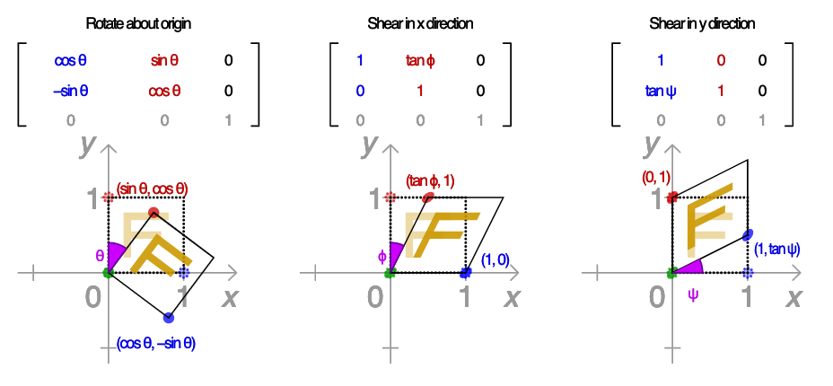
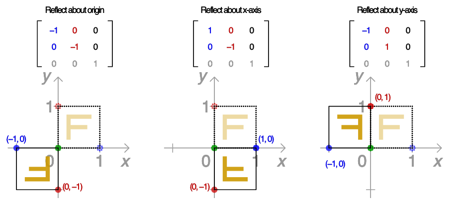

# CSS Transform 属性

## matrix 值

matrix(scaleX, skewX, skewY, scaleY, translateX, translateY)

## matrix 计算规则

## 不同的变化对应的matrix值

## 参考资料

- 理解CSS3 transform中的Matrix(矩阵) https://www.zhangxinxu.com/wordpress/2012/06/css3-transform-matrix-%E7%9F%A9%E9%98%B5/
- matrix计算函数解析 https://www.quackit.com/css/functions/css_matrix_function.cfm
- transform值测试 http://angrytools.com/css-generator/transform/
