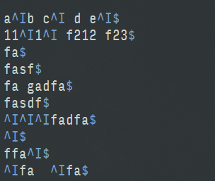
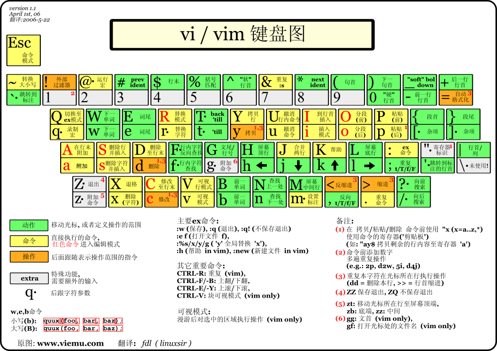

[TOC]

# VIM

参考资料:


- [官方文档](http://vimdoc.sourceforge.net/htmldoc/usr_toc.html)
- [中文文档](http://vimcdoc.sourceforge.net/doc/help.html)
- [vim文档](http://vimdoc.sourceforge.net/)
- [菜鸟教程](http://www.runoob.com/linux/linux-vim.html)
- [Vim 从入门到精通](https://github.com/wsdjeg/vim-galore-zh_cn)
- [中文速查表](https://github.com/skywind3000/awesome-cheatsheets/blob/master/editors/vim.txt)
- [http://www.cnblogs.com/jiqingwu/archive/2012/06/14/vim_notes.html#id60
](http://www.cnblogs.com/jiqingwu/archive/2012/06/14/vim_notes.html#id60
)

## 模式

有四种模式

- normal(普通模式)insert(插入模式),command(命令行模式),visual(可视化模式)

## 查看帮助

```
# 查看帮助
:help <命令>
# 在一个新的tab查看帮助
:tab help
# 退出帮助
:q

```

## Set 设置

显示set所有的选项

```
set all
```

查看当前某个设置的值, 在结尾加 ? 可以显示当前的值
```
:set listchars?
```

### set list 显示隐藏字符

Vim是不会显示space,tabs,newlines,trailing space,wrapped lines等不可见字符的。
显示隐藏字符, 制表符显示为 '^I', 行尾符显示为 '$', 空格显示为一个空白字符
```
:set list
```


重新隐藏不可见字符
```
:set nolist 
```
切换不可见字符的显示隐藏
```
:set list!
```

设置显示的字符

```
:set listchars
# 查看替换符号的帮助, 缩写为 lcs
:help 'listchars'
# 用.显示空格, ^I显示tab
```

其中，特殊符号是在插入状态下，点击快捷键Ctrl-k，然后键入编码来输入的。比如，中点是由.M输入；左书名号是由<<输入，右书名号是由>>输入。

查看可以输入的特殊字符

```
:digraphs
```

## 搜索替换

### 搜索

搜索在普通模式下以 (/) 开头输入要搜索的内容, 搜索换行符用 \n
如:
```
/foo\nbar
# 可以匹配到
foo
bar
```

### 替换

替换使用s命令

```
# 把所在行的haha替换为xixi, 只替换找到的第一个, 斜杠表示多个命令的分割
:s/haha/xixi/ 
# 结尾加g表示该行所有, 把所在行的haha替换为xixi, 替换该行所有的
:s/haha/xixi/g
# s前面可以加数字表示第几行, 把第三行的haha替换为xixi, 替换该行所有的
:3s/haha/xixi/g
# %表示所有行, 把全文的haha替换为xixi
:%s/haha/xixi/g
# 把全文所有的tab替换为空格
:%s/\t/ /g

```
## 移动



### 字符移动
在Vim的Normal模式里（如果你在Visual模式或者Insert模式，可以按<Esc>回到Normal模式）， 通过h, j, k, l, i来进行左下上右的光标移动。

在Vim中多数操作都支持数字前缀，比如10j可以向下移动10行。

### 单词移动
多数情况下单词移动比字符移动更加高效。 w移动光标到下一个单词的词首，b移动光标到上一个单词的词首；e移动光标到下一个单词的结尾，ge移动光标到上一个单词的结尾。

单词移动同样支持数字前缀，比如4w可以向后移动4个单词。连续的标点符号算一个单词。

有趣的是，W, B, E具有同样的功能，只不过它是用空格来分隔单词的，可以跳地更远~

^到行首，$到行尾。

拷贝一行：^y$。

### 相对屏幕移动
通过c-f向下翻页，c-b向上翻页；c-e逐行下滚，c-y逐行上滚。这在几乎所有Unix软件中都是好使的，比如man和less。 H可以移动到屏幕的首行，L到屏幕尾行，M到屏幕中间。

zt可以置顶当前行，通常用来查看完整的下文，比如函数、类的定义。 zz将当前行移到屏幕中部，zb移到底部。

### 文件中移动
通过:10可以直接移动光标到文件第10行。如果你看不到行号，可以:set number。 gg移到文件首行，G移到尾行。

拷贝整个文件：ggyG。

/xx可以查找某个单词xx，n查找下一个，N查找上一个。 在光标跳转之后，可以通过c-o返回上一个光标位置，c-i跳到下一个光标位置。

?xx可以反向查找，q/, q?可以列出查找历史。


