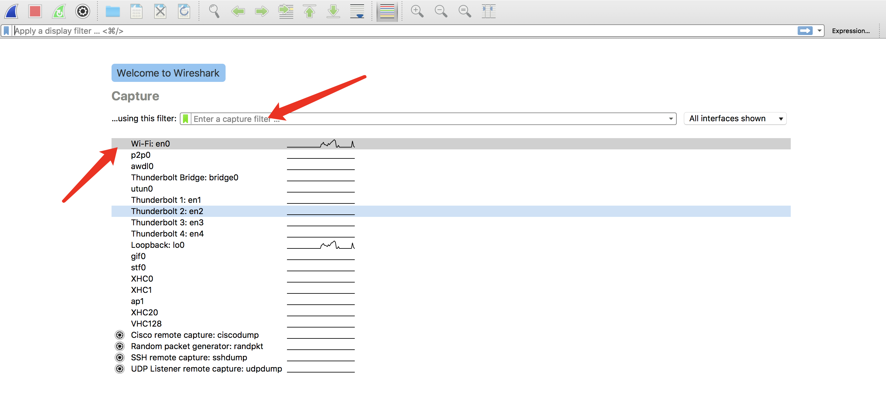
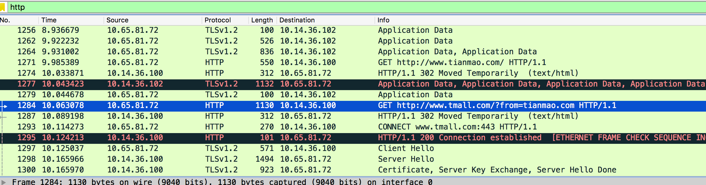
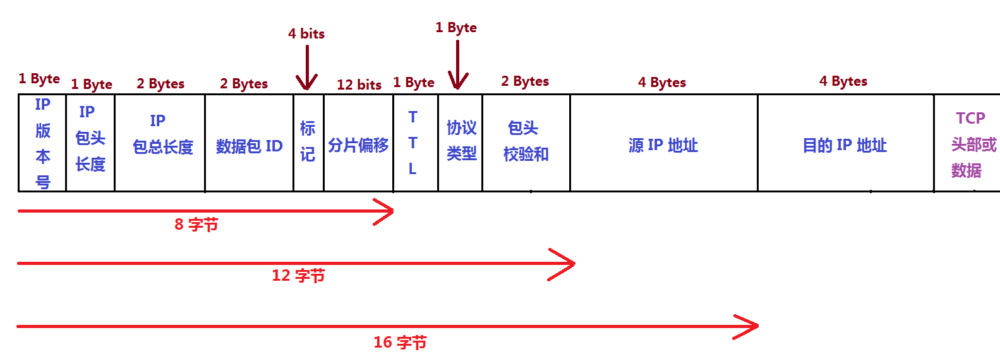
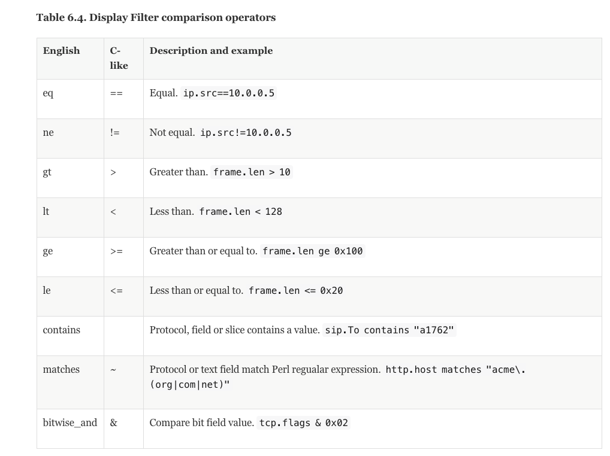
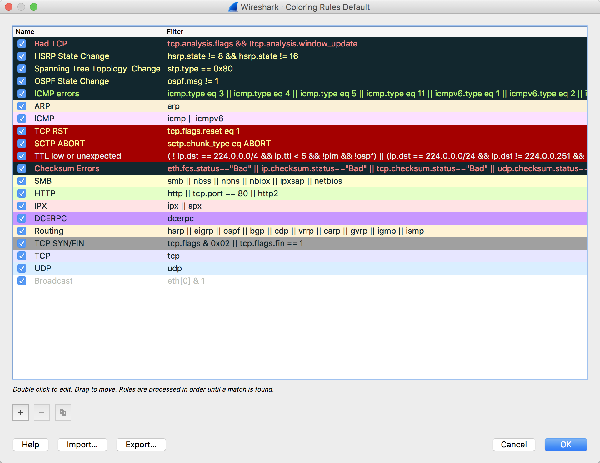
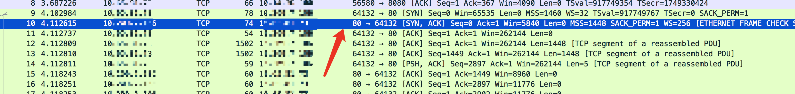
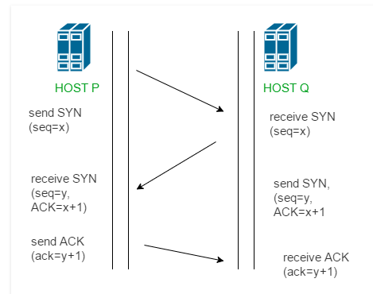
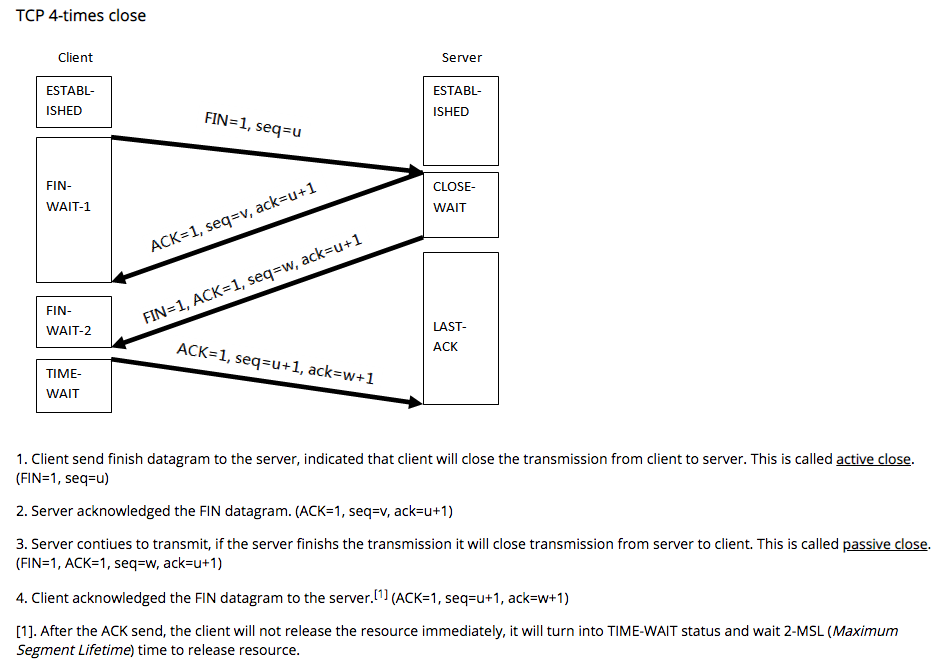

[TOC]

# wireshark

## 捕获



这一步设置捕获, 
设置捕获过滤, 选择网卡

[捕获过滤语法官方文档](https://wiki.wireshark.org/CaptureFilters)

捕获过滤器与显示过滤器不同. 捕获过滤器来过滤需要捕获的请求, 只有符合条件的请求才会被捕获. 显示过滤器用来筛选在列表中显示的请求.

### 例子

Capture only traffic to or from IP address 172.18.5.4:
```
host 172.18.5.4
```
Capture traffic to or from a range of IP addresses:
```
net 192.168.0.0/24
```
or
```
net 192.168.0.0 mask 255.255.255.0
```
Capture traffic from a range of IP addresses:
```
src net 192.168.0.0/24
```
or
```
src net 192.168.0.0 mask 255.255.255.0
```
Capture traffic to a range of IP addresses:
```
dst net 192.168.0.0/24
```

## display filters

[显示过滤语法官方文档](https://wiki.wireshark.org/DisplayFilters)

表达式规则

1. 协议过滤

比如TCP，只显示TCP协议。 http 只显示 http 请求



2. IP 过滤

比如 ip.src ==192.168.1.102 显示源地址为192.168.1.102，

ip.dst==192.168.1.102, 目标地址为192.168.1.102

3. 端口过滤

tcp.port == 80,  端口为80的

tcp.srcport == 80,  只显示TCP协议的原端口为80的。

4. Http模式过滤

http.request.method=="GET",   只显示HTTP GET方法的。
http.request.uri contains "github.com" // 过滤 uri 中包含github.com的请求

5. 逻辑运算符为 AND/ OR


过滤网段 192.168.1.0 中的数据包

```
net 192.168.1.0/24
```

表达式

```
ip[8:1]==1
```
含义为仅显示 IP 从分组头部的第八个字节开始（8），长度为1字节（1），其“值”为 10进制1 的数据包

查看相关 RFC 文档对 IP 分组头部结构的定义，其第九个字节为 TTL（Time To Live），这将会显示所有 IP 分组头部的 TTL=1 的数据包。

下图为 IP 分组头部结构，wireshark 的“中括号内数字加冒号”的表达式正是利用了这种结构中，“结构成员”的字节偏移（第N字节）与“结构成员”的长度：



可以用的操作符

参考[官方文档](https://www.wireshark.org/docs/wsug_html_chunked/ChWorkBuildDisplayFilterSection.html)



## 请求颜色标识

[官方文档](https://www.wireshark.org/docs/wsug_html_chunked/ChCustColorizationSection.html)

进行到这里已经看到报文以绿色，蓝色，黑色显示出来。Wireshark通过颜色让各种流量的报文一目了然。比如默认绿色是TCP报文，深蓝色是DNS，浅蓝是UDP，黑色标识出有问题的TCP报文——比如乱序报文。




## 观察 TCP 的三次握手

### 过滤握手链接

在 wireshark 的 Edit -> Find Packet 输入 tcp.flags 过滤后可以筛选 TCP 请求
查看具体的 flag: tcp.flags.syn == 1 点击find之后Trace 种的第一个 SYN 报文会亮



TCP 协议中的几个信号

- CWR - Congestion Window Reduced
- ECE - Explicit Congestion Notification echo
- URG - Urgent
- ACK - Acknowledgement
- PSH - Push
- RST - Reset
- SYN - Synchronize (Synchronize Sequence Number)
- FIN - Finished



### 四次挥手关闭连接



参考资料:

- [Wireshark基本用法](https://www.cnblogs.com/dragonir/p/6219541.html)
- [过滤表达式](http://blog.51cto.com/shayi1983/1558161)
- [利用wireshark进行TCP的分析](http://blog.51cto.com/shayi1983/1558161)