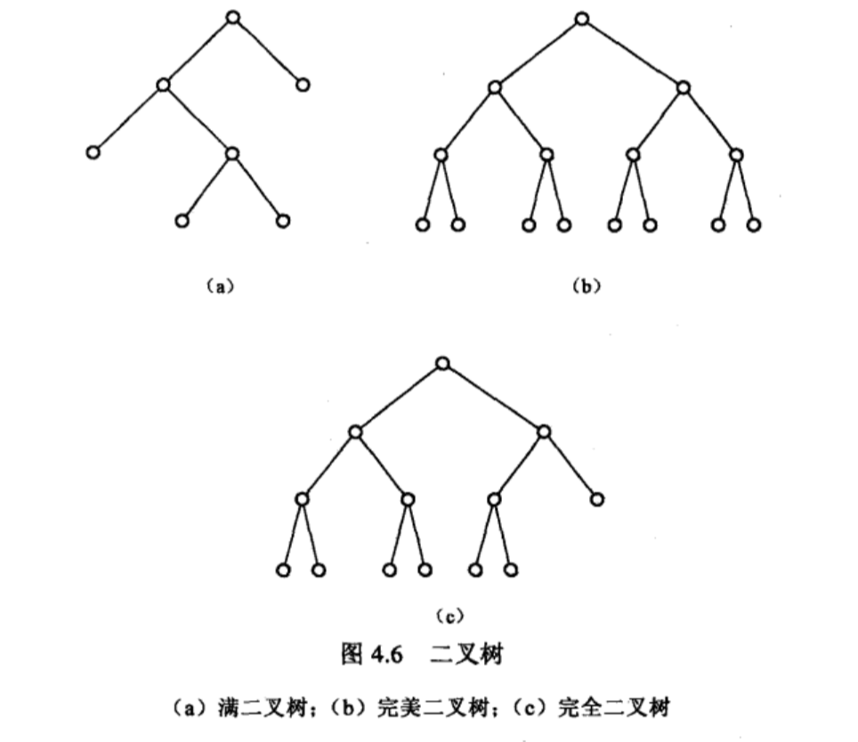

# 二叉树

## 二叉树种类

## 二叉树结构

根节点为0
节点 i 的左子节点为 2 * i + 1
节点 i 的右子节点为 2 * i + 2

## 完全二叉树

完全二叉树是效率很高的数据结构，完全二叉树是由满二叉树而引出来的。对于深度为K的，有n个结点的二叉树，当且仅当其每一个结点都与深度为K的满二叉树中编号从1至n的结点一一对应时称之为完全二叉树。

节点数量可以使任意个, 其最后一行可能是不完整的. 

K 层的完全二叉树, 节点数量 N 介于 2^(k - 1) - 1 < N <= 2^k - 1

## 满二叉树

从形象上来说满二叉树是一个绝对的三角形，也就是说它的最后一层全部是叶子节点，其余各层全部是非叶子节点，满二叉树的节点必须是个确定的数目.

一共 n 项, 编号为 0, 1, 2, 3 ..., n - 1
根节点索引为0
第 m 层的节点数量为 2 ^ (m - 1)
一共 k 层, 则有 n = 2^k - 1; k = lg(n + 1)
对于节点 i
isLeaf: i >= 2^(k - 1) - 1; n >= 2 * i + 1
LeftSibling: i - 1
RightSibling: i + 1
LeftChild: Lc = 2 * i + 1
RightChild: Rc = 2 * i + 2
Parent: P = Math.ceil((i - 2) / 2)
Depth 根节点到当前层的深度: D = Math.floor(lg(i + 1))
Height 当前节点所在层到最后一层的高度: H = Math.ceil(lg((n + 1) / (i + 1))) - 1

