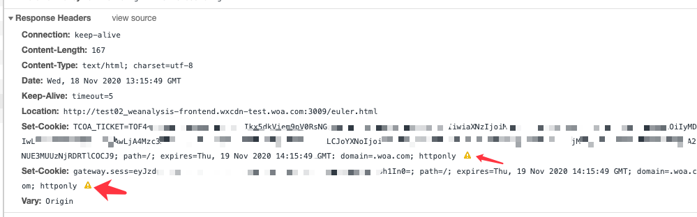

# samesite 对cookie 的影响

## https下cookie设置失败

黄色感叹号会提示 `This set-cookie was blocked because it was not sent over a secure connection and would have overwritten a cookie with secure attribute`
set-cookie 会覆盖 https 下设置的cookie, 因此被屏蔽了.

## 参考资料

- [Incrementally Better Cookies draft-west-cookie-incrementalism-01](https://tools.ietf.org/html/draft-west-cookie-incrementalism-01)
- [SameSite cookies explained](https://web.dev/samesite-cookies-explained/)
- [MDN Using HTTP cookies](https://developer.mozilla.org/en-US/docs/Web/HTTP/Cookies)
