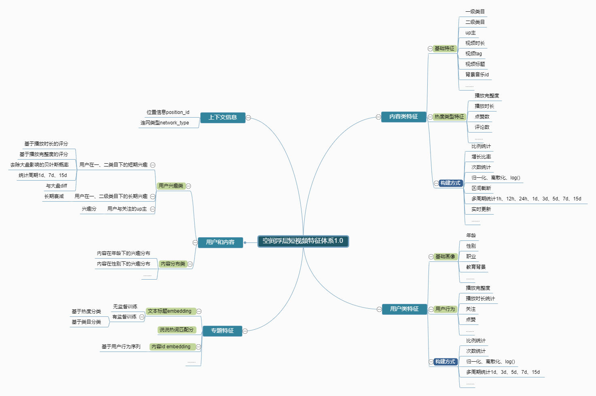

# 学习笔记

## 某视频推荐精排方案学习

精排模型构建整体上是一个离线计算的过程. 
整个过程分为4步

- 数据分析
- 样本设计
- 特征工程
- 模型训练              

整个过程是不断重复这4步, 循环迭代优化的过程.

### 数据分析

分为3步

- 数据验证
- 数据过滤
- 数据统计

数据验证是通过在业务实际线上场景中检验各个字段是否正确, 是否存在曝光丢失, 操作行为是否能对应上.

第二部进行构建场景相应的数据, 这一步也即数据清洗, 进行数据过滤. 数据中有一些是不需要的, 所以构建了一个中间表, 来基于中间表构建后续的运算.

数据统计, 从用户行为, 内容进行分析, 寻找规律, 为后续样本构建和特征提取工作. 通过分析用户行为, 了解用户行为与推荐的item之间的关系, 具体可以从用户整体活跃度波动和用户正负向操作比率波动, 用户操作类型分布分析, 用户在每个session中item相对位置上的分布统计等进行分析, 进行特征构建

### 样本设计

构建样板分2个步骤
1. 样本标签构建
2. 对有标签的样本进行采集数据得到训练和测试样本数据

样板设计
1. 正负样本定义
2. 样板采样的权重
3. 样板偏差消除: 消除一些个性化样本的影响

### 特征工程

特征决定机器学习的上限, 模型只是在逼近这个上限. 

特征构建的步骤

1. 数据分析, 分析特征的背景, 确定特征的物理含义, 分析统计周期, 变换方式的影响.
2. 进行特征开发
3. 单特征验证, 通常使用特征的覆盖度, 单特征auc以及特征相应的分布(均值, 方差);
4. abtest 验证实际效果

构建的特征

### 模型训练

